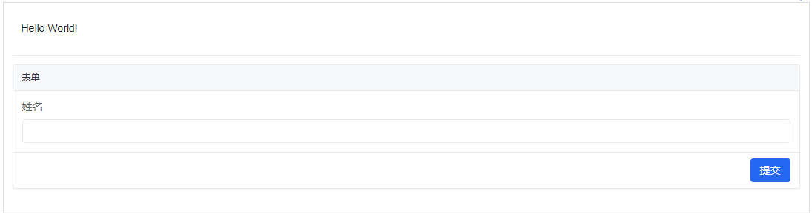

# amis

## 配置与组件

每一个配置都必须有 `type` ，表示要渲染的是什么，`type` 的值可以取：

* page 页面
* divider 分割线
* form 表单


### page

如果 `type` 是 page，那就要有 `body` 属性，表示 page 的值

```json
{
  "type": "page",
  "body": "Hello World!"
}
```




* 第一个 page 表示整个页面，这整个页面的内容是第一个 body
  * body 是一个数组，表示整个页面由很多部分组成
    * 第一个部分是一个 page，内容是 ”Hello World“
    * 第二个部分是 divider 分割线
    * 第三个部分是 form 表单，内容 body 也是一个数组，表示可能有多个
      * 第一个部分是 input-text 输入表单

```json
{
  "type": "page",
  "body": [
    {
      "type": "page",
      "body": "Hello World!"   
    },
    {
      "type": "divider"
    },
    {
      "type": "form",
      "body": [
        {
          "type": "input-text",
          "name": "name",
          "label": "姓名"
        }
      ]
    }
  ]
}
```



<figure><figcaption></figcaption></figure>




