---
tags:
  - 标签
cssclasses: []
---
#临时笔记 
# 🌕字体类型
### 🌗标题
```
# 🌕一级标题    
## 🌕二级标题       
### 🌗三级标题       
#### 🌗四级标题      
##### 🌑五级标题      
###### 🌙六级标题    
```
### 🌗字号
<font size="1">1号字(最小)</font>
<font size="2">2号字</font>
<font size="3">3号字</font>
<font size="4">4号字</font>
<font size="5">5号字</font>
<font size="6">6号字</font>
<font size="7">7号字(最大)</font>

```
<font size="1">1号字(最小)</font>
<font size="2">2号字</font>
<font size="3">3号字</font>
<font size="4">4号字</font>
<font size="5">5号字</font>
<font size="6">6号字</font>
<font size="7">7号字(最大)</font>
```
### 🌗字体颜色
<font color ="red">红色</font>
<font color ="green">绿色</font>
<font color ="blue">蓝色</font>
<font color ="rgb(200, 100, 100)">使用RGB颜色集</font>
<font color ="FF00BB">使用十六进制颜色集</font>
```
<font color ="red">红色</font>
<font color ="green">绿色</font>
<font color ="blue">蓝色</font>
<font color ="rgb(200, 100, 100)">使用RGB颜色集</font>
<font color ="FF00BB">使用十六进制颜色集</font>
```

---
### 🌗斜体，粗体，删除线，下划线，高亮

```
*斜体*
**粗体**
***又斜又粗***
~~删除线~~
<u>下划线</u>
==高亮==
```
*斜体*
**粗体**
***又斜又粗***
~~删除线~~
<u>下划线</u>
==高亮==
### 🌗代码块
`单行代码块`
`` 内含`反引号`的代码块 ``
```
多行代码块
```
### 🌗公式块
```
$$
这里是居中公式块，英文有斜体显示
$$
```
# 🌕超链接
### 🌗文本超链接
 [百度](https://www.baidu.com)
 [**百度一下，链接加粗**](http://www.baidu.com)
### 🌗图片超链接
```

```


```

```
obsidianobsidianobsidianobsidianobsidianobsidianobsidianobsidianobsidianobsidianobsidianobsidianobsidianobsidianobsidianobsidianobsidianobsidianobsidianobsidianobsidianobsidianobsidianobsidianobsidianobsidianobsidianobsidianobsidian
### 🌗内部超链接
##### 🌑链接文件
[[测试]]
##### 🌑链接标题
[[#三、超链接]]
##### 🌑链接章节详细内容
![[#斜体，粗体，删除线，高亮]]
##### 🌑链接全局
```
![[^^存储 运算 控制]]
```
```
查找有包含存储，运算，控制这三个关键词的语句
```
![[作业2#^6bccc9]]
### 🌗网页超链接
<iframe src="https://player.bilibili.com/player.html?aid=485269699&bvid=BV1hT411n7gG&cid=1104774731&page=1" scrolling="no" border="0" frameborder="no" framespacing="0" allowfullscreen="true" width="100%" height="450"> </iframe>
<div style="position: relative; width: 100%; height: 0; padding-top: 56.2500%;
 padding-bottom: 0; box-shadow: 0 2px 8px 0 rgba(63,69,81,0.16); margin-top: 1.6em; margin-bottom: 0.9em; overflow: hidden;
 border-radius: 8px; will-change: transform;">
  <iframe loading="lazy" style="position: absolute; width: 100%; height: 100%; top: 0; left: 0; border: none; padding: 0;margin: 0;"
    src="https:&#x2F;&#x2F;www.canva.cn&#x2F;design&#x2F;DAFmXTF2CKs&#x2F;view?embed" allowfullscreen="allowfullscreen" allow="fullscreen">
  </iframe>
</div>
<iframe src="https://www.bilibili.com/" style="width: 100%; height: 400px;"></iframe>
# 🌕列表
### 🌗无序列表
```
- 列表1
	- 二级列表1
- 列表2
```
- 列表1
	- 二级列表1
- 列表2
### 🌗有序列表
```
1. 列表1
2. 列表2
	1. 二级列表1
```
1. 列表1
2. 列表2
	1. 二级列表1
### 🌗任务列表
```
- [x] 支持 #标签 ，[链接]()，**样式** 
- [x] 这是一个已经完成的项目 
- [ ] 这是一个未完成的项目 
```
- [x] 支持 #标签 ，[链接]()，**样式** 
- [x] 这是一个已经完成的项目  
- [ ] 这是一个未完成的项目 
# 🌕引用
```
>一级引用
>>二级引用
>>>三级引用
```
>一级引用
>>二级引用
>>>三级引用
# 🌕代码
### 🌗行内代码
```
`使用一对反引号`
```
`使用一对反引号`
### 🌗代码块
```
使用三对反引号,可以在引号后面声明语言类型来获取高亮
或者首行连续四个空格
```

```java
public class UDPReceiveDemo { 
    public static void main(String[] args) throws SocketException {  
        DatagramSocket dgsr=new DatagramSocket(10086);  
    } 
}
```
# 🌕脚注
```
这是一个简单的脚注[^1]

下面是对脚注的定义:
[^1]:这就是脚注
```

这是一个简单的脚注[^1]

[^1]:这就是脚注
# 🌕注释
```
这里是行内注释：%%预览模式下你将看不到这句话%%

这里是跨行注释：
%%
所谓跨行
就是可以有很多行
%%
```

这里是行内注释：%%预览模式下你将看不到这句话%%

这里是跨行注释：
%%
所谓跨行
就是可以有很多行
%%
# 🌕表格
```
| **标题1** | **标题2** |
| -- | -- | 
| 11 | 12 | 
| 21 | 22 |
```

| **标题1** | **标题2** |
| -- | -- | 
| 11 | 12 | 
|21| 22 |
### 🌗表格内的文字换行
使用`<br>`

|标题1|标题2 |
|:-:|:-:|
|我是一段很长的文字我是一段很长的文字<br>我是一段很长的文字我是一段很长的文字<br>我是一段很长的文字我是一段很长的文字<br>我是一段很长的文字我是一段很长的文字 |我是一段很短的文字 |
# 🌕Front-matter
```
---
tags: 标签
---
```
# 🌕绘图
### 🌗流程图
##### 🌑方向
graph TB：从上往下
graph BT：从下往上
graph LR：从左往右
graph RL：从右往左
##### 🌑结点
````
```mermaid
graph           %%形状取决于符号，符号里面是结点的内容%%
    默认方形     %%无名字结点%%
    id1[方形]    %%名字为id1的结点%%
    id2(圆边矩形)
    id3([体育场形])
    id4[[子程序形]]
    id5[(圆柱形)]
    id6((圆形))
	id7{菱形}
	id8{{六角形}}
	id9[/平行四边形/]
	id10[\反向平行四边形\]
	id11[/梯形\]
	id12[\反向梯形/]
```
````

##### 🌑连线
- [!] 实线箭头
````
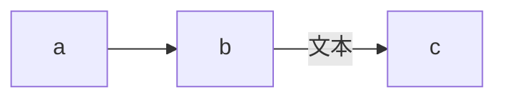
````

- [!] 粗实线箭头
````
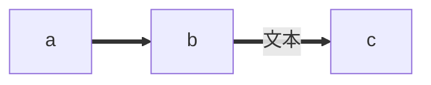
````

- [!] 虚线箭头
````
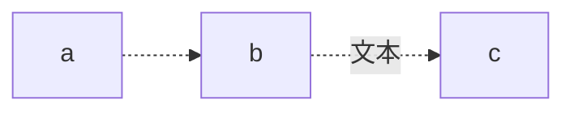
````

- [!] 无箭头线
````
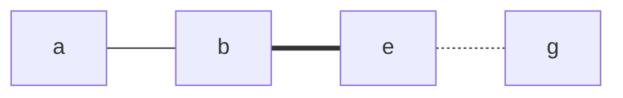
````

- [!] 其他连线
````
```mermaid
graph LR
	A o--o B
	B <-----> C      %%符号越长，连线越长%%
	C x--x D
```
````
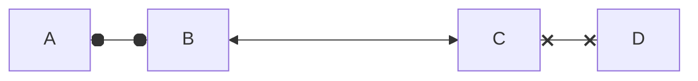
##### 🌑子图
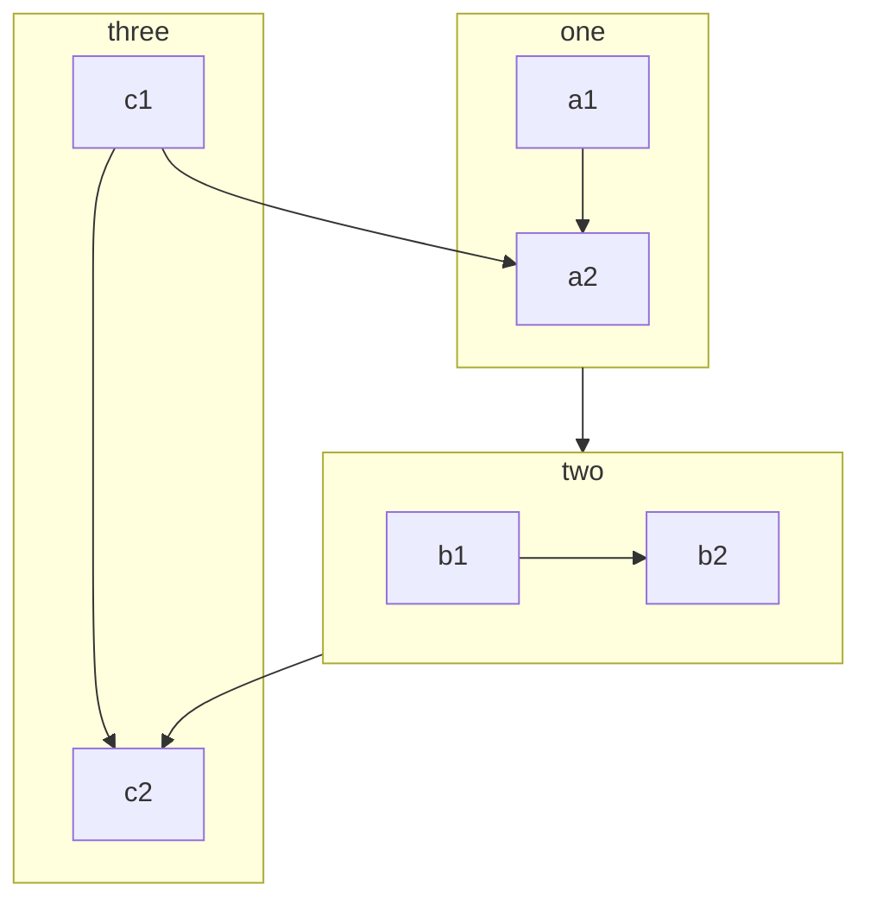

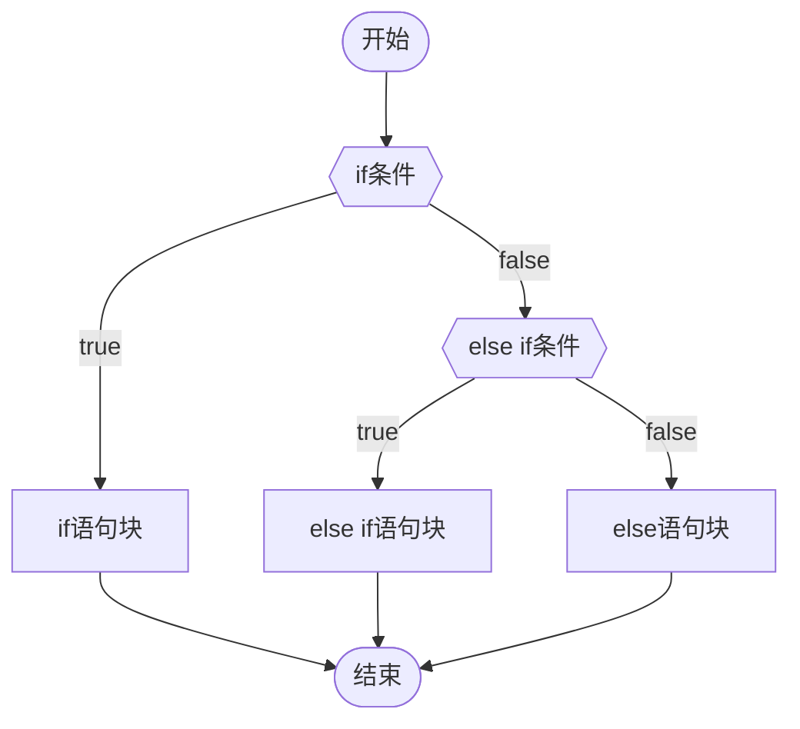
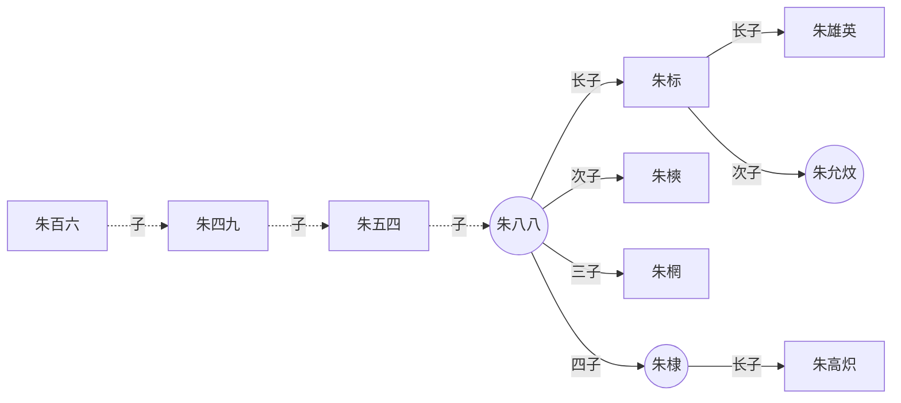
### 🌗饼图
````
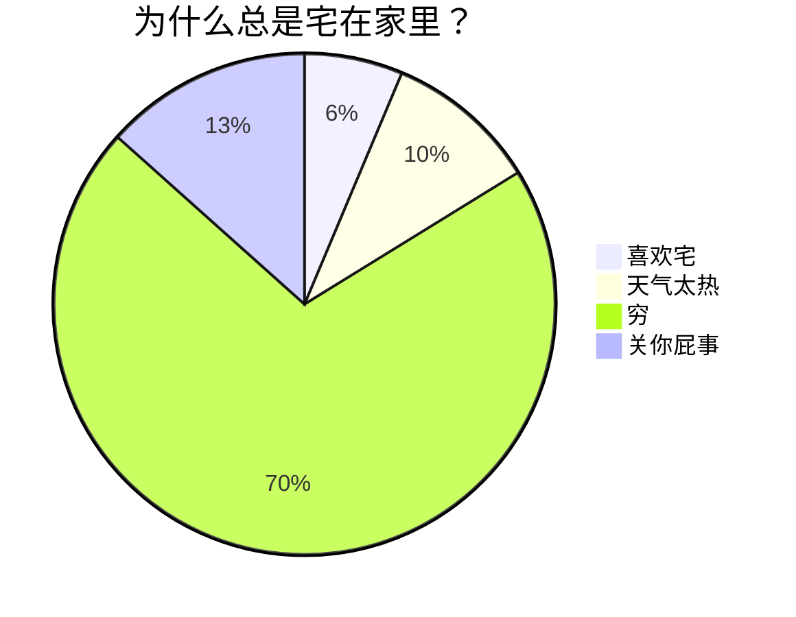
冒号后的数字最多支持2位小数
````

### 🌗时序图
### 🌗甘特图
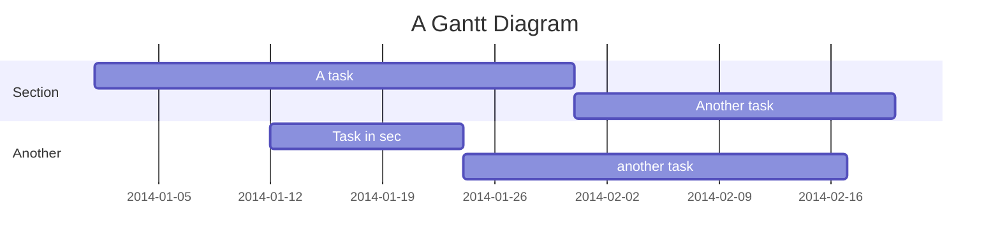
### 🌗类图
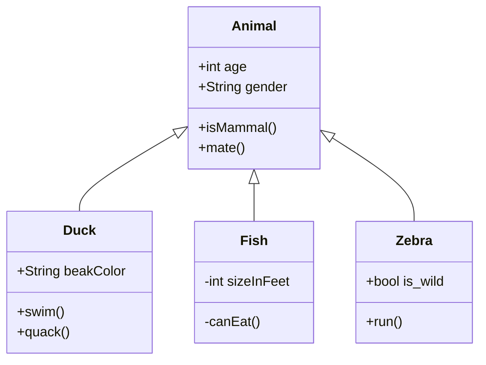
# 🌕数学公式
### 🌗行内公式
```
$x^2 + 2x + 5 + \sqrt x = 0$
$e^{i\pi} + 1 = 0$
$\ce{CO2 + C -> 2 CO}$
$\ce{2Mg + O2 ->[燃烧] 2 MgO}$
```
$x^2 + 2x + 5 + \sqrt x = 0$
$e^{i\pi} + 1 = 0$
$\ce{CO2 + C -> 2 CO}$
$\ce{2Mg + O2 ->[燃烧] 2 MgO}$
### 🌗公式块
$$
\ce{Zn^2+  <=>[+ 2OH-][+ 2H+]  $\underset{\text{amphoteres Hydroxid}}{\ce{Zn(OH)2 v}}$  <=>[+ 2OH-][+ 2H+]  $\underset{\text{Hydroxozikat}}{\ce{[Zn(OH)4]^2-}}$}
$$
$$
\begin{array}{lll}
\nabla\times E &=& -\;\frac{\partial{B}}{\partial{t}}   
\ \nabla\times H &=& \frac{\partial{D}}{\partial{t}}+J   
\ \nabla\cdot D &=& \rho
\ \nabla\cdot B &=& 0
\ \end{array}
$$
$$
i\hbar\frac{\partial \psi}{\partial t} = \frac{-\hbar^2}{2m} \left(\frac{\partial^2}{\partial x^2} + \frac{\partial^2}{\partial y^2}+\frac{\partial^2}{\partial z^2} \right) \psi + V \psi
$$

