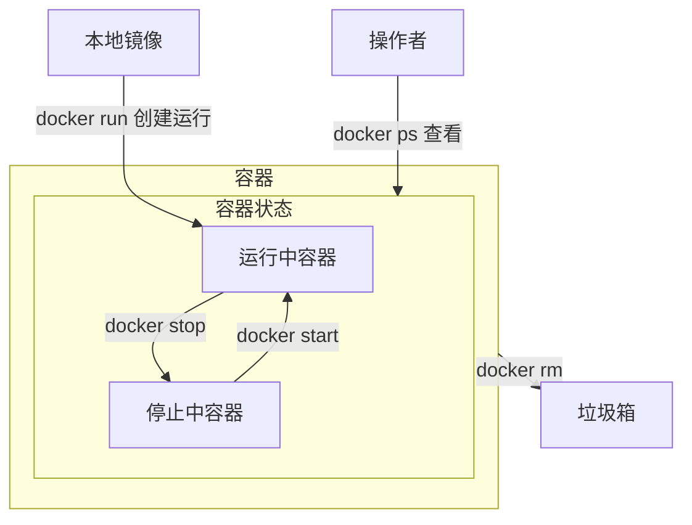

# 基本概念
## 什么是Docker
> Docker 是一个开源的容器化平台，**用于构建、部署和运行应用程序**。它提供了一种轻量级的虚拟化技术，允许将应用程序及其依赖项打包到一个<u>容器</u>中

>[!quote] 容器
>独立的运行环境

### 作用
- **容器化应用程序**：Docker 允许将应用程序及其所有依赖项打包到一个独立的容器中。容器可以在不同的环境中运行，而无需担心环境差异导致的问题，确保应用程序在任何地方都能一致运行。每个容器都是一个可隔离的、可移植的单元，具有自己的文件系统、运行时环境和资源
- **轻量级和快速启动**：与传统的虚拟机相比，Docker 容器非常轻量级，启动时间非常快

- **环境隔离**：Docker 容器提供了强大的隔离性，使应用程序可以在独立的环境中运行，互不干扰
- **可移植性**：Docker 容器可以在不同的平台和操作系统上运行，包括Linux，Windows，macOS……，这使得应用程序可以轻松地在开发、测试和生产环境之间进行迁移和部署
- **版本控制和复制**：Docker 使用镜像来构建容器。镜像是一个可重复的、可版本控制的文件，包含了应用程序的所有代码和依赖项
- **扩展性和弹性**：Docker 容器可以轻松地进行水平扩展，通过使用容器编排工具如Docker Compose，Kubernetes，可以实现自动化的容器管理和部署

## 体系结构


### 镜像 与 容器
>[!quote] 镜像
><u>镜像</u> 是一个只读的模板

>[!quote] 容器
><u>容器</u> 是一个运行实例【类似**类与实例的关系**】
>
>- <u>容器是一个隔离的环境，我的依赖跟你的依赖不冲突</u>【比如有一个 MySQL 服务，这个服务的内部容器端口永远是 3306，但是我可以使用端口映射创建两个 MySQL 服务，`docker run -p 3306:3306`，`docker run -p 3307:3306`】

>[!quote] 仓库
><u>仓库</u> 是用来存储，分享 Docker 镜像的地方【DockerHub……】

## Docker Engine
>Docker Engine 是 Docker 的核心部分，负责构建和容器化应用程序

### 安装 Docker
>[!hint] 以下配置均在 Ubuntu 中安装

- 卸载旧版本
```bash
for pkg in docker.io docker-doc docker-compose docker-compose-v2 podman-docker containerd runc; do sudo apt-get remove $pkg; done
```

- 卸载映像，容器，卷，网络【如果需要】
```bash
# 卸载 Docker Engine、CLI、containerd 和 Docker Compose 包
sudo apt-get purge docker-ce docker-ce-cli containerd.io docker-buildx-plugin docker-compose-plugin docker-ce-rootless-extras

# 删除所有映像、容器和卷
sudo rm -rf /var/lib/docker
sudo rm -rf /var/lib/containerd
```

- 使用 apt 存储库安装
```bash
# 添加 Docker 官方的 GPG 密钥
sudo apt-get update
sudo apt-get install ca-certificates curl
# 在 `/etc/apt/keyrings` 路径下创建目录，用于存放密钥环。`-m 0755` 设置了目录的权限【所有用户都可以读取或者进入该目录，只有拥有者可以写入数据】
sudo install -m 0755 -d /etc/apt/keyrings
# 下载密钥并保存到刚刚创建的目录
sudo curl -fsSL https://download.docker.com/linux/ubuntu/gpg -o /etc/apt/keyrings/docker.asc
# 修改了 `docker.asc` 文件的权限，使所有用户都可以读取该文件
sudo chmod a+r /etc/apt/keyrings/docker.asc

# 让系统知道从哪里下载Docker，并确保下载的是与系统架构和版本相匹配的Docker版本
echo \
  "deb [arch=$(dpkg --print-architecture) signed-by=/etc/apt/keyrings/docker.asc] https://download.docker.com/linux/ubuntu \
  $(. /etc/os-release && echo "$VERSION_CODENAME") stable" | \

sudo tee /etc/apt/sources.list.d/docker.list > /dev/null
# 更新系统的软件包列表，这样就可以从新添加的Docker仓库中获取Docker的最新版本
sudo apt-get update
```

- 安装 Docker 包
```bash
sudo apt-get install docker-ce docker-ce-cli containerd.io docker-buildx-plugin docker-compose-plugin

# 验证是否安装成功
docker version
sudo docker run hello-world
```

- 配置镜像加速 https://cr.console.aliyun.com/cn-hangzhou/instances/mirrors
	- 进入阿里云的容器镜像服务
	- 进入镜像工具的镜像加速器
	- 根据操作文档修改

#### 额外配置
> 额外的配置可以让我们在使用 Docker 时更加方便

---

- 以非 root 用户身份管理 Docker【可以在使用 Docker 命令时，不加 `sudo`】
	- 创建 Docker 组 `sudo groupadd docker`
	- 将用户添加到 docker 组 `sudo usermod -aG docker 用户`
	- 激活对组的更改 `newgrp docker`

---

### 容器化的步骤
>[!quote] Dockerfile
>Dockerfile 是一个文本文件，里面包含一系列指令，用来告诉 Docker 如何构建镜像

- 创建一个 Dockerfile
- 使用 Dockerfile 构建镜像
- 使用镜像创建，运行容器

### 数据卷
>容器中的数据不会<u>持久化</u>【容器一旦停止，容器的所有数据都会丢失】，而**数据卷 Volumes** 可以把容器中的指定路径映射到宿主机的某个位置，实现双向数据绑定，实现持久化

>[!hint] 在容器内修改文件是很困难的，因为从仓库中下载的镜像一般是可运行某个应用程序的最小镜像，不会包括 Vim 编辑器，**所以我们需要用数据卷 Volums** 进行映射，使用宿主机里的 Vim 编辑器进行修改

数据卷默认在宿主机的 `/var/lib/docker/volumes/数据卷名`

## Docker Compose
>如果多个容器之间需要相互关联【前端，后端，数据库，redis，负载均衡……】，那么就需要使用 Docker Compose

## Docker Desktop
>Docker Desktop = <u>Docker Engine</u> + <u>Docker Build</u> + <u>Docker Extensions</u> + <u>Docker Compose</u>

>[!warning] Linux 上安装的 Docker Desktop 会在这个 Linux 的基础上创建一个虚拟机，这个虚拟机是在 Docker Desktop 中运行的，而不是直接在 Linux 的 Docker 引擎上。所以<u>Linux 的 Docker Engine 上部署的镜像和容器</u>与<u> Linux 上安装的 Docker Desktop 里部署的镜像和容器</u>是独立的

>[!warning] Docker Desktop 只允许在本机中运行，不允许在虚拟机中运行


# Docker 命令
## 操作镜像
### docker pull
> `docker pull 镜像名` 可以从远程的 Docker 镜像仓库中下载 Docker 镜像到本地


### docker save，docker load
> - `docker save -o 文件名 镜像名` 可以把一个镜像保存为一个 `tar 文件`
> - `docker load -i 文件名` 可以从文件中导入一个镜像

```bash
docker save -o my_mysql.tar my_mysql

docker load -i my_mysql.tar
```

### docker images
>docker images 可以列出本地上所有的 Docker 镜像


### docker rmi
>`docker rmi 镜像名:版本号` 可以删除本地上的镜像


### docker build


### docker push


## 操作容器


### docker run
>[!hint] 运行 `docker run 镜像名称` 如果本地没有镜像，会自动去镜像仓库下载

- `docker run ……参数 镜像名称:[版本号]` 创建并运行一个容器【**版本号不写默认最新版**】
	- `-d` 在后台运行
	- `--name 容器名字` 设置容器的名字
	- `-p 主机端口号:容器端口号` 将<u>容器的端口</u>映射到<u>主机的端口</u>
	- `-e key=value` 配置环境变量【比如 MySQL 的账号密码，时区……】
	- `-v 数据卷名:容器内的目录` 挂载数据卷 ^131b42

```bash
docker run -d --name some-mysql -e MYSQL_ROOT_PASSWORD=my-secret-pw mysql:5.7
```


### docker stop
>`docker stop 容器名` 可以停止正在运行的 Docker 容器，**但是容器还在，没有删除**


### docker start
> `docker start 容器名` 可以启动被停止的 Docker 容器

### 查看
#### docker ps
> `docker ps` 可以列出当前正在运行的 Docker 容器

- 参数
	- `-a` 查看所有容器【包括停止的】

#### docker inspect
> `docker inspect 容器名` 可以详细的查看某个容器的信息

### docker rm
> docker rm 用来删除停止的容器

- 参数
	- `-f` 强制删除【可以删除正在运行的容器】


### docker logs
> `docker logs 容器名` 用于获取和查看 Docker 容器的日志

- 参数
	- `-f` 持续跟进日志


### docker exec
>[!hint] 容器就是虚拟了一个计算机，我们可以进入容器，去修改里面文件系统中的文件

> `docker exec [参数] 容器名 [命令]` 可以进入到容器的内部，来修改容器

- 参数
	- `-i` 允许提供输入给容器内部
	- `-t` 分配一个伪终端
- 命令
	- `bash` 在容器中打开一个交互式的 bash shell
	- `ls` 查看目录
	- ……

```bash
docker exec -it my_container bash
```

## 操作数据卷
>[!warning] 容器创建之后不能再挂载数据卷，只能在 `docker run` 的时候就挂载


---

- `docker volume create` 创建数据卷

---

### 挂载数据卷
[[#^131b42]] ，挂载数据卷时，如果没有数据卷，会自动创建数据卷，**所以 `docker volume create` 一般用不到**

```bash
docker run -d --name nginx -p 80:80 -v html:/usr/share/nginx/html nginx
```

---

- 查看
	- `docker volume ls` 查看所有数据卷
	- `docker volume inspect 数据卷名` 查看某个数据卷的详情【数据卷在宿主机的目录，……】

---

- 删除
	- `docker volume rm` 删除指定数据卷
	- `docker volume prune` 删除未使用的数据卷


