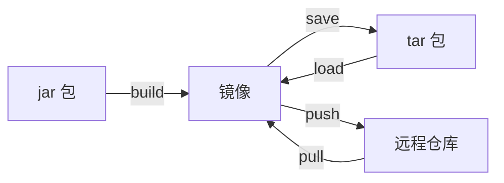
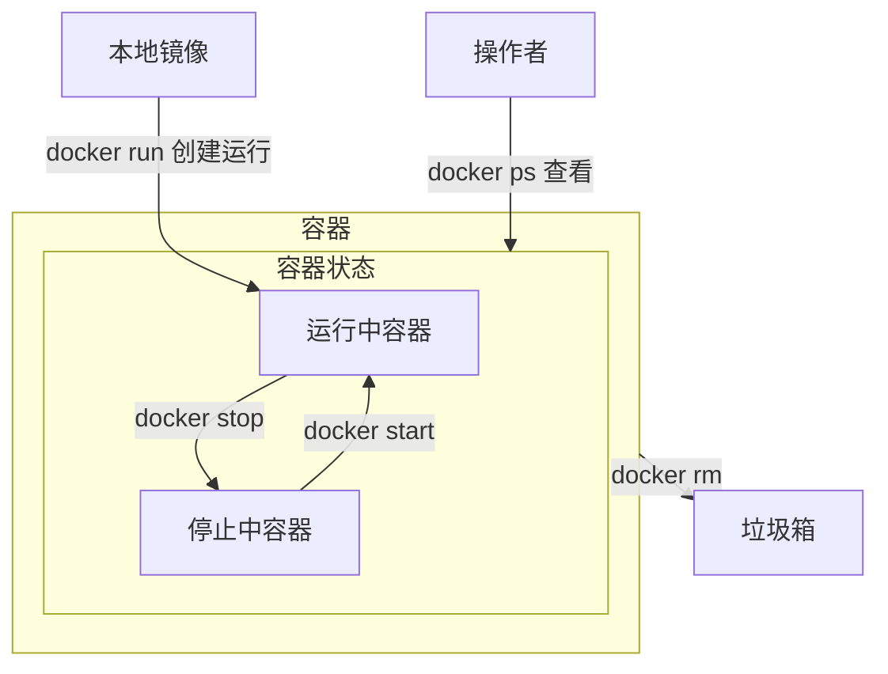

# Docker 的体系结构
>[!quote] Docker
> Docker 是一个开源的容器化平台，**用于构建、部署和运行应用程序**。它提供了一种轻量级的虚拟化技术，允许将应用程序及其依赖项打包到一个<u>容器</u>中

>[!quote] 容器
>独立的运行环境

---

>[!hint] 作用
> - **容器化应用程序**：Docker 允许将应用程序及其所有依赖项打包到一个独立的容器中。容器可以在不同的环境中运行，而无需担心环境差异导致的问题，确保应用程序在任何地方都能一致运行。每个容器都是一个可隔离的、可移植的单元，具有自己的文件系统、运行时环境和资源
> - **轻量级和快速启动**：与传统的虚拟机相比，Docker 容器非常轻量级，启动时间非常快
> 
> - **环境隔离**：Docker 容器提供了强大的隔离性，使应用程序可以在独立的环境中运行，互不干扰
> - **可移植性**：Docker 容器可以在不同的平台和操作系统上运行，包括Linux，Windows，macOS……，这使得应用程序可以轻松地在开发、测试和生产环境之间进行迁移和部署
> - **版本控制和复制**：Docker 使用镜像来构建容器。镜像是一个可重复的、可版本控制的文件，包含了应用程序的所有代码和依赖项
> - **扩展性和弹性**：Docker 容器可以轻松地进行水平扩展，通过使用容器编排工具如Docker Compose，Kubernetes，可以实现自动化的容器管理和部署

---


>[!quote] 镜像
><u>镜像</u> 是一个只读的模板

>[!quote] 容器
><u>容器</u> 是一个运行实例【类似**类与实例的关系**】
>
>- <u>容器是一个隔离的环境，我的依赖跟你的依赖不冲突</u>【比如有一个 MySQL 服务，这个服务的内部容器端口永远是 3306，但是我可以使用端口映射创建两个 MySQL 服务，`docker run -p 3306:3306`，`docker run -p 3307:3306`】

>[!quote] 仓库
><u>仓库</u> 是用来存储，分享 Docker 镜像的地方【DockerHub……】

---

>[!quote] Docker Engine
>Docker Engine 是 Docker 的核心部分，负责构建和容器化应用程序

# 安装 Docker Engine
>[!hint] 以下配置均在 Ubuntu 中安装

- 卸载旧版本
```bash
for pkg in docker.io docker-doc docker-compose docker-compose-v2 podman-docker containerd runc; do sudo apt-get remove $pkg; done
```

- 卸载映像，容器，卷，网络【如果需要】
```bash
# 卸载 Docker Engine、CLI、containerd 和 Docker Compose 包
sudo apt-get purge docker-ce docker-ce-cli containerd.io docker-buildx-plugin docker-compose-plugin docker-ce-rootless-extras

# 删除所有映像、容器和卷
sudo rm -rf /var/lib/docker
sudo rm -rf /var/lib/containerd
```

- 使用 apt 存储库安装
```bash
# 添加 Docker 官方的 GPG 密钥
sudo apt-get update
sudo apt-get install ca-certificates curl
# 在 `/etc/apt/keyrings` 路径下创建目录，用于存放密钥环。`-m 0755` 设置了目录的权限【所有用户都可以读取或者进入该目录，只有拥有者可以写入数据】
sudo install -m 0755 -d /etc/apt/keyrings
# 下载密钥并保存到刚刚创建的目录
sudo curl -fsSL https://download.docker.com/linux/ubuntu/gpg -o /etc/apt/keyrings/docker.asc
# 修改了 `docker.asc` 文件的权限，使所有用户都可以读取该文件
sudo chmod a+r /etc/apt/keyrings/docker.asc

# 让系统知道从哪里下载Docker，并确保下载的是与系统架构和版本相匹配的Docker版本
echo "deb [arch=$(dpkg --print-architecture) signed-by=/etc/apt/keyrings/docker.asc] https://download.docker.com/linux/ubuntu $(. /etc/os-release && echo "$VERSION_CODENAME") stable" | sudo tee /etc/apt/sources.list.d/docker.list > /dev/null

# 更新系统的软件包列表，这样就可以从新添加的Docker仓库中获取Docker的最新版本
sudo apt-get update
```

- 安装 Docker 包
```bash
sudo apt-get install docker-ce docker-ce-cli containerd.io docker-buildx-plugin docker-compose-plugin

# 验证是否安装成功
docker version
```

>[!hint] 配置镜像加速
> ```bash
> # 创建文件
> sudo nano /etc/docker/daemon.json
> 
> # 往 daemon.json 这个文件中添加内容
> {
>   "registry-mirrors": [
>     "https://hub.uuuadc.top",
>     "https://docker.anyhub.us.kg",
>     "https://dockerhub.jobcher.com",
>     "https://dockerhub.icu",
>     "https://docker.ckyl.me",
>     "https://docker.awsl9527.cn"
>   ]
> }
> ```

>[!hint] 额外配置
>>额外的配置可以让我们在使用 Docker 时更加方便
>
> - 以非 root 用户身份管理 Docker【可以在使用 Docker 命令时，不加 `sudo`】
> 	- 创建 Docker 组 `sudo groupadd docker`
> 	- 将用户添加到 docker 组 `sudo usermod -aG docker 用户`
> 	- 激活对组的更改 `newgrp docker`

# ❤ 在 win 上的 docker
docker 命令在 win 上运行时，由于 Windows 独特的文件路径，`-v` 挂载会出问题，以下是一个正确的示例：

```bash
# 这样写是为了可读性，实际在win上运行时，只支持一行写完命令，而不是多行
docker run -d --name kafka-server \
	-p 9092:9092 \
	-e KAFKA_CFG_NODE_ID=0 \
	-e KAFKA_CFG_PROCESS_ROLES="controller,broker" \
	-e KAFKA_CFG_LISTENERS="PLAINTEXT://:9092,CONTROLLER://:9093" \
	-e KAFKA_CFG_LISTENER_SECURITY_PROTOCOL_MAP="PLAINTEXT:PLAINTEXT,CONTROLLER:PLAINTEXT" \
	-e KAFKA_CFG_CONTROLLER_QUORUM_VOTERS="0@localhost:9093" \
	-e KAFKA_CFG_CONTROLLER_LISTENER_NAMES="CONTROLLER" \
	-v "D:/文档/docker binds/kafka:/opt/bitnami/kafka" \
	bitnami/kafka:latest
```


# ❤ 镜像
## 💛 制作镜像
### 根据 Dockerfile 制作镜像
[https://www.runoob.com/docker/docker-dockerfile.html](https://www.runoob.com/docker/docker-dockerfile.html)

>[!quote] Dockerfile
>Dockerfile 是一个文本文件，里面包含一系列指令，用来告诉 Docker 如何构建镜像
>
>- 指令
>	- `FROM` 指定基础镜像
>	- `EVN` 设置环境变量
>	- `COPY` 拷贝本地文件到镜像目录里，`COPY 本地文件 镜像目录`
>	- `RUN` 将拷贝的文件在 Linux 里解压缩……，`RUN tar -zxvf 文件……`
>	- `EXPOSE` 指定容器运行时的端口号，`EXPOSE 端口号`
>	- `ENTRYPOINT` <u>入口命令</u>【应用程序启动的命令，比如 Java 是 `java -jar jar包`】

- 创建一个 Dockerfile
```dockerfile
# 定义基础镜像
FROM openjdk:17-alpine
# 设置时区
ENV TZ=Asia/Shanghai
RUN ln -snf /usr/share/zoneinfo/$TZ /etc/localtime && echo $TZ > /etc/timezone
# 将跟Dockerfile同一路径下的jar包，拷贝到Docker镜像的根目录下
COPY docker-demo.jar /app.jar
# 入口
ENTRYPOINT ["java", "-jar", "/app.jar"]
```

- 将 Dockerfile 和 jar 包放到同一目录下

- 在该目录下，使用 Dockerfile 构建镜像
```bash
docker build -t demo:1.0 .
```

### 根据容器实例构建镜像
- `docker commit 容器id/名称` 将运行中的容器快照生成为一个新的镜像
	- `-a 镜像作者` 
	- `-m '说明信息'`

## 💛 操作镜像


- **创建**
	- `docker build Dockerfile所在的目录` 根据 Dockerfile 构建镜像
		- `-t 镜像名称:版本号` 指定镜像名，和<u>版本号</u>【不指定默认为 latest】

```bash
# . 表示Dockerfile就在当前目录
docker build -t demo:1.0 .
```

---

- **获取/推送**
	- 从 tar 包获取/打包
		- `docker save -o 文件名 镜像名` 把一个镜像保存为一个 `tar 文件`
		- `docker load -i 文件名` 从文件中导入一个镜像
	- 从远程仓库获取/推送
		- 【获取】
			- `docker pull 镜像名` 从远程的 Docker 镜像仓库中下载 Docker 镜像到本地
		- 【推送】
			- `docker login` 
			- `docker push 用户名/仓库名:版本号` 

```bash
# save，load
docker save -o my_mysql.tar my_mysql

docker load -i my_mysql.tar
```

```bash
# 进行登录
docker login

# 推送到dockerhub
# docker push 用户名/仓库名:版本号
docker push 1962883041612/ltzf-interface
```

---

- **查看**
	- `docker images` 列出本地上所有的 Docker 镜像
	- `docker image inspect 镜像名` 查看镜像的信息，例如版本号 ……
- **删除**
	- `docker rmi 镜像名:版本号` 删除本地上的镜像

# ❤ 容器


---

>[!hint] 运行 `docker run 镜像名称` 如果本地没有镜像，会自动去镜像仓库下载

- **创建并运行**：`docker run ……参数 镜像名称:[版本号]` 【**版本号不写默认最新版**】
	- `-d` 在后台运行
	- `--name 容器名字` 设置容器的名字
	- `-p 主机号:主机端口号:容器端口号` 将<u>容器的端口</u>映射到<u>主机的端口</u>，~~主机号表示只有某个 IP 地址可以访问到该容器服务，可选~~
		- `docker run -d -p 127.0.0.1:8080:80` 只有宿主机可以直接访问到该容器服务
	- `-P` 让 Docker 为你随机分配端口
	- `-e key=value` 配置环境变量【比如 MyzSQL 的账号密码，时区……】
	- `-v 数据卷名:绝对容器内的目录` 挂载数据卷 ^131b42
	- `-v 绝对本地目录:绝对容器内的目录` 将容器内目录直接挂载到本地目录【不用数据卷】 ^ca483a
	- `--privileged=true` 可以让容器操作宿主机【不推荐使用】
	- `--restart=always` 如果容器停止，总是重新启动容器

```bash
docker run -d --name some-mysql -e MYSQL_ROOT_PASSWORD=my-secret-pw -p 3306:3306 mysql:5.7
```

---

- **启动/停止**
	- `docker restart 容器名` 重启某个容器，可以重新加载配置文件
	- `docker stop 容器名` 停止正在运行的 Docker 容器【**但是容器还在，没有删除**】
	- `docker start 容器名` 启动被停止的 Docker 容器
- **查看**
	- `docker ps` 列出当前正在运行的 Docker 容器
		- `-a` 查看所有容器【包括停止的】
	- `docker inspect 容器名` 详细的查看某个容器的信息【某个容器数据卷挂载的情况……】
	- `docker logs 容器名` 获取和查看 Docker 容器的日志
		- `-f` 持续跟进日志
	- `docker top 容器名` 查看容器内运行的进程，及其 PID
	- `docker stats 容器名` 查看容器的实时资源使用情况，包括 CPU，内存，IO ……
- **删除**
	- `docker rm` 删除停止的容器
		- `-f` 强制删除【可以删除正在运行的容器】

---

>[!hint] 容器就是虚拟了一个计算机，我们可以进入容器，去修改里面文件系统中的文件

- **进入容器**：`docker exec [参数] 容器名 [命令]` 可以进入到容器的内部，来修改容器
	- 参数
		- `-i` 允许提供输入给容器内部
		- `-t` 分配一个伪终端
	- 命令
		- `bash` 在容器中打开一个交互式的 bash shell
		- `ls` 查看目录
		- ……

```bash
docker exec -it my_container bash
```

# ❤ 挂载
**挂载有两个原因**：
- 在容器内修改文件是很困难的，~~因为从仓库中下载的镜像一般是可运行某个应用程序的最小镜像，不会包括 Vim 编辑器~~
- 我们需要持久化文件

**挂载有两种方式**：
- 【挂载到数据卷】 ：数据卷 Volumes 可以把容器中的指定路径映射到宿主机的某个位置，实现双向数据绑定，实现持久化
	- 数据卷默认在宿主机的 `/var/lib/docker/volumes/数据卷名`
	- 由于数据卷存储在宿主机上的 <u>只有 root 用户 </u> 才可以访问的位置，我们频繁修改文件非常不方便，所以**一般我们会使用直接挂载到本地目录**
- 【直接挂载到本地目录】==常用== ： 直接挂载到本地目录可以任意指定挂载的地方，方便访问和修改

---

## 复制
- `docker cp 容器名:容器内文件 宿主机文件` 将容器内的文件复制到宿主机上

## 数据卷
>[!warning] 容器创建之后不能再挂载数据卷，只能在 `docker run` 的时候就挂载


---

- `docker volume create` 创建数据卷

- [[#^131b42]] ，挂载数据卷时，如果没有数据卷，会自动创建数据卷

```bash
docker run -d --name nginx -p 80:80 -v html:/usr/share/nginx/html nginx
```

- 查看
	- `docker volume ls` 查看所有数据卷
	- `docker volume inspect 数据卷名` 查看某个数据卷的详情【数据卷在宿主机的目录，……】
- 删除
	- `docker volume rm` 删除指定数据卷
	- `docker volume prune` 删除未使用的数据卷

## 本地目录
具体操作：[[#^ca483a]]

```bash
docker run -d --name mysql -p 3306:3306 -e TZ=Asia/Shanghai -e MYSQL_ROOT_PASSWORD=13433026660 -v ./mysql/data:/var/lib/mysql -v ./mysql/conf:/etc/mysql/conf.d -v ./mysql/init:/docker-entrypoint-initdb.d mysql
```

# ❤ 容器通信
[https://blog.csdn.net/d2916172682/article/details/135640415](https://blog.csdn.net/d2916172682/article/details/135640415)

- **创建网络**
	- `docker network create 网络名`
		- `-d 网络类型` 网络驱动类型可以是 bridge ，overlay ……

```bash
docker network create -d bridge test-net
```

---

- **连接网络**
```bash
docker run -itd --name test1 --network test-net ubuntu /bin/bash

docker run -itd --name test2 --network test-net ubuntu /bin/bash
```

>[!hint] 如果你有多个容器之间需要互相连接，推荐使用 Docker Compose

# ❤ 异常
```
(HTTP code 500) server error - Ports are not available: exposing port TCP 0.0.0.0:6379 -> 0.0.0.0:0: listen tcp 0.0.0.0:6379: bind: An attempt was made to access a socket in a way forbidden by its access permissions.

解决办法：
- 管理员身份运行 cmd
- net stop winnat
- net start winnat
```


---

For a better experience on WSL, consider enabling the WSL [autoMemoryReclaim 3](https://learn.microsoft.com/en-us/windows/wsl/wsl-config) setting available since WSL 1.3.10 (experimental).

This feature causes the Windows host to better reclaim unused memory inside the WSL virtual machine, thereby resulting in better memory availability to other host applications. This is particularly helpful with Docker Desktop, since otherwise the WSL VM may consume large amounts (GBs) of memory in the Linux kernel’s page cache as Docker builds container images, without ever returning that memory to the host when it becomes unused inside the VM.

感觉你可以尝试下在 .wslconfig 文件里加上如下配置：
`[experimental] autoMemoryReclaim=dropcache`

