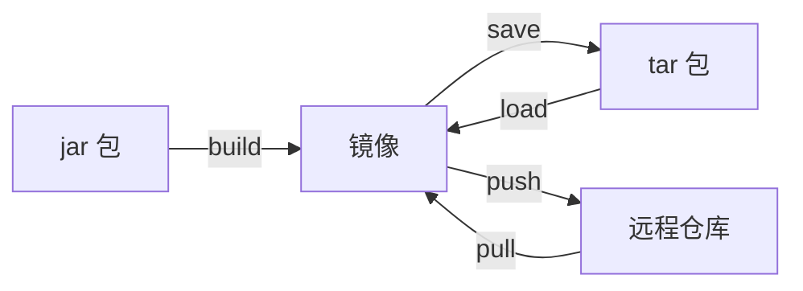
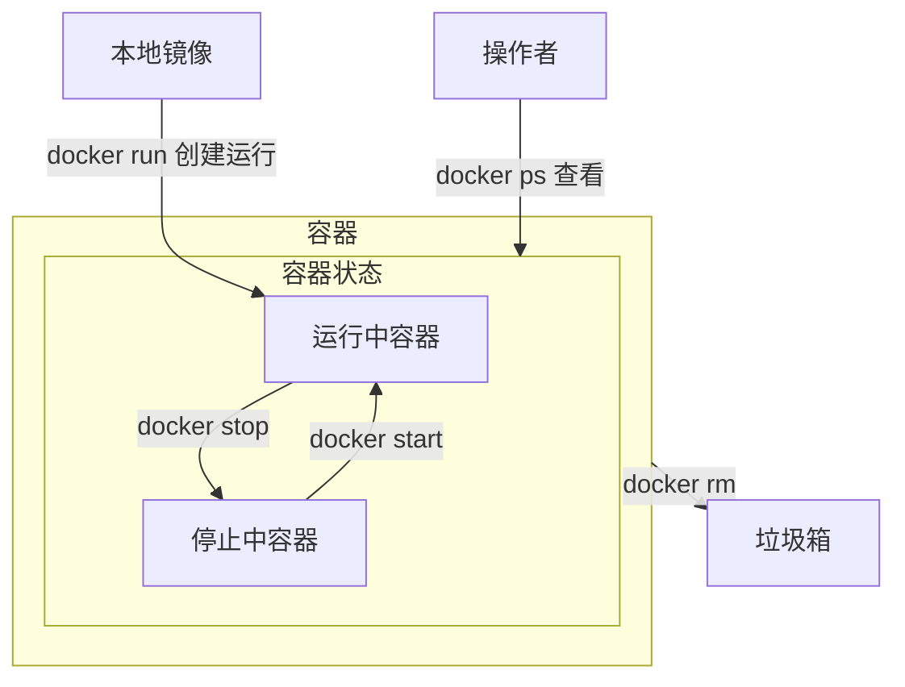

>[!quote] Docker
> Docker 是一个开源的容器化平台，**用于构建、部署和运行应用程序**。它提供了一种轻量级的虚拟化技术，允许将应用程序及其依赖项打包到一个<u>容器</u>中

>[!quote] 容器
>独立的运行环境

---

>[!hint] 作用
> - **容器化应用程序**：Docker 允许将应用程序及其所有依赖项打包到一个独立的容器中。容器可以在不同的环境中运行，而无需担心环境差异导致的问题，确保应用程序在任何地方都能一致运行。每个容器都是一个可隔离的、可移植的单元，具有自己的文件系统、运行时环境和资源
> - **轻量级和快速启动**：与传统的虚拟机相比，Docker 容器非常轻量级，启动时间非常快
> 
> - **环境隔离**：Docker 容器提供了强大的隔离性，使应用程序可以在独立的环境中运行，互不干扰
> - **可移植性**：Docker 容器可以在不同的平台和操作系统上运行，包括Linux，Windows，macOS……，这使得应用程序可以轻松地在开发、测试和生产环境之间进行迁移和部署
> - **版本控制和复制**：Docker 使用镜像来构建容器。镜像是一个可重复的、可版本控制的文件，包含了应用程序的所有代码和依赖项
> - **扩展性和弹性**：Docker 容器可以轻松地进行水平扩展，通过使用容器编排工具如Docker Compose，Kubernetes，可以实现自动化的容器管理和部署

## 体系结构


>[!quote] 镜像
><u>镜像</u> 是一个只读的模板

>[!quote] 容器
><u>容器</u> 是一个运行实例【类似**类与实例的关系**】
>
>- <u>容器是一个隔离的环境，我的依赖跟你的依赖不冲突</u>【比如有一个 MySQL 服务，这个服务的内部容器端口永远是 3306，但是我可以使用端口映射创建两个 MySQL 服务，`docker run -p 3306:3306`，`docker run -p 3307:3306`】

>[!quote] 仓库
><u>仓库</u> 是用来存储，分享 Docker 镜像的地方【DockerHub……】


# Docker 命令
## 操作镜像


- **创建**
	- `docker build Dockerfile所在的目录` 根据 Dockerfile 构建镜像
		- `-t 镜像名称:版本号` 指定镜像名，和<u>版本号</u>【不指定默认为 latest】
- **获取/推送**
	- 从 tar 包获取/打包
		- `docker save -o 文件名 镜像名` 把一个镜像保存为一个 `tar 文件`
		- `docker load -i 文件名` 从文件中导入一个镜像
	- 从远程仓库获取/推送
		- `docker push` 
		- `docker pull 镜像名` 从远程的 Docker 镜像仓库中下载 Docker 镜像到本地
- **查看**
	- `docker images` 列出本地上所有的 Docker 镜像
- **删除**
	- `docker rmi 镜像名:版本号` 删除本地上的镜像

```bash
# . 表示Dockerfile就在当前目录
docker build -t demo:1.0 .
```

```bash
# save，load
docker save -o my_mysql.tar my_mysql

docker load -i my_mysql.tar
```

## 操作容器


---

>[!hint] 运行 `docker run 镜像名称` 如果本地没有镜像，会自动去镜像仓库下载

- **创建并运行**：`docker run ……参数 镜像名称:[版本号]` 【**版本号不写默认最新版**】
	- `-d` 在后台运行
	- `--name 容器名字` 设置容器的名字
	- `-p 主机端口号:容器端口号` 将<u>容器的端口</u>映射到<u>主机的端口</u>
	- `-e key=value` 配置环境变量【比如 MySQL 的账号密码，时区……】
	- `-v 数据卷名:绝对容器内的目录` 挂载数据卷 ^131b42
	- `-v 绝对本地目录:绝对容器内的目录` 将容器内目录直接挂载到本地目录【不用数据卷】 ^ca483a
	- `--privileged=true` 可以让容器操作宿主机【不推荐使用】
	- `--restart=always` 如果容器停止，总是重新启动容器

```bash
docker run -d --name some-mysql -e MYSQL_ROOT_PASSWORD=my-secret-pw -p 3306:3306 mysql:5.7
```

---

- **启动/停止**
	- `docker restart 容器名` 重启某个容器，可以重新加载配置文件
	- `docker stop 容器名` 停止正在运行的 Docker 容器【**但是容器还在，没有删除**】
	- `docker start 容器名` 启动被停止的 Docker 容器
- **查看**
	- `docker ps` 列出当前正在运行的 Docker 容器
		- `-a` 查看所有容器【包括停止的】
	- `docker inspect 容器名` 详细的查看某个容器的信息【某个容器数据卷挂载的情况……】
	- `docker logs 容器名` 获取和查看 Docker 容器的日志
		- `-f` 持续跟进日志
	- `docker top 容器名` 查看容器内运行的进程，及其 PID
	- `docker stats 容器名` 查看容器的实时资源使用情况，包括 CPU，内存，IO ……
- **删除**
	- `docker rm` 删除停止的容器
		- `-f` 强制删除【可以删除正在运行的容器】

---

>[!hint] 容器就是虚拟了一个计算机，我们可以进入容器，去修改里面文件系统中的文件

- **进入容器**：`docker exec [参数] 容器名 [命令]` 可以进入到容器的内部，来修改容器
	- 参数
		- `-i` 允许提供输入给容器内部
		- `-t` 分配一个伪终端
	- 命令
		- `bash` 在容器中打开一个交互式的 bash shell
		- `ls` 查看目录
		- ……

```bash
docker exec -it my_container bash
```

## 挂载
### 复制
- `docker cp 容器名:容器内文件 宿主机文件` 将容器内的文件复制到宿主机上

### 数据卷
>[!warning] 容器创建之后不能再挂载数据卷，只能在 `docker run` 的时候就挂载


---

- `docker volume create` 创建数据卷

- [[#^131b42]] ，挂载数据卷时，如果没有数据卷，会自动创建数据卷

```bash
docker run -d --name nginx -p 80:80 -v html:/usr/share/nginx/html nginx
```

- 查看
	- `docker volume ls` 查看所有数据卷
	- `docker volume inspect 数据卷名` 查看某个数据卷的详情【数据卷在宿主机的目录，……】
- 删除
	- `docker volume rm` 删除指定数据卷
	- `docker volume prune` 删除未使用的数据卷

### 本地目录
具体操作：[[#^ca483a]]

```bash
docker run -d --name mysql -p 3306:3306 -e TZ=Asia/Shanghai -e MYSQL_ROOT_PASSWORD=13433026660 -v ./mysql/data:/var/lib/mysql -v ./mysql/conf:/etc/mysql/conf.d -v ./mysql/init:/docker-entrypoint-initdb.d mysql
```


---

For a better experience on WSL, consider enabling the WSL [autoMemoryReclaim 3](https://learn.microsoft.com/en-us/windows/wsl/wsl-config) setting available since WSL 1.3.10 (experimental).

This feature causes the Windows host to better reclaim unused memory inside the WSL virtual machine, thereby resulting in better memory availability to other host applications. This is particularly helpful with Docker Desktop, since otherwise the WSL VM may consume large amounts (GBs) of memory in the Linux kernel’s page cache as Docker builds container images, without ever returning that memory to the host when it becomes unused inside the VM.

感觉你可以尝试下在 .wslconfig 文件里加上如下配置：
`[experimental] autoMemoryReclaim=dropcache`


