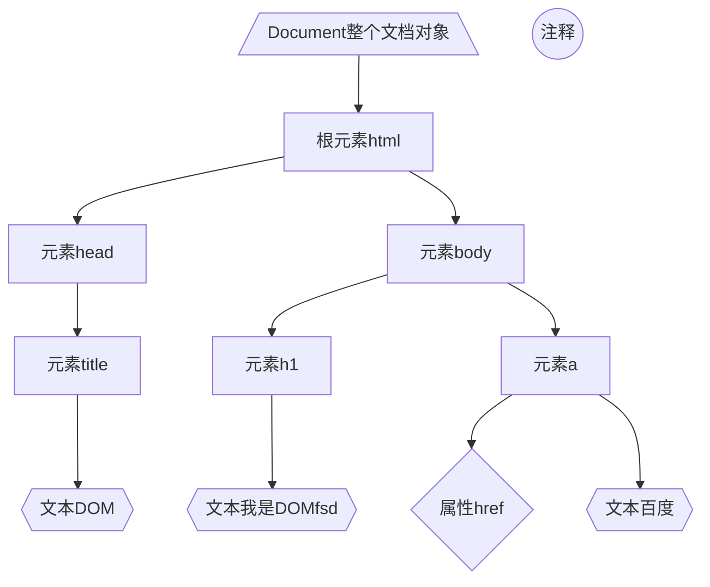

# 引入方式

### 定义在HTML文件中
```html
<script>
	…………
</script>
```
***一般放置在\<body\>的底部***
### 定义在外部的.js文件中
```html
<script src="demo.js"></script>
```
```js
…………
```

# 基础语法

### 注释，流程控制语句
与Java相同
### 输出语句
- `alert` 
  ***会在浏览器弹出警告框***
  ```js
  alert("hello javascript");
  ```
  ![[Excalidraw/计算机/JavaWeb.md#^group=L84gWEf4]]
- `document.write` 
  ***会把内容直接写入到浏览器里显示***
- `console.log` 
  ***写入浏览器的控制台***
### 变量
##### var
```js
var a = 20;
a = "张三"；
```

- ***var可以存放不同类型的值***
- var不管在哪里定义，都是全局变量
  ```js
{
  var a = 10;
}
alert(a);
  ```
- var可以重复定义
  ```js
{
  var a = 10;
  var a = "js";
}
  ```
##### let
- ***定义的是局部变量***
- 不可以重复声明
##### const
- 定义常量，不可修改
### 数据类型
```js
    alert(typeof 1);  //number
    alert(typeof "1");  //string
    alert(typeof true);  //boolean
    alert(typeof null);  //object

    var a;
    alert(typeof a);  //undefined（变量未被初始化，则为undefined）
```
##### 类型转换
###### string转number
```js
alert(parseInt("123"));  //123
alert(parseInt("123A34"));  //123
alert(parseInt("A123"));  //NaN
```
###### 其他类型转Boolean
number：0和NaN为`false`，其他为`true`
string：空字符为`false`，其他为`true`
null：均为`false`
undefined：均为`false`
### 比较运算符
`==` 会在比较之前进行类型转换
`===` 只进行比较，不进行类型转换
```js
    var a = 10;
    alert(a == "10");  // true
    alert(a === "10");  // false
    alert(a === 10);  // true
```
# 函数
### 定义函数
- 无需写返回值，直接在函数体内`return`，如果无需返回值则不写
- 参数无需写数据类型【因为JavaScript是弱类型语言】
```js
function 函数名(参数1, 参数2……){
	函数体
}
```
### 调用函数
`var result = add(10, 20);`

***调用函数时可以指定任意数量的参数***
```js
var result = add(10, 20, 30, 40);
alert(result);  //30
```
# 对象
### Array
***数组的长度可变**
***数组里元素的数据类型可以不一样***
##### 定义
- `var 变量名 = new Array(1, 2, 3, 4);`
- `var 变量名 = [1, 2, 3, 4];`
##### 访问
`变量名[索引]`
##### 添加元素
```js
var arr = new Array(1, 2, 3, 4);
arr.push(5, 6, 7);  //可以添加多个元素到数组的尾部
```
##### 删除
```js
var arr = new Array(1, 2, 3, 4);
arr.splice(3, 2);  //从索引3开始删，删2个 
```
##### 遍历
###### 遍历所有
```js
var arr = new Array(1, 2, 3, 4);
for (let i = 0; i < arr.length; i++) {
	console.log(arr[i]);
}
```
###### 遍历有值的元素
```js
var arr = new Array(1, 2, 3, 4);
arr.foreach(function (e){
	console.log(e);
})
```
### String
>[!summary]
>length()  获取字符串长度
>charAt()  返回指定位置的字符
>indexOf()  检索字符串
>trim()  去除字符串两边的空格
>substring()  提取字符串中两个指定索引之间的字符

```js
var str = "javascript";
console.log(str.length);
console.log(str.charAt(2));
console.log(str.indexOf("sc"));
console.log(str.substring(2, 4));

10
v
4
va
```
### 自定义对象
##### 定义
```js
var 对象名 = {
	属性名1: 属性值1,
	属性名2: 属性值2,
	函数名称: function(参数……){
		函数体
	}
}
```
##### 调用
```js
对象名.属性名;
对象名.函数名();
```

```js
var p1 = {
	name: "吴彦祖",
	age: 48,
	handsome(a) {
		console.log(a);
	}
}

console.log(p1.name);
p1.handsome("帅气");


吴彦祖
帅气   
```
### JSON
JSON是存储和传输数据的字符串
##### 书写格式
```js
var jsonstr = '{"name":"吴彦祖","age":48,"isman":true,"works":["新警察故事","环游地球80天"]}';
```
##### JSON转JS对象
`JS js = JSON.parse(JSON json);`
```js
var jsonstr = '{"name":"吴彦祖","age":48,"isman":true,"works":["新警察故事","环游地球80天"]}';
var obj = JSON.parse(jsonstr);
console.log(obj.name);


吴彦祖
```
##### JS对象转JSON
`JSON json = JSON.stringify(JS js);`
```js
var jsonstr = '{"name":"吴彦祖","age":48,"isman":true,"works":["新警察故事","环游地球80天"]}';
var obj = JSON.parse(jsonstr);

var json = JSON.stringify(obj);
console.log(json);


{"name":"吴彦祖","age":48,"isman":true,"works":["新警察故事","环游地球80天"]}
```
### BOM
BOM是浏览器对象模型，允许JavaScript与浏览器对话
##### Window 浏览器窗口对象
>[!summary]
>window.history  返回窗口的History对象
>window.location  返回窗口的Location对象
>window.navigator  返回窗口的Navigator对象
>window.screen 返回窗口的Screen对象
>
>alert()  显示带有消息和确定按钮的警报框
>confirm()  显示包含消息以及确定和取消按钮的对话框。根据点击返回***true***或***false***
>setInterval(函数名,周期)  周期性执行指定的代码
>setTimeout(函数名,延迟数值)  在经过指定的时间之后执行代码

###### alert()

###### confirm()
```js
confirm("hello javascript!\nhello javascript!");
```
![[Excalidraw/计算机/JavaWeb.md#^group=7iLBg2GO]]

```js
let text;
if (confirm("点击按钮") == true) {
	text = "你点了确定";
} else {
	text = "你点了取消";
}

console.log(text);
```
###### setInterval
```js
setInterval(() => {
	alert("hello");
}, 2000);


每隔2秒弹出hello
```
###### setTimeout
```js
setTimeout(() => {
	alert("hello");
}, 2000);


打开网页后延迟2秒会弹出hello
```
##### Navigator 浏览器对象

##### Screen 屏幕对象

##### History 历史记录对象

##### Location 地址栏对象
>[!summary]
>location.href	获取整个URL

```js
alert("我们要去百度了")
location.href = "https://www.baidu.com/";


点击完提示框后，会自动跳转到baidu的官网
```
### DOM
当 HTML 文档加载到 Web 浏览器中时，它就变成了一个DOM
##### 核心DOM
核心DOM是DOM的通用规范
- Document 整个文档对象
- Element 元素对象
- Attribute 属性对象
- Text 文本对象
- Comment 注释对象
```html
<html>
	<head>
		<title>DOM</title>
	</head>           <!--注释-->
	<body>
		<h1>我是DOM</h1>
		<a href="https://www.baidu.com/">百度</a>
	</body>
</html>
```

##### XML DOM
专门用于XML文件的DOM规范
##### HTML DOM
HTML DOM是专门用于HTML的DOM规范，***其中把每个HTML标签都封装成了一个元素***
>[!summary] 属性
>innerHTML  设置或返回元素的内容

>[!summary] 方法
>getElementById()	 返回拥有指定***id属性***的单个Element元素
>getElementsByClassName()  返回指定***类名***的Element对象数组
>getElementsByName()  返回***name属性***的Element对象数组
>getElementsByTagName()  返回指定***标签名称***的Element对象数组
>
>Element.innerHTML	设置或返回元素的内容

###### HTMLParagraphElement
```html
<body>
	<p id="p2">责任编辑：指数爆炸</p>
</body>

<script>
    var ide = document.getElementById("p2")  //现在已经拿到了这个对象了
    alert(ide);
    
    ide.innerHTML = "指数爆炸";  //会把<p>里的内容修改成“指数爆炸”
</script>


[object HTMLParagraphElement]
```
###### HTMLImageElement
>[!summary] 属性
>src  设置或返回图像的 src 属性值


```html
<body>
	
	
</body>

<script>
    var imges = document.getElementByClassName("img");
    for(int i=0; i<imges.length; i++){
	    alert(imges[i]);
    }
</script>


[object HTMLImageElement]
[object HTMLImageElement]
```
###### HTMLInputElement
>[!summary] 属性
>checked  设置或返回复选框的选中状态

```html
<body>
<input type="hidden" name="id" value="1">
</body>

<script>
    var namees = document.getElementsByName("id");
    for (var i = 0; i < namees.length; i++) {
        alert(namees[i]);
    }
</script>


[object HTMLInputElement]
```
###### HTMLDivElement
```html
<body>
	<div>
		…………
	</div>
</body>

<script>
    var tages = document.getElementsByTagName("div");
    for (var i = 0; i < namees.length; i++) {
        alert(tages[i]);
    }
</script>


[object HTMLDivElement]
```


