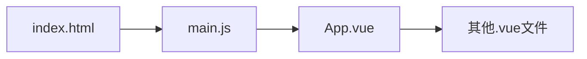

# 文件路径
[[1 HTML 初级#文件路径]]

>[!hint] 补充
>`@/api/hello.js` 位于 src 文件夹下的 api 文件夹下的 hello.js 文件

# 使用 Vue
>[!warning] 局部使用 Vue 和 工程化使用 Vue 由于环境不一样，所以某些语法是不一样的

以下默认使用工程化来演示代码

## 局部使用 Vue
>[!hint] 因为 Vue 是渐进式框架，可以 <u>局部使用</u>【使用 CDN 来引入 `Vue` ，而不是 `npm`】

## 工程化使用 Vue
>[!quote] 工程化使用 Vue
>工程化使用 Vue 就是使用 `npm` 创建 Vue 项目

>[!attention] 在全局使用 Vue 时，注意：
>- 导入数据不能使用 `createApp` ，因为 `createApp` 创建Vue 实例，而 Vue 实例已经在<u>入口文件</u>【`main.js`】里面创建过了
>- 方法里要访问响应式数据，不用写 `this` 关键字

>[!hint] 最终呈现在用户面前的是 `index.html` ，而 `index.html` 里导入了 `main.js` ，`main.js` 里面又导入了 `App.vue` ，所以后续写的 `.vue 文件` 都要导入到 `App.vue` 中




# 模板代码
- `<script setup>` **必需**
	- 从已经下载的 `vue` 文件中导入<u>各种函数</u>
	- 使用 `ref()` 定义**响应式变量**，`ref()` 会返回一个对象，这个对象的有一个指向内部值的属性 `value`
	- 定义方法可以直接定义，**不需要在 `methods` 里面**
	- 钩子方法使用 `onMounted()`
- `<template>` html代码
- `<style>` css代码

```html
<script setup>    /* 必须指明setup */
import { onMounted, ref } from 'vue';   /* 从vue中导入ref()函数，onMounted()函数 */

const count = ref(0);      /* 使用ref()函数定义响应式变量 */

function increment() {
    count.value++;    /* 在方法中使用count，需要.value拿到值 */
}

onMounted(() => {
    alert('mounted!');
});
</script>

<template>
    <div>
        <h1>{{ count }}</h1>     <!--在<template>里使用变量不需要.value -->
        <button @click="increment">Increment</button>
    </div>
</template>

<style></style>
```
