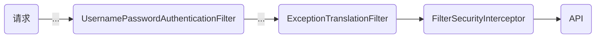

# 准备工作
- 引入依赖
```xml
<!--SpringSecurity-->  
<dependency>  
    <groupId>org.springframework.boot</groupId>  
    <artifactId>spring-boot-starter-security</artifactId>  
</dependency>
```

# 流程
- 宏观流程

- 微观流程
	- ***UsernamePasswordAuthenticationFilter*** ：判断用户名和密码是否正确
	- ***ExceptionTranslationFilter*** ：处理在认证授权时的所有异常
	- ***FilterSecurityInterceptor*** ：当登录成功后，判断用户是谁，有没有权限


## UsernamePasswordAuthenticationFilter


>[!warning] 目前的Spring Security的流程是不符合我们的开发要求的，我们要进行修改

## 登录
- 自定义登录Controller接口
	- 调用 ProviderManager 方法进行认证
		- 如果认证通过，生成 JWT令牌
		- 再把用户信息存入redis
- 自定义 `UserDetailsService`，在这个类中去查询数据库
## 校验
- 定义JWT认证过滤器
	- 获取token
	- 解析token获取UserId
	- 从redis中获取用户信息
	- 把用户信息存入 `SecurityContextHolder`【为了<u>JWT认证过滤器</u>后续的过滤器可以使用用户信息做某些事情】





