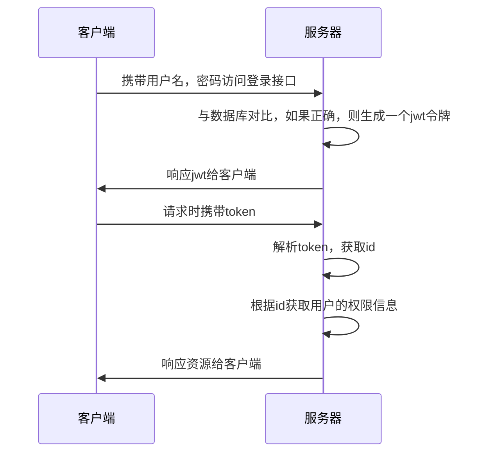
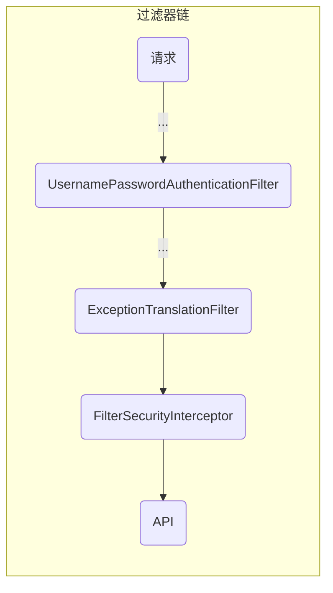
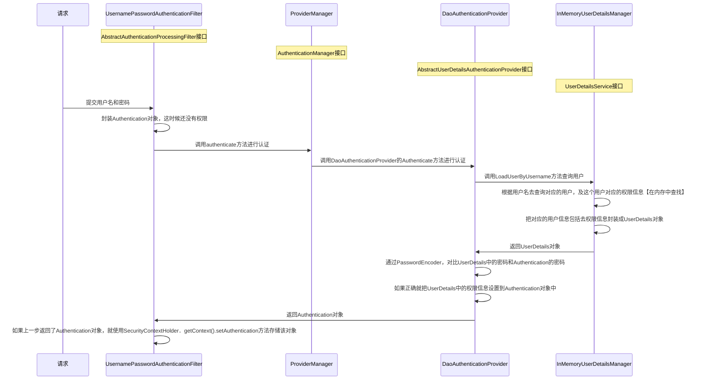
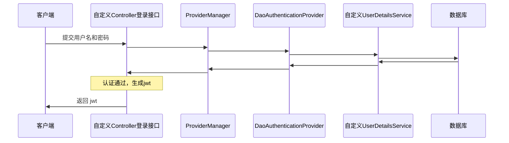
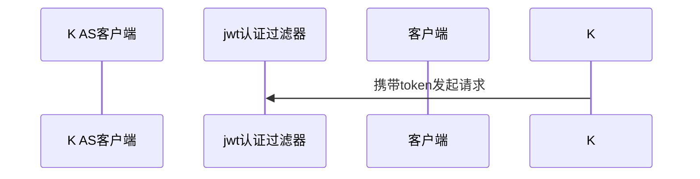

```xml
<!--SpringSecurity-->  
<dependency>  
    <groupId>org.springframework.boot</groupId>  
    <artifactId>spring-boot-starter-security</artifactId>  
</dependency>
```

# 流程
- 宏观流程



- 微观流程
	- `UsernamePasswordAuthenticationFilter` 判断用户名和密码是否正确
	- `ExceptionTranslationFilter` 处理在认证授权时的所有异常
	- `FilterSecurityInterceptor` 当登录成功后，判断用户是谁，有没有权限



## UsernamePasswordAuthenticationFilter


>[!warning] 目前的 Spring Security 的流程是不符合我们的开发要求的，我们要进行修改，要替换不符合要求的实现类

## 登录


## 校验
>[!quote] 校验
>校验 是当用户请求一个受保护的资源时，会检查用户是否已登录，以及用户是否具有访问该资源的权限



- 定义 JWT 认证过滤器
	- 获取 token
	- 解析 token 获取 UserId
	- 从 redis 中获取用户信息
	- 把用户信息存入 `SecurityContextHolder`【为了 <u>JWT 认证过滤器</u>后续的过滤器可以使用用户信息做某些事情】


