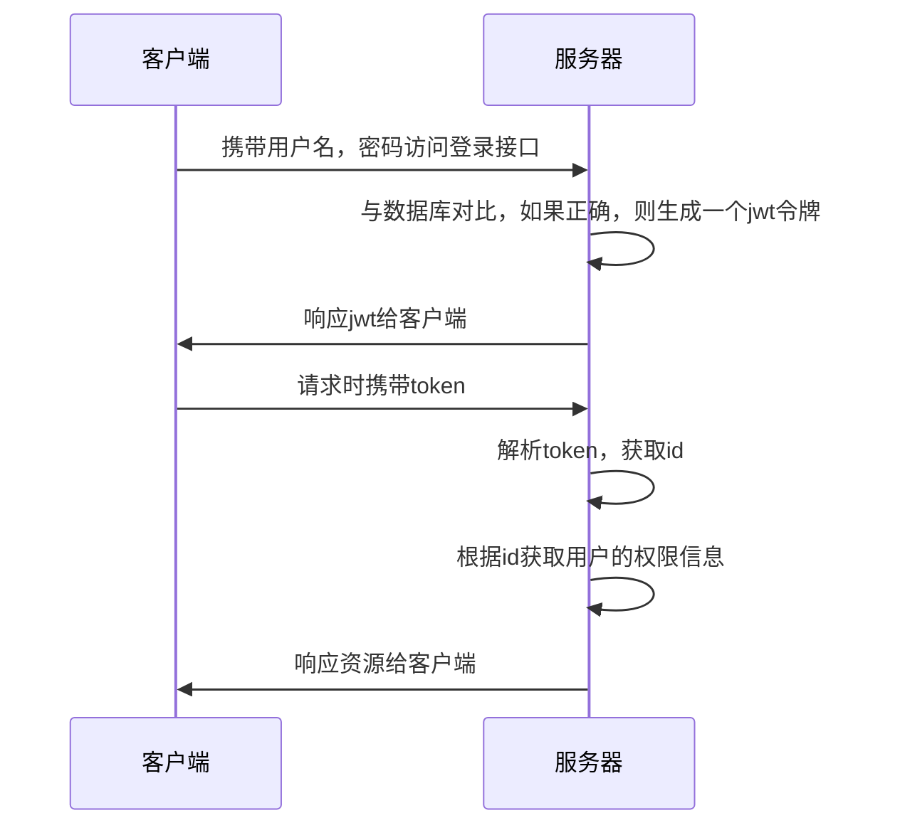

```xml
<!--由于是starter版本，所以不用指定版本号-->  
<dependency>  
    <groupId>org.springframework.boot</groupId>  
    <artifactId>spring-boot-starter-security</artifactId>  
</dependency>
```

# 业务层面流程


# 技术层面流程
## 宏观流程


---


>[!quote] 微观流程
> - `UsernamePasswordAuthenticationFilter` 判断用户名和密码是否正确
> - `ExceptionTranslationFilter` 处理在认证授权时的所有异常
> - `FilterSecurityInterceptor` 当登录成功后，判断用户是谁，有没有权限
> 
> ```mermaid
> graph LR
> 	subgraph 过滤器链
> 	    A(请求) -->|...| B(UsernamePasswordAuthenticationFilter)
> 	    B -->|...| C(ExceptionTranslationFilter)
> 	    C --> D(FilterSecurityInterceptor)
> 	    D --> E(API)
>     end
> ```

---

>[!quote] Spring Security 默认的流程
> ```mermaid
> sequenceDiagram
>     participant 请求
>     participant U AS UsernamePasswordAuthenticationFilter
>     participant P AS ProviderManager
> 	participant D AS DaoAuthenticationProvider
> 	participant I AS InMemoryUserDetailsManager
> 
> 	Note over U: AbstractAuthenticationProcessingFilter接口
> 	Note over P: AuthenticationManager接口
> 	Note over D: AbstractUserDetailsAuthenticationProvider接口
> 	Note over I: UserDetailsService接口
> 
> 	请求->>U: 提交用户名和密码
> 	U->>U: 封装Authentication对象，这时候还没有权限
> 	U->>P: 调用authenticate方法进行认证
> 	P->>D: 调用DaoAuthenticationProvider的Authenticate方法进行认证
> 	D->>I: 调用LoadUserByUsername方法查询用户
> 	I->>I: 根据用户名去查询对应的用户，及这个用户对应的权限信息【在内存中查找】
> 	I->>I: 把对应的用户信息包括去权限信息封装成UserDetails对象
> 	I->>D: 返回UserDetails对象
> 	D->>D: 通过PasswordEncoder，对比UserDetails中的密码和Authentication的密码
> 	D->>D: 如果正确就把UserDetails中的权限信息设置到Authentication对象中
> 	D->>U: 返回Authentication对象
> 	U->>U: 如果上一步返回了Authentication对象，就使用SecurityContextHolder．getContext().setAuthentication方法存储该对象
> ```

>[!warning] 目前的 Spring Security 的流程是不符合我们的开发要求的，我们要进行修改，要替换不符合要求的实现类


