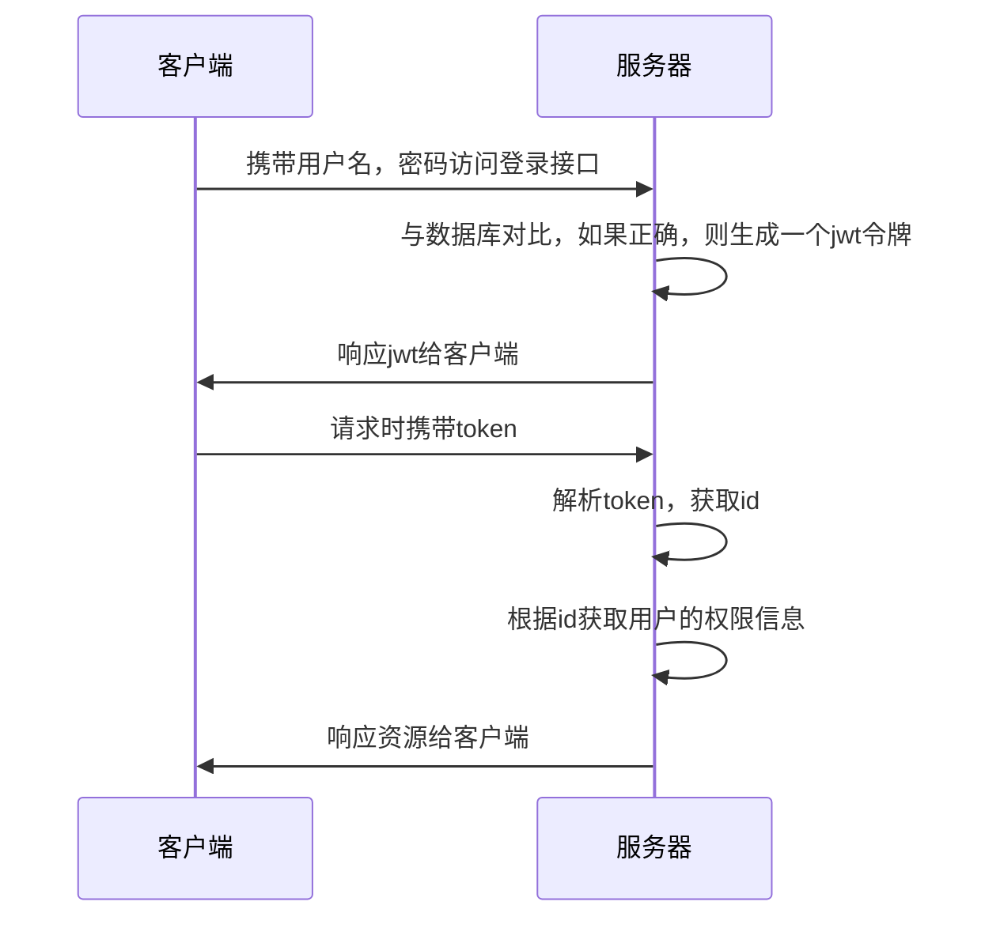
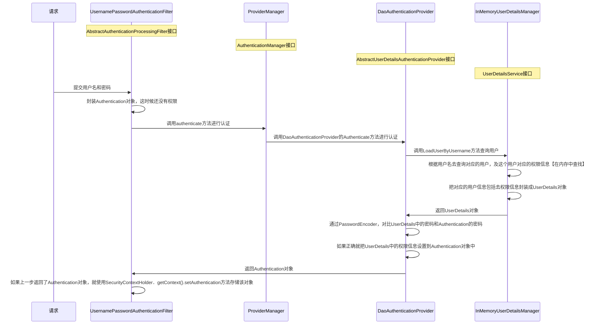

```xml
<!--由于是starter版本，所以不用指定版本号-->  
<dependency>  
    <groupId>org.springframework.boot</groupId>  
    <artifactId>spring-boot-starter-security</artifactId>  
</dependency>
```

# 业务层面流程


# 技术层面流程


## DefaultSecurityFilterChain
>[!warning] 如果使用一个 `http` 对象配置所有配置，则不用加入 `.and()` 来连接多项配置；但是如果使用多个 `http` 对象来配置，可能会发生冲突，需要使用 `.and()` 来手动连接处理

```java
// 这是默认的过滤器链 DefaultSecurityFilterChain，就是这个默认配置生成了默认的16个过滤器
@Bean
public SecurityFilterChain filterChain(HttpSecurity http) throws Exception {
	http
		.authorizeHttpRequests(authorize -> authorize
			// 对所有的请求开启授权保护
			.anyRequest()
			// 已认证的请求会被自动授权
			.authenticated()
		)
		// 使用表单授权方式，产生了UsernamePasswordAuthenticationFilter，DefaultLoginPageGeneratingFilter，DefaultLogoutPageGeneratingFilter过滤器
		.formLogin(withDefaults())
		// 使用基本授权方式，产生了BasicAuthenticationFilter过滤器
		.httpBasic(withDefaults());
	return http.build();
}
```

>[!quote] `DefaultSecurityFilterChain`
>`DefaultSecurityFilterChain` 是 <u>Spring Security 默认的过滤器链</u>，里面包括了 16 个过滤器：
> - `DisableEncodeUrlFilter` 
> - `WebAsyncManagerIntegrationFilter` 
> - `SecurityContextHolderFilter` 
> - `HeaderWriterFilter` 
> - `CorsFilter` 
> - `CsrfFilter` 对 csrf 攻击进行防御
> - `LogoutFilter` 实现登出流程
> - `UsernamePasswordAuthenticationFilter` 判断用户名和密码是否正确
> - `DefaultLoginPageGeneratingFilter` 展示默认登录页
> - `DefaultLogoutPageGeneratingFilter` 展示默认登出页
> - `BasicAuthenticationFilter` 基本授权方式【~~一般不使用~~】
> - `RequestCacheAwareFilter`
> - `SecurityContextHolderAwareRequestFilter`
> - `AnonymousAuthenticationFilter`
> - `ExceptionTranslationFilter` 处理在认证授权时的所有异常
> - `AuthorizationFilter` 

所以 Spring Security 默认的登录授权流程是：


>[!warning] 目前的 Spring Security 的流程是不符合我们的开发要求的，我们要进行修改，要替换不符合要求的实现类

### 登录对象
- `Authentication` 
```java
// Authentication 的定义
public interface Authentication extends Principal, Serializable {
	// 返回用户被授予的所有权限的集合
    Collection<? extends GrantedAuthority> getAuthorities();

	// 返回一个表示证书的对象，通常是密码
    Object getCredentials();

	// 返回一个用户的详细信息对象，在用户登录成功后保存在`Authentication`对象中
    Object getDetails();

	// 返回一个用户基本信息对象【用户名，密码，权限……】，就是实现了UserDetails的那个对象
    Object getPrincipal();

	// 返回一个布尔值，表示用户是否已经通过身份验证
    boolean isAuthenticated();

	// 设置用户的身份验证状态，如果参数为`true`，那么用户被视为已经通过身份验证
    void setAuthenticated(boolean isAuthenticated) throws IllegalArgumentException;
}
```

```java
// 如何在其他地方获取到 Authentication 对象
// 通过SecurityContextHolder获取到SecurityContext对象
SecurityContext context = SecurityContextHolder.getContext();  
// 通过SecurityContext获取到Authentication
Authentication authentication = context.getAuthentication();
```

- `UserDetails` 
```java
package org.springframework.security.core.userdetails;

public interface UserDetails extends Serializable {
    Collection<? extends GrantedAuthority> getAuthorities();

    String getPassword();

    String getUsername();

    boolean isAccountNonExpired();

    boolean isAccountNonLocked();

    boolean isCredentialsNonExpired();

    boolean isEnabled();
}
```

- `User` 
```java
package org.springframework.security.core.userdetails;

public class User implements UserDetails, CredentialsContainer {
    private static final long serialVersionUID = 620L;
    private static final Log logger = LogFactory.getLog(User.class);
    private String password;
    private final String username;
    private final Set<GrantedAuthority> authorities;
    private final boolean accountNonExpired;
    private final boolean accountNonLocked;
    private final boolean credentialsNonExpired;
    private final boolean enabled;

    public User(String username, String password, Collection<? extends GrantedAuthority> authorities) {
        this(username, password, true, true, true, true, authorities);
    }

    public User(String username, String password, boolean enabled, boolean accountNonExpired, boolean credentialsNonExpired, boolean accountNonLocked, Collection<? extends GrantedAuthority> authorities) {
        Assert.isTrue(username != null && !"".equals(username) && password != null, "Cannot pass null or empty values to constructor");
        this.username = username;
        this.password = password;
        this.enabled = enabled;
        this.accountNonExpired = accountNonExpired;
        this.credentialsNonExpired = credentialsNonExpired;
        this.accountNonLocked = accountNonLocked;
        this.authorities = Collections.unmodifiableSet(sortAuthorities(authorities));
    }

    public Collection<GrantedAuthority> getAuthorities() {
        return this.authorities;
    }

    public String getPassword() {
        return this.password;
    }

    public String getUsername() {
        return this.username;
    }

    public boolean isEnabled() {
        return this.enabled;
    }

    public boolean isAccountNonExpired() {
        return this.accountNonExpired;
    }

    public boolean isAccountNonLocked() {
        return this.accountNonLocked;
    }

    public boolean isCredentialsNonExpired() {
        return this.credentialsNonExpired;
    }

    public void eraseCredentials() {
        this.password = null;
    }

    private static SortedSet<GrantedAuthority> sortAuthorities(Collection<? extends GrantedAuthority> authorities) {
        Assert.notNull(authorities, "Cannot pass a null GrantedAuthority collection");
        SortedSet<GrantedAuthority> sortedAuthorities = new TreeSet(new AuthorityComparator());
        Iterator var2 = authorities.iterator();

        while(var2.hasNext()) {
            GrantedAuthority grantedAuthority = (GrantedAuthority)var2.next();
            Assert.notNull(grantedAuthority, "GrantedAuthority list cannot contain any null elements");
            sortedAuthorities.add(grantedAuthority);
        }

        return sortedAuthorities;
    }

    public boolean equals(Object obj) {
        if (obj instanceof User user) {
            return this.username.equals(user.getUsername());
        } else {
            return false;
        }
    }

    public int hashCode() {
        return this.username.hashCode();
    }

    public String toString() {
        StringBuilder sb = new StringBuilder();
        sb.append(this.getClass().getName()).append(" [");
        sb.append("Username=").append(this.username).append(", ");
        sb.append("Password=[PROTECTED], ");
        sb.append("Enabled=").append(this.enabled).append(", ");
        sb.append("AccountNonExpired=").append(this.accountNonExpired).append(", ");
        sb.append("CredentialsNonExpired=").append(this.credentialsNonExpired).append(", ");
        sb.append("AccountNonLocked=").append(this.accountNonLocked).append(", ");
        sb.append("Granted Authorities=").append(this.authorities).append("]");
        return sb.toString();
    }

    public static UserBuilder withUsername(String username) {
        return builder().username(username);
    }

    public static UserBuilder builder() {
        return new UserBuilder();
    }

    
    @Deprecated
    public static UserBuilder withDefaultPasswordEncoder() {
        logger.warn("User.withDefaultPasswordEncoder() is considered unsafe for production and is only intended for sample applications.");
        PasswordEncoder encoder = PasswordEncoderFactories.createDelegatingPasswordEncoder();
        UserBuilder var10000 = builder();
        Objects.requireNonNull(encoder);
        return var10000.passwordEncoder(encoder::encode);
    }

    public static UserBuilder withUserDetails(UserDetails userDetails) {
        return withUsername(userDetails.getUsername()).password(userDetails.getPassword()).accountExpired(!userDetails.isAccountNonExpired()).accountLocked(!userDetails.isAccountNonLocked()).authorities(userDetails.getAuthorities()).credentialsExpired(!userDetails.isCredentialsNonExpired()).disabled(!userDetails.isEnabled());
    }

    private static class AuthorityComparator implements Comparator<GrantedAuthority>, Serializable {
        private static final long serialVersionUID = 620L;

        private AuthorityComparator() {
        }

        public int compare(GrantedAuthority g1, GrantedAuthority g2) {
            if (g2.getAuthority() == null) {
                return -1;
            } else {
                return g1.getAuthority() == null ? 1 : g1.getAuthority().compareTo(g2.getAuthority());
            }
        }
    }

    public static final class UserBuilder {
        private String username;
        private String password;
        private List<GrantedAuthority> authorities = new ArrayList();
        private boolean accountExpired;
        private boolean accountLocked;
        private boolean credentialsExpired;
        private boolean disabled;
        private Function<String, String> passwordEncoder = (password) -> {
            return password;
        };

        private UserBuilder() {
        }

        public UserBuilder username(String username) {
            Assert.notNull(username, "username cannot be null");
            this.username = username;
            return this;
        }

        public UserBuilder password(String password) {
            Assert.notNull(password, "password cannot be null");
            this.password = password;
            return this;
        }

        public UserBuilder passwordEncoder(Function<String, String> encoder) {
            Assert.notNull(encoder, "encoder cannot be null");
            this.passwordEncoder = encoder;
            return this;
        }

        public UserBuilder roles(String... roles) {
            List<GrantedAuthority> authorities = new ArrayList(roles.length);
            String[] var3 = roles;
            int var4 = roles.length;

            for(int var5 = 0; var5 < var4; ++var5) {
                String role = var3[var5];
                Assert.isTrue(!role.startsWith("ROLE_"), () -> {
                    return role + " cannot start with ROLE_ (it is automatically added)";
                });
                authorities.add(new SimpleGrantedAuthority("ROLE_" + role));
            }

            return this.authorities((Collection)authorities);
        }

        public UserBuilder authorities(GrantedAuthority... authorities) {
            Assert.notNull(authorities, "authorities cannot be null");
            return this.authorities((Collection)Arrays.asList(authorities));
        }

        public UserBuilder authorities(Collection<? extends GrantedAuthority> authorities) {
            Assert.notNull(authorities, "authorities cannot be null");
            this.authorities = new ArrayList(authorities);
            return this;
        }

        public UserBuilder authorities(String... authorities) {
            Assert.notNull(authorities, "authorities cannot be null");
            return this.authorities((Collection)AuthorityUtils.createAuthorityList(authorities));
        }

        public UserBuilder accountExpired(boolean accountExpired) {
            this.accountExpired = accountExpired;
            return this;
        }

        public UserBuilder accountLocked(boolean accountLocked) {
            this.accountLocked = accountLocked;
            return this;
        }

        public UserBuilder credentialsExpired(boolean credentialsExpired) {
            this.credentialsExpired = credentialsExpired;
            return this;
        }

        public UserBuilder disabled(boolean disabled) {
            this.disabled = disabled;
            return this;
        }

        public UserDetails build() {
            String encodedPassword = (String)this.passwordEncoder.apply(this.password);
            return new User(this.username, encodedPassword, !this.disabled, !this.accountExpired, !this.credentialsExpired, !this.accountLocked, this.authorities);
        }
    }
}
```

## SecurityProperties
>[!quote] `SecurityProperties` 
>`SecurityProperties` 是默认的登录配置，里面包含了默认的 username，password：
> ```java
> private String name = "user";  
> private String password = UUID.randomUUID().toString();
> ```
> 
> 我们可以在配置文件中进行修改：
> ```yml
> spring:
>   security:
>     user:
>       name: admin
>       password: admin
> ```


