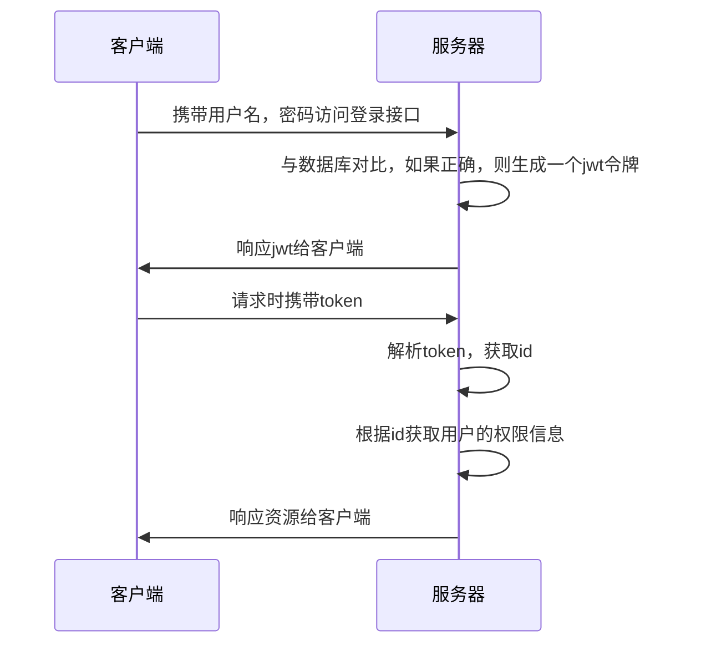
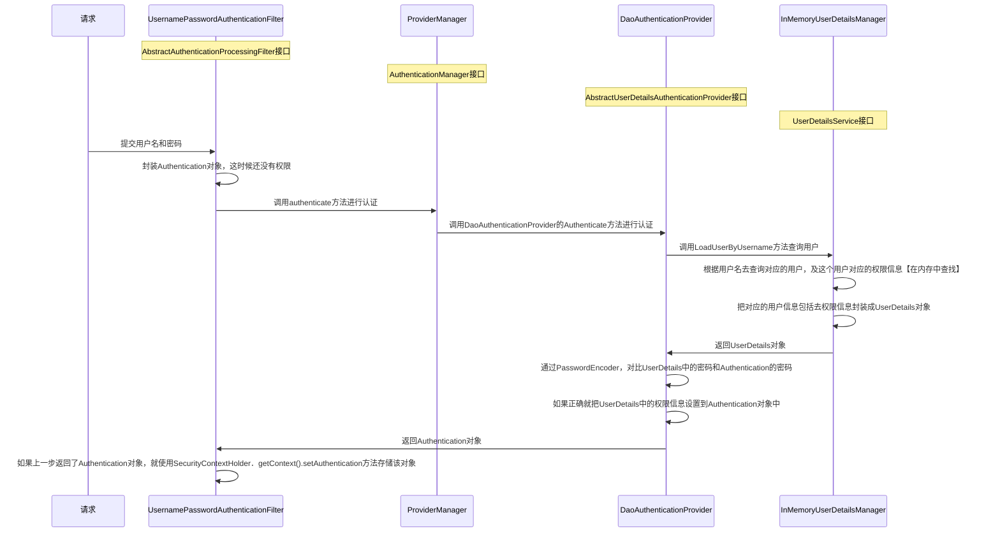

```xml
<!--由于是starter版本，所以不用指定版本号-->  
<dependency>  
    <groupId>org.springframework.boot</groupId>  
    <artifactId>spring-boot-starter-security</artifactId>  
</dependency>
```

# 业务层面流程


# 技术层面流程


## DefaultSecurityFilterChain
```java
// 这是默认的过滤器链 DefaultSecurityFilterChain，就是这个默认配置生成了默认的16个过滤器
@Bean
public SecurityFilterChain filterChain(HttpSecurity http) throws Exception {
	http
		.authorizeHttpRequests(authorize -> authorize
			// 对所有的请求开启授权保护
			.anyRequest()
			// 已认证的请求会被自动授权
			.authenticated()
		)
		// 使用表单授权方式，产生了UsernamePasswordAuthenticationFilter，DefaultLoginPageGeneratingFilter，DefaultLogoutPageGeneratingFilter过滤器
		.formLogin(withDefaults())
		// 使用基本授权方式，产生了BasicAuthenticationFilter过滤器
		.httpBasic(withDefaults());
	return http.build();
}
```

>[!quote] `DefaultSecurityFilterChain`
>`DefaultSecurityFilterChain` 是 <u>Spring Security 默认的过滤器链</u>，里面包括了 16 个过滤器：
> - `DisableEncodeUrlFilter` 
> - `WebAsyncManagerIntegrationFilter` 
> - `SecurityContextHolderFilter` 
> - `HeaderWriterFilter` 
> - `CorsFilter` 
> - `CsrfFilter` 对 csrf 攻击进行防御
> - `LogoutFilter` 实现登出流程
> - `UsernamePasswordAuthenticationFilter` 判断用户名和密码是否正确
> - `DefaultLoginPageGeneratingFilter` 展示默认登录页
> - `DefaultLogoutPageGeneratingFilter` 展示默认登出页
> - `BasicAuthenticationFilter` 基本授权方式【~~一般不使用~~】
> - `RequestCacheAwareFilter`
> - `SecurityContextHolderAwareRequestFilter`
> - `AnonymousAuthenticationFilter`
> - `ExceptionTranslationFilter` 处理在认证授权时的所有异常
> - `AuthorizationFilter` 

所以 Spring Security 默认的登录授权流程是：


>[!warning] 目前的 Spring Security 的流程是不符合我们的开发要求的，我们要进行修改，要替换不符合要求的实现类

### 登录对象
- `Authentication` 
```java
// Authentication 的定义
public interface Authentication extends Principal, Serializable {
	// 返回用户被授予的所有权限的集合
    Collection<? extends GrantedAuthority> getAuthorities();

	// 返回一个表示证书的对象，通常是密码
    Object getCredentials();

	// 返回一个用户的详细信息对象，在用户登录成功后保存在`Authentication`对象中
    Object getDetails();

	// 返回一个用户基本信息对象【用户名，密码，权限……】，就是实现了UserDetails的那个对象
    Object getPrincipal();

	// 返回一个布尔值，表示用户是否已经通过身份验证
    boolean isAuthenticated();

	// 设置用户的身份验证状态，如果参数为`true`，那么用户被视为已经通过身份验证
    void setAuthenticated(boolean isAuthenticated) throws IllegalArgumentException;
}
```

```java
// 如何在其他地方获取到 Authentication 对象
// 通过SecurityContextHolder获取到SecurityContext对象
SecurityContext context = SecurityContextHolder.getContext();  
// 通过SecurityContext获取到Authentication
Authentication authentication = context.getAuthentication();
```


- `UserDetails` 


## SecurityProperties
>[!quote] `SecurityProperties` 
>`SecurityProperties` 是默认的登录配置，里面包含了默认的 username，password：
> ```java
> private String name = "user";  
> private String password = UUID.randomUUID().toString();
> ```
> 
> 我们可以在配置文件中进行修改：
> ```yml
> spring:
>   security:
>     user:
>       name: admin
>       password: admin
> ```


