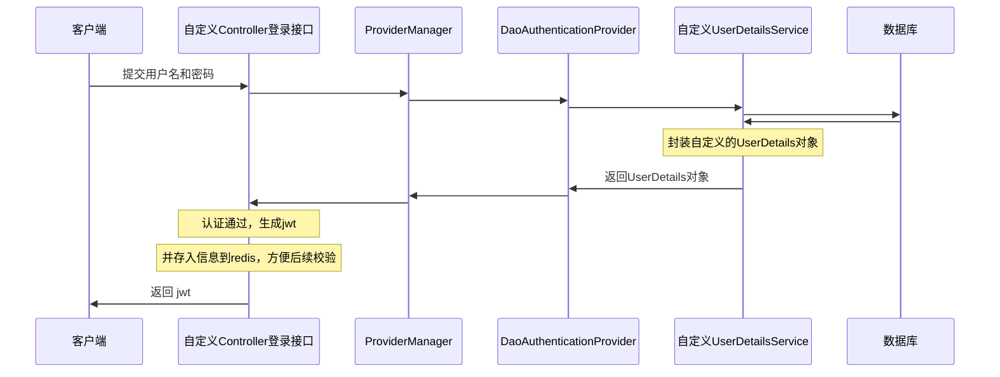

# UserDetailsService
- 自定义 UserDetailsService 的实现类
```java
package com.example.spring_security.domain.service.impl.UserDetailsServiceImpl;

@Service
public class UserDetailsServiceImpl implements UserDetailsService {
    @Autowired
    private UserMapper userMapper;

    @Override
    public UserDetails loadUserByUsername(String username) throws UsernameNotFoundException {
        // 查询用户信息
        user user = userMapper.selectByUserName(username);
        if (user == null) {
            throw new UsernameNotFoundException("用户不存在");
        }

        // todo 查询用户对应的权限信息

        // 把用户信息封装成UserDetails对象
        return new LoginUser(user);
    }
}
```

- 自定义 UserDetails 的实现类
```java
@Data  
@NoArgsConstructor  
@AllArgsConstructor
public class LoginUser implements UserDetails {
	private user user;
	
    // 这个方法返回一个权限集合，表示用户具有的角色。Spring Security中的角色通常以ROLE_开头
    @Override
    public Collection<? extends GrantedAuthority> getAuthorities() {
        return null;
    }

    // 返回用户的密码
	@Override  
	public String getPassword() { return user.getUserPassword(); }  
	  
	// 返回用户的用户名  
	@Override  
	public String getUsername() { return user.getUserName(); }

	// 账户是否过期，如果返回false，那么账号就是过期的
    @Override
    public boolean isAccountNonExpired() { return true; }

    // 账户是否锁定，如果返回false，那么账号就是被锁定的
    @Override
    public boolean isAccountNonLocked() { return true; }

    // 凭证是否过期，如果返回false，那么凭证就是过期的
    @Override
    public boolean isCredentialsNonExpired() { return true; }

    // 账户是否可用，如果返回false，那么账号就是不可用的
    @Override
    public boolean isEnabled() { return true; }
}
```

# BCryptPasswordEncoder
>[!hint] 使用 `BCryptPasswordEncoder` 加密是不可逆的，而且就算明文一样，加密后也会不同

- 将创建好的 `BCryptPasswordEncoder` 注入到 IOC 容器中，替换默认的 `PasswordEncoder` ，后续要使用直接依赖注入
```java
package com.example.spring_security.infrastructure.config;   

@Configuration  
public class SercurityConfig {  
    @Bean  
    public PasswordEncoder passwordEncoder() {  
        return new BCryptPasswordEncoder();  
    }  
}
```

```java
// 测试一下
@Test  
public void testPasswordEncoder() {  
    BCryptPasswordEncoder bCryptPasswordEncoder = new BCryptPasswordEncoder();  
    // 加密
    String encode = bCryptPasswordEncoder.encode("123456");  
    System.out.println(encode);  // $2a$10$OgvYJMWInoiOmGqBCdwrOub3glU9zb5Nm0O0xkcNeAjgMUsSELE5e  
    
    // 比较明文与密文是否匹配  
    boolean matches = bCryptPasswordEncoder.  
            matches("123456",  
                    "$2a$10$OgvYJMWInoiOmGqBCdwrOub3glU9zb5Nm0O0xkcNeAjgMUsSELE5e");  
    System.out.println(matches);  
}

---
$2a$10$n/zIwDJII2Mzzo6XTWnn0uuWmHZ6Q44R.nl7DlkgfSieS.JkRVOzS
true
```

# Controller


