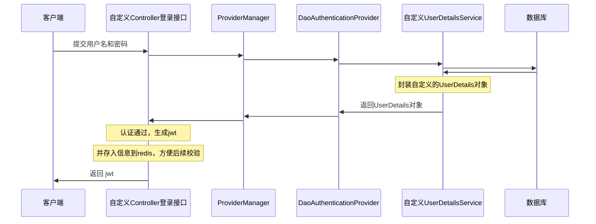

# UserDetailsService
```java
public interface UserDetailsService {
    UserDetails loadUserByUsername(String username) throws UsernameNotFoundException;
}
```

```java
// 提供了更多的关于用户的方法
public interface UserDetailsManager extends UserDetailsService {
	// 创建新用户
	void createUser(UserDetails user);  

	// 更新已有用户的信息
	void updateUser(UserDetails user);  

	// 删除用户
	void deleteUser(String username);  

	// 更改用户的密码
	void changePassword(String oldPassword, String newPassword);  

	// 确认用户是否存在
	boolean userExists(String username);
}
```

## 自定义 UserDetailsManager 的实现类
参照 UserDetailsManager 接口的实现类 `InMemoryUserDetailsManager` 来写

```java
// InMemoryUserDetailsManager
public class InMemoryUserDetailsManager implements UserDetailsManager, UserDetailsPasswordService {
    public UserDetails loadUserByUsername(String username) throws UsernameNotFoundException {
        UserDetails user = (UserDetails)this.users.get(username.toLowerCase());
        if (user == null) {
            throw new UsernameNotFoundException(username);
        } else {
            return new User(user.getUsername(), user.getPassword(), user.isEnabled(), user.isAccountNonExpired(), user.isCredentialsNonExpired(), user.isAccountNonLocked(), user.getAuthorities());
        }
    }
}
```

```java
package com.example.spring_security.domain.service.impl.UserDetailsServiceImpl;

import com.example.spring_security.domain.model.po.LoginUser;  
import org.springframework.security.core.userdetails.User;

@Service
public class UserDetailsServiceImpl implements UserDetailsManager, UserDetailsPasswordService {
    @Autowired
    private UserMapper userMapper;

    @Override
    public UserDetails loadUserByUsername(String username) throws UsernameNotFoundException {
        // 查询出用户信息
        LoginUser loginUser = userMapper.selectByUserName(username);
        if (loginUser == null) {
            throw new UsernameNotFoundException(username + "用户不存在");
        } else {
	        // 这个User是SpringSecurity的User
            return new User(loginUser.getUsername(), loginUser.getPassword(), loginUser.isEnabled(), loginUser.isAccountNonExpired(), loginUser.isCredentialsNonExpired(), loginUser.isAccountNonLocked(), loginUser.getAuthorities());
        }
    }
}
```

## 自定义 UserDetails 的实现类
```java
@Data  
@NoArgsConstructor  
@AllArgsConstructor
public class LoginUser implements UserDetails {
	private Integer userId;  
	private String userName;  
	private String userPassword;  
	private String userAuthority;
	
    // 这个方法返回一个权限集合，表示用户具有的角色。Spring Security中的角色通常以ROLE_开头
    public Collection<? extends GrantedAuthority> getAuthorities() {
        List<GrantedAuthority> authorities = new ArrayList<>();
        return authorities;
    }

    // 返回用户的密码
	@Override  
	public String getPassword() { return userPassword; }  
	
	// 返回用户的用户名  
	@Override  
	public String getUsername() { return userName; }

	// 账户是否过期，如果返回false，那么账号就是过期的
    @Override
    public boolean isAccountNonExpired() { return true; }

    // 账户是否锁定，如果返回false，那么账号就是被锁定的
    @Override
    public boolean isAccountNonLocked() { return true; }

    // 凭证是否过期，如果返回false，那么凭证就是过期的
    @Override
    public boolean isCredentialsNonExpired() { return true; }

    // 账户是否可用，如果返回false，那么账号就是不可用的
    @Override
    public boolean isEnabled() { return true; }
}
```

# BCryptPasswordEncoder
>[!hint] 使用 `BCryptPasswordEncoder` 加密是不可逆的，而且就算明文一样，加密后也会不同

- 将创建好的 `BCryptPasswordEncoder` 注入到 IOC 容器中，替换默认的 `PasswordEncoder` ，后续要使用直接依赖注入
```java
package com.example.spring_security.infrastructure.config;   

@Configuration  
public class SercurityConfig {  
    @Bean  
    public PasswordEncoder passwordEncoder() {  
        return new BCryptPasswordEncoder();  
    }  
}
```

```java
// 测试一下
@Test  
public void testPasswordEncoder() {  
    BCryptPasswordEncoder bCryptPasswordEncoder = new BCryptPasswordEncoder();  
    // 加密
    String encode = bCryptPasswordEncoder.encode("123456");  
    System.out.println(encode);  // $2a$10$OgvYJMWInoiOmGqBCdwrOub3glU9zb5Nm0O0xkcNeAjgMUsSELE5e  
    
    // 比较明文与密文是否匹配  
    boolean matches = bCryptPasswordEncoder.  
            matches("123456",  
                    "$2a$10$OgvYJMWInoiOmGqBCdwrOub3glU9zb5Nm0O0xkcNeAjgMUsSELE5e");  
    System.out.println(matches);  
}

---
$2a$10$n/zIwDJII2Mzzo6XTWnn0uuWmHZ6Q44R.nl7DlkgfSieS.JkRVOzS
true
```

# Controller


我需要把springsecurity默认的InMemoryUserDetailsManager换掉，我是要实现UserDetailsService，还是实现UserDetailsManager，和UserDetailsPasswordService

在Spring Security中，如果你想替换默认的InMemoryUserDetailsManager，你需要实现UserDetailsService接口。UserDetailsService是Spring Security用于从特定数据源（如数据库，LDAP等）加载用户数据的核心接口。这个接口只有一个方法：

```plaintext
UserDetails loadUserByUsername(String username) throws UsernameNotFoundException;
```

在这个方法中，你可以从你的数据源加载用户数据，并返回一个UserDetails对象。

UserDetailsManager接口是UserDetailsService的一个扩展，它添加了一些用于更改用户数据的方法，例如创建和更新用户，改变密码等。如果你的应用需要这些功能，你可以选择实现这个接口。

UserDetailsPasswordService是一个更专业的接口，它提供了一个更新用户密码的方法。如果你的应用需要处理用户密码的更改，而不仅仅是在创建和更新用户时设置密码，那么你可以实现这个接口。

  

总的来说，你应该根据你的应用需求来决定实现哪个接口。如果你只需要从特定数据源加载用户数据，那么实现UserDetailsService就足够了。如果你需要更改用户数据或处理密码更改，那么你可能需要实现UserDetailsManager或UserDetailsPasswordService。