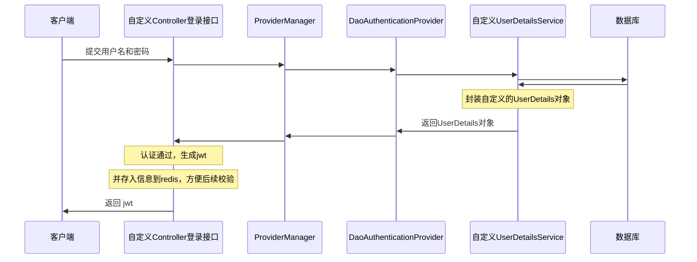

# UserDetailsService
```java
public interface UserDetailsService {
    UserDetails loadUserByUsername(String username) throws UsernameNotFoundException;
}
```

```java
// 提供了更多的关于用户的方法
public interface UserDetailsManager extends UserDetailsService {
	// 创建新用户
	void createUser(UserDetails user);  

	// 更新已有用户的信息
	void updateUser(UserDetails user);  

	// 删除用户
	void deleteUser(String username);  

	// 更改用户的密码
	void changePassword(String oldPassword, String newPassword);  

	// 确认用户是否存在
	boolean userExists(String username);
}
```

## 自定义 UserDetailsManager 的实现类
参照 UserDetailsManager 接口的实现类 `InMemoryUserDetailsManager` 来写

```java
// InMemoryUserDetailsManager
public class InMemoryUserDetailsManager implements UserDetailsManager, UserDetailsPasswordService {
    public UserDetails loadUserByUsername(String username) throws UsernameNotFoundException {
        UserDetails user = (UserDetails)this.users.get(username.toLowerCase());
        if (user == null) {
            throw new UsernameNotFoundException(username);
        } else {
            return new User(user.getUsername(), user.getPassword(), user.isEnabled(), user.isAccountNonExpired(), user.isCredentialsNonExpired(), user.isAccountNonLocked(), user.getAuthorities());
        }
    }
}
```

```java
package com.example.spring_security.domain.service.impl.UserDetailsServiceImpl;

import com.example.spring_security.domain.model.po.LoginUser;  
import org.springframework.security.core.userdetails.User;

@Service
public class UserDetailsServiceImpl implements UserDetailsManager, UserDetailsPasswordService {
    @Autowired
    private UserMapper userMapper;

    @Override
    public UserDetails loadUserByUsername(String username) throws UsernameNotFoundException {
        // 查询出用户信息
        LoginUser loginUser = userMapper.selectByUserName(username);
        if (loginUser == null) {
            throw new UsernameNotFoundException(username + "用户不存在");
        } else {
	        // 这个User是SpringSecurity的User
            return new User(loginUser.getUsername(), loginUser.getPassword(), loginUser.isEnabled(), loginUser.isAccountNonExpired(), loginUser.isCredentialsNonExpired(), loginUser.isAccountNonLocked(), loginUser.getAuthorities());
        }
    }
}
```

## 自定义 UserDetails 的实现类
```java
@Data  
@NoArgsConstructor  
@AllArgsConstructor
public class LoginUser implements UserDetails {
	private Integer userId;  
	private String userName;  
	private String userPassword;  
	private String userAuthority;
	
    // 这个方法返回一个权限集合，表示用户具有的角色。Spring Security中的角色通常以ROLE_开头
    public Collection<? extends GrantedAuthority> getAuthorities() {
        List<GrantedAuthority> authorities = new ArrayList<>();
        return authorities;
    }

    // 返回用户的密码
	@Override  
	public String getPassword() { return userPassword; }  
	
	// 返回用户的用户名  
	@Override  
	public String getUsername() { return userName; }

	// 账户是否过期，如果返回false，那么账号就是过期的
    @Override
    public boolean isAccountNonExpired() { return true; }

    // 账户是否锁定，如果返回false，那么账号就是被锁定的
    @Override
    public boolean isAccountNonLocked() { return true; }

    // 凭证是否过期，如果返回false，那么凭证就是过期的
    @Override
    public boolean isCredentialsNonExpired() { return true; }

    // 账户是否可用，如果返回false，那么账号就是不可用的
    @Override
    public boolean isEnabled() { return true; }
}
```

# 密码加密
>[!quote] 密码加密的历史
>从<u>明文密码</u> -> <u>哈希算法</u>【~~可以很容易地被暴力破解~~】 -> <u>加盐密码</u>【~~比哈希算法更好~~】 -> <u>自适应单向函数</u>【~~使用“工作因子”占用 CPU 的资源，从而拖慢密码破解的速度~~】

>[!hint] `BCryptPasswordEncoder`
>- 使用自适应单向函数 `BCryptPasswordEncoder` 加密是不可逆的，<u>而且就算明文一样，加密后也会不同</u>【~~因为盐是随机的~~】
>- 工作因子越大，匹配时间也会越长，因为匹配的过程中也要进行加密

- 将创建好的 `BCryptPasswordEncoder` 注入到 IOC 容器中，替换默认的 `PasswordEncoder` ，后续要使用直接依赖注入
```java
package com.example.spring_security.infrastructure.config;   

@Configuration  
public class SercurityConfig {  
    @Bean  
    public PasswordEncoder passwordEncoder() {  
        return new BCryptPasswordEncoder();  
    }  
}
```

```java
// 测试一下
@Test  
public void testPasswordEncoder() {  
    BCryptPasswordEncoder bCryptPasswordEncoder = new BCryptPasswordEncoder();  
    // 加密
    String encode = bCryptPasswordEncoder.encode("123456");  
    System.out.println(encode);  // $2a$10$OgvYJMWInoiOmGqBCdwrOub3glU9zb5Nm0O0xkcNeAjgMUsSELE5e  
    
    // 比较明文与密文是否匹配  
    boolean matches = bCryptPasswordEncoder.  
            matches("123456",  
                    "$2a$10$OgvYJMWInoiOmGqBCdwrOub3glU9zb5Nm0O0xkcNeAjgMUsSELE5e");  
    System.out.println(matches);  
}

---
$2a$10$n/zIwDJII2Mzzo6XTWnn0uuWmHZ6Q44R.nl7DlkgfSieS.JkRVOzS
true
```

# 认证成功/失败 / 未认证


>[!warning] 以下流程的前提是前后端分离开发，后端只需要返回 JSON 数据给前端，前端根据后端返回的结果来处理页面的跳转

## 成功
- 自定义 MyAuthenticationSuccessHandler 实现 AuthenticationSuccessHandler 接口，用于登录成功后，做一些处理
```java
package com.example.spring_security.infrastructure.config;

// 自定义登录成功处理器，在登录成功后，做一些处理
public class MyAuthenticationSuccessHandler implements AuthenticationSuccessHandler {
    // 登录成功后，做一些处理
    @Override
    public void onAuthenticationSuccess(HttpServletRequest request, HttpServletResponse response, Authentication authentication) throws IOException, ServletException {
        Object credentials = authentication.getCredentials();
        Object details = authentication.getDetails();
        Object principal = authentication.getPrincipal();
        Object authorities = authentication.getAuthorities();
        boolean authenticated = authentication.isAuthenticated();

        Result<String> responseResult = Result.buildResult(Result.Status.OK, "登录成功",
                "密码：" + credentials +
                        "，详情：" + details +
                        "，主体：" + principal +
                        "，权限：" + authorities +
                        "，是否认证：" + authenticated);

        // 定义json数据
        ObjectMapper objectMapper = new ObjectMapper();
        String jsonData = objectMapper.writeValueAsString(responseResult);

        response.setContentType("application/json;charset=utf-8");
        response.getWriter().println(jsonData);
    }
}
```

- 在 Security 配置文件 `SecurityConfig` 中配置 successHandler
```java
http  
		……
		.formLogin(form -> {  
			form.loginPage("http://localhost:5173/")  
					.loginProcessingUrl("/login")
					.successHandler(new MyAuthenticationSuccessHandler());  
		});
```

## 失败
- 自定义 MyAuthenticationFailureHandler 实现 AuthenticationFailureHandler 接口，用于登录失败后，做一些处理
```java
package com.example.spring_security.infrastructure.config;

public class MyAuthenticationFailureHandler implements AuthenticationFailureHandler {
    Logger logger = LoggerFactory.getLogger(MyAuthenticationFailureHandler.class);

    @Override
    public void onAuthenticationFailure(HttpServletRequest request, HttpServletResponse response, AuthenticationException exception) throws IOException, ServletException {
        logger.atInfo().log("登录失败，我要做一些处理");

        String localizedMessage = exception.getLocalizedMessage();

        Result<String> responseResult = Result.buildResult(Result.Status.ERROR, "登录失败", localizedMessage);

        ObjectMapper objectMapper = new ObjectMapper();
        String jsonData = objectMapper.writeValueAsString(responseResult);

        response.setContentType("application/json;charset=utf-8");
        response.getWriter().println(jsonData);
    }
}
```

- 在 Security 配置文件 SecurityConfig 中配置 failureHandler
```java
.formLogin(form -> {  
    form.loginPage("http://localhost:5173/")  
            .loginProcessingUrl("/login")  
            .successHandler(new MyAuthenticationSuccessHandler())  
            .failureHandler(new MyAuthenticationFailureHandler());  
});
```

## 未认证
当访问一个需要认证


# 注销
- 自定义 MyLogoutSuccessHandler 实现 LogoutSuccessHandler 接口
```java
package com.example.spring_security.infrastructure.config;  
  
public class MyLogoutSuccessHandler implements LogoutSuccessHandler {  
    Logger logger = LoggerFactory.getLogger(MyLogoutSuccessHandler.class);  
  
    @Override  
    public void onLogoutSuccess(HttpServletRequest request, HttpServletResponse response, Authentication authentication) throws IOException, ServletException {  
        logger.atInfo().log("注销成功了，我要做一些处理");  
  
        Result<Object> responseResult = Result.buildResult(Result.Status.OK, "注销成功");  
  
        ObjectMapper objectMapper = new ObjectMapper();  
        String jsonData = objectMapper.writeValueAsString(responseResult);  
  
        response.setContentType("application/json;charset=utf-8");  
        response.getWriter().println(jsonData);  
    }  
}
```

- 在 `SecurityConfig` 配置文件中配置
```java
// 注销配置  
http.logout(logout -> {  
    logout.logoutSuccessHandler(new MyLogoutSuccessHandler());  
});
```


# 功能
## 创建用户
- 定义 Controller 【`LoginUser` 实现了 UserDetails】
```java
@RestController
public class UserController {
    @Autowired
    private UserService userService;

    // 创建用户
    @PostMapping("/create")
    public Result createUser(@RequestBody LoginUser loginUser) {
        userService.createUser(loginUser);
        return Result.buildResult(Result.Status.OK, "创建用户成功");
    }
}
```

- 定义 UserService，UserServiceImpl
```java
package com.example.spring_security.domain.service.impl;

@Service
public class UserServiceImpl implements UserService {
    @Autowired
    private UserDetailsServiceImpl userDetailsServiceImpl;

    @Override
    public void createUser(LoginUser loginUser) {
        userDetailsServiceImpl.createUser(loginUser);
    }
}
```

- 定义 userDetailsServiceImpl
```java
package com.example.spring_security.domain.service.impl;

import org.springframework.security.core.userdetails.User;

@Service
public class UserDetailsServiceImpl implements UserDetailsManager {
    @Autowired
    private UserMapper userMapper;

	// 加载用户信息
    @Override
    public UserDetails loadUserByUsername(String username) throws UsernameNotFoundException {
        // 查询用户信息
        LoginUser loginUser = userMapper.selectByUserName(username);
        if (loginUser == null) {
            throw new UsernameNotFoundException(username + "用户不存在");
        } else {
            return loginUser;
        }
    }

    // 创建用户
    @Override
    public void createUser(UserDetails user) {
        // 密码加密
        PasswordEncoder bCryptPasswordEncoder = new BCryptPasswordEncoder();
        String encode = bCryptPasswordEncoder.encode(user.getPassword());

        LoginUser loginUser = (LoginUser) user;
        loginUser.setUserPassword(encode);
        userMapper.createOneUser(loginUser);
    }
    ……
}
```


