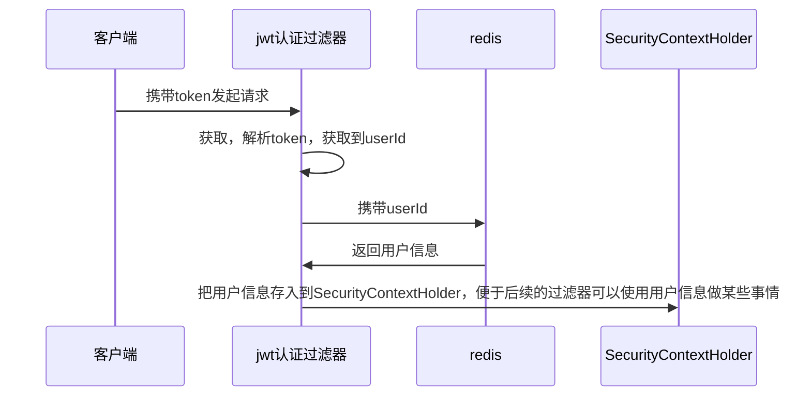

>[!quote] 校验
>校验 是当用户请求一个受保护的资源时，会检查用户是否已登录，以及用户是否具有访问该资源的权限

```mermaid
sequenceDiagram
	participant K AS 客户端
	participant J AS jwt认证过滤器
	participant R AS redis
	participant S AS SecurityContextHolder

	K->>J: 携带token发起请求
	J->>J: 获取，解析token，获取到userId
	J->>R: 携带userId
	R->>J: 返回用户信息
	J->>S: 把用户信息存入到SecurityContextHolder，便于后续的过滤器可以使用用户信息做某些事情
```

