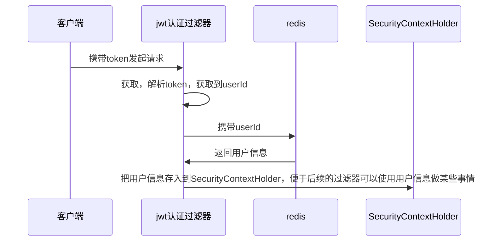
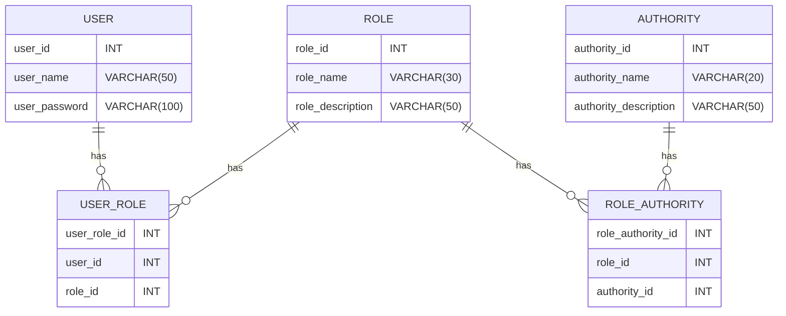

>[!quote] 授权
>授权 是当用户请求一个受保护的资源时，会检查用户是否已登录，以及用户是否具有访问该资源的权限



---

>[!quote] Spring Security 的两种授权模式：
> - **用户-权限-资源**：用户直接与权限进行关联，权限再与资源进行关联，适用于权限管理相对较少复杂的系统
> - **用户-角色-权限-资源**：用户首先与角色进行关联，角色再与权限进行关联，权限再与资源进行关联，适用于权限管理较为复杂的系统

>[!quote] Spring Security 的两种授权方法：
>- 基于请求的授权
>- 基于方法的授权

>[!hint] 一般使用 <u>用户-角色-权限-资源</u> + <u>基于方法的授权</u> 来进行授权

# 基于请求的授权
>[!quote] 基于请求的授权
>基于请求的授权 是指根据 <u>HTTP 请求的信息</u> 来决定是否授予访问权限，适合权限规则相对简单，与具体操作无关的情况

基于请求的授权策略通常适用于权限规则相对简单，与具体操作无关的情况。例如，一个博客网站可能只需要根据 URL 就能决定用户是否可以访问某个页面。因为在这种情况下，权限规则通常可以直接映射到 URL 路径上，例如“/admin”路径只允许管理员访问


# 基于方法的授权
>[!quote] 基于方法的授权
>基于方法的授权 是指在执行特定方法前先检查用户是否具有相应的权限，适用于复杂的权限控制

## 用户-权限-资源
……

## 用户-角色-权限-资源
### 数据库表


>[!quote]+ 具体的建表语句
> ```sql
> // 用户表 user
> create table user  
> (  
>     user_id        int auto_increment  
>         primary key,  
>     user_name      varchar(50)  not null,  
>     user_password  varchar(100) not null
> );
> ```
> 
> ```sql
> // 角色表
> create table role  
> (  
>     role_id          int auto_increment  
>         primary key,  
>     role_name        varchar(30) not null comment '角色名',  
>     role_description varchar(50) not null comment '描述角色'  
> )  
>     comment '角色表';
> ```
> 
> ```sql
> // 权限表
> create table authority  
> (  
>     authority_id          int auto_increment,  
>     authority_name        varchar(20) not null,  
>     authority_description varchar(50) not null comment '权限描述',  
>     constraint authority_pk  
>         primary key (authority_id)  
> )  
>     comment '权限表';
> ```
> 
> ```sql
> // 用户-角色表
> create table user_role  
> (  
>     user_role_id int auto_increment,  
>     user_id      int not null,  
>     role_id      int not null,  
>     constraint user_role_pk  
>         primary key (user_role_id)  
> )  
>     comment '用户角色关联表';
> ```
> 
> ```sql
> // 角色-权限表
> create table role_authority  
> (  
>     role_authority_id int auto_increment,  
>     role_id           int not null,  
>     authority_id      int not null,  
>     constraint role_authority_pk  
>         primary key (role_authority_id)  
> )  
>     comment '角色权限关联表';
> ```

### 具体操作
- 在 `SecurityConfig` 配置中开启基于方法授权
```java
@Configuration  
@EnableMethodSecurity  
public class SecurityConfig { …… }
```


