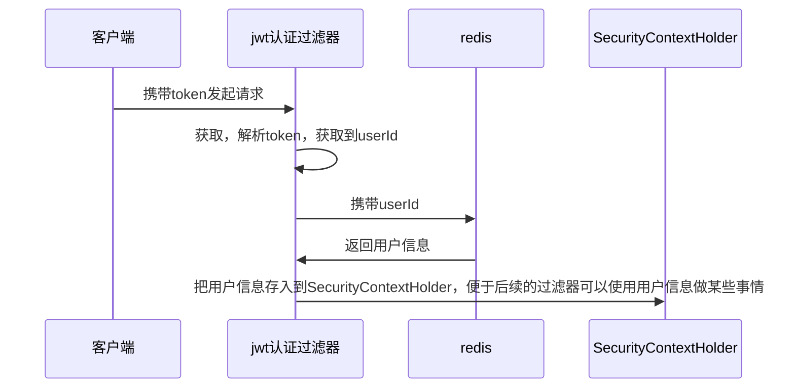

>[!quote] 授权
>授权 是当用户请求一个受保护的资源时，会检查用户是否已登录，以及用户是否具有访问该资源的权限

---

>[!hint] Spring Security 的两种授权模式：
> - **用户-权限-资源模式**：用户直接与权限进行关联，权限再与资源进行关联，适用于权限管理相对较少复杂的系统
> - **用户-角色-权限-资源模式**：用户首先与角色进行关联，角色再与权限进行关联，权限再与资源进行关联，适用于权限管理较为复杂的系统

# 基于请求的授权
>[!quote] 基于请求的授权
>基于请求的授权 是指根据 <u>HTTP 请求的信息</u> 来决定是否授予访问权限，适合权限规则相对简单，与具体操作无关的情况

    
基于请求的授权策略通常适用于权限规则相对简单，与具体操作无关的情况。例如，一个博客网站可能只需要根据 URL 就能决定用户是否可以访问某个页面。因为在这种情况下，权限规则通常可以直接映射到 URL 路径上，例如“/admin/*”路径只允许管理员访问

# 基于方法的授权
>[!quote] 基于方法的授权
>基于方法的授权 是指在执行特定方法前先检查用户是否具有相应的权限，适用于复杂的权限控制

1. **方法级别的控制**：这种授权策略是在方法级别进行权限控制，而不仅仅是在URL或者HTTP方法级别。这意味着你可以更为精细地控制用户的权限，例如，你可以设置只有某些用户才能执行特定的业务操作

基于方法的授权策略通常适用于需要复杂权限控制的情况。例如，一个电商网站可能需要对订单的创建、修改、删除等操作进行细粒度的权限控制。在这种情况下，简单的基于请求的授权可能无法满足需求，而基于方法的授权能够提供更为精细的控制 

