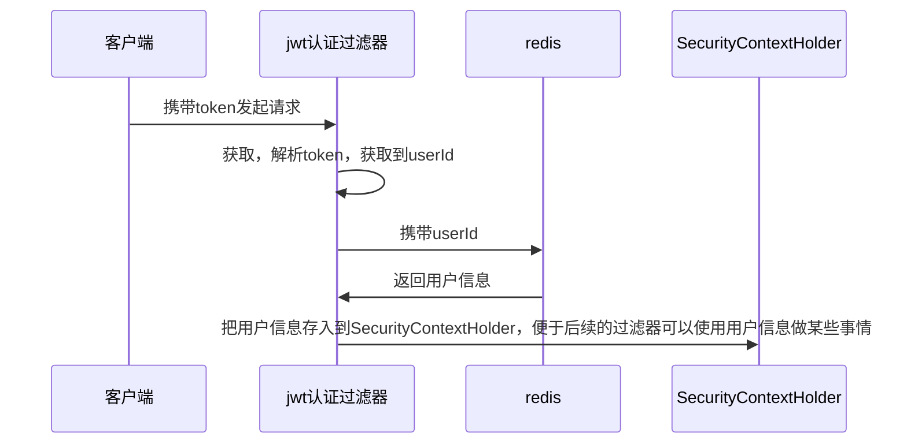

>[!quote] 授权
>授权 是当用户请求一个受保护的资源时，会检查用户是否已登录，以及用户是否具有访问该资源的权限

---

>[!quote] Spring Security 的两种授权模式：
> - **用户-权限-资源模式**：用户直接与权限进行关联，权限再与资源进行关联，适用于权限管理相对较少复杂的系统
> - **用户-角色-权限-资源模式**：用户首先与角色进行关联，角色再与权限进行关联，权限再与资源进行关联，适用于权限管理较为复杂的系统

# 基于请求的授权
>[!quote] 基于请求的授权
>基于请求的授权 是指根据 HTTP 请求的信息来决定是否授予访问权限，适合权限规则相对简单，与具体操作无关的情况

# 基于方法的授权
>[!quote] 基于方法的授权
>基于方法的授权 是指在执行特定方法前先检查用户是否具有相应的权限，适用于复杂的权限控制

