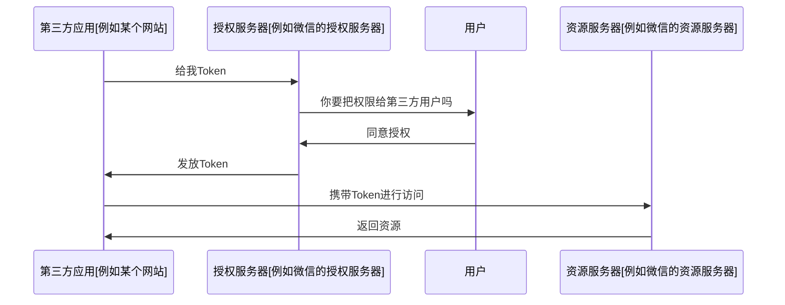

# 概述
## 使用场景
- 开放系统间授权
	- 社交登录
	- 

- **授权而非认证**：它重点解决的是授权问题，即允许一个用户授权决定是否给予这个第三方应用访问你资源的许可
- **多种授权模式**：包括授权码模式、隐式授权模式、密码模式、客户端模式 ……
- **分离资源所有者、客户端和资源服务器**
- **安全和灵活**：通过令牌来传递授权信息，确保了授权过程的安全性，同时允许灵活地配置授权范围和权限

