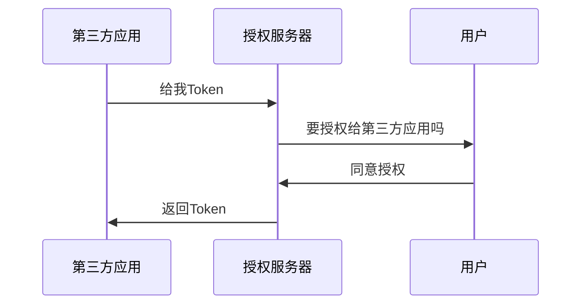

>[!quote] 宏观流程
>
> ```mermaid
> sequenceDiagram
>     participant D as 第三方应用[例如某个网站]
>     participant S as 授权服务器[例如微信的授权服务器]
> 	participant Y as 用户
> 	participant Z as 资源服务器[例如微信的资源服务器]
> 
> 	D->>S: 给我Token
> 	S->>Y: 你要把权限给第三方用户吗
> 	Y->>S: 同意授权
> 	S->>D: 发放Token
> 	D->>Z: 携带Token进行访问
> 	Z->>D: 返回资源
> ```

# 概述
## 使用场景
- **开放系统间授权**
	- 社交登录【~~微信登录各种网页~~】
	- 开放 API【~~小白羊网盘获取阿里网盘的资源~~】
- **现代微服务安全**
- **企业内部应用认证授权**
	- 单点登录
	- 身份识别与访问管理

# 授权模式
>[!quote] 四种授权模式
>- **隐藏式**：适用于纯前端网站，【浏览器-服务器】
>- **客户端凭证式**：适用于纯后端网站，服务器-服务器
>- **密码式**：最不安全，适用于公司内部高度信任的两个系统之间使用
>- **授权码式**：最常用，最复杂，最安全，适用于前后端分离网站

## 隐藏式，客户端凭证式



## 密码式


## 授权码式


