# 🌕MyBatis
## 🌗基本概念
#####🌑什么是MyBatis
>MyBatis是一个开源的Java持久层框架，***封装了JDBC程序***，提供了一种优雅的方式来进行数据库访问，简化了数据库访问代码的编写，提供了灵活性和高度可定制的SQL映射，以及良好的性能

>JDBC是SUN公司提供的一套操作关系型数据库的API

```mermaid
graph TB
	a[Java程序]-->b[JDBC]
	b--控制-->c[MySql实现]
	b--控制-->d[Oracle实现]
	b--控制-->e[SqlServer实现]

	c--控制-->f[Mysql]
	d--控制-->g[Oracle]
	e--控制-->h[SqlServer]

    subgraph 驱动
    c
    d
    e
    end
```
#####🌑数据库连接池技术
- 在没有数据库连接池技术时，Java程序要执行一条SQL语句，就要创建一个数据库连接对象，在使用完成之后，再释放这个连接对象
- 而使用了数据库连接池技术后，客户端需要执行SQL语句时，可以去数据库连接池中拿连接对象，用完之后再还回去

```mermaid
graph LR
	a[客户端A]--拿Connection对象-->b[数据库连接池]
	b--还回去-->a
	
	c[客户端B]-->b
	
	d[客户端C]-->b

	b--访问-->e[数据库]
```


![[Excalidraw/计算机/编程语言/数据库/MyBatis Draw.md#^group=8ii8fwyi|700]]

>[!hint] 数据库连接池的优点
>- 资源的重用【用完的Connection对象无需销毁，还回去即可】
>- 提升系统的响应速度【无需创建Connection对象，去拿即可】
## 🌗准备工作
- 引入MyBatis的相关依赖

- 配置MyBatis

```xml
spring.datasource.driver-class-name=com.mysql.cj.jdbc.Driver  
spring.datasource.url=jdbc:mysql://localhost:3306/mybatis  
spring.datasource.username=root  
spring.datasource.password=13433026660
```
- 配置SQL提示
	
	- 在idea的数据库配置中添加数据库
	
	
- 安装`MyBatisX`插件
	- 可以在xml文件 与 Mapper接口 中快速跳转
## 🌗通过注解来实现MyBatis
#####🌑基本操作
######🌙增删改查
```java
//配置实体user类
package com.example.Pojo;  

@Getter     //lombok中的注释
@Setter        
@ToString  
@NoArgsConstructor  
@AllArgsConstructor  
public class user {  
    private Integer id;  
    private String name;  
    private Integer age;  
    private Integer gender;  
    private String phone;  
}
```

```java
//定义Mapper接口
package com.example.mapper;  
  
import com.example.Pojo.user;  
  
//表示当前类是MyBatis的Mapper接口，在运行时会自动生成该接口的实现类对象，并将该对象交给IOC容器管理  
@Mapper    
public interface UserMapper {  
    //查询
    @Select("SELECT * FROM user")  
    public List<user> list();  
  
    //增
    @Insert("INSERT INTO user VALUES(#{id},#{name},#{age},#{gender},#{phone})")  
    public int InsertOne(Integer id, String name, Integer age, Integer gender, String phone);  
  
    //删  
    @Delete("DELETE FROM user WHERE id = #{id}")   //这个DELETE语句会返回删除了几条数据  
    public void DeleteOne(Integer id);  
  
    //改  
    @Update("UPDATE user SET name=#{name},age=#{age},gender=#{gender},phone=#{phone} WHERE id = #{id}")  
    public void UpdateOne(Integer id, String name, Integer age, Integer gender, String phone);  
}
```

```java
//启动测试类
package com.example;  
  
import com.example.Pojo.user;  
import com.example.mapper.UserMapper;  
  
@SpringBootTest  
class SpringBootMyBatisApplicationTests {  
    @Autowired  
    private UserMapper userMapper;  
  
    @Test  
    public void SelectUser() {  
        List<user> list = userMapper.list();  
        for (user user : list) {  
            System.out.println(user.toString());  
        }  
    }  
  
    @Test  
    public void InsertOne() {  
        int i = userMapper.InsertOne(6, "hoan", 30, 1, "211");  
        System.out.println(i);    //输出影响的记录数  
    }  
  
    @Test  
    public void DeleteOne() {  
        userMapper.DeleteOne(6);  
    }  
  
    @Test  
    public void UpdateOne() {  
        userMapper.UpdateOne(1, "greenteck", 35, 1, "985985");  
    }  
}

---
打印出所有用户数据
---
1
---
删除
---
修改
```

>[!hint] 以上的SQL语句用了“#{}”占位符，就是***预编译SQL语句***
>>=="#{}"不能放在***单引号***或***多引号***之间使用==
>>如果一定要在引号里进行占位符，可以使用`CONCAT函数`
>
>预编译SQL语句有两个优点：
>- 性能高，因为不同参数的SQL语句只用编译一遍【MYSQL有缓存机制】
>- 安全：防止了SQL注入【用户使用输入数据来篡改SQL语句】
######🌙主键返回
>在很多时候我们会在插入一条数据之后，再拿到这条数据的id。由于不能简单的通过getId来获取，所以我们要添加***Options注释***

`useGeneratedKeys = true`  表示我们要拿到生成的主键值
`keyProperty = "id"`  表示将自动生成的主键值映射到`user`对象的`id`属性

```java
@Options(useGeneratedKeys = true, keyProperty = "id")    //需要添加这条注释  
@Insert("INSERT INTO user(name,age,gender,phone) VALUES(#{name},#{age},#{gender},#{phone})") 
public void InsertOne(user user);
```

```java
package com.example;  
  
import com.example.Pojo.user;  
import com.example.mapper.UserMapper;  
  
@SpringBootTest  
class SpringBootMyBatisApplicationTests {  
    @Autowired  
    private UserMapper userMapper;  
  
    @Test  
    public void InsertOne() {  
        user user = new user();  
        user.setName("chico");  //有主键自增，所以不用插入id
        user.setAge(47);  
        user.setGender(1);  
        user.setPhone("9898989");  

        userMapper.InsertOne(user);  
        System.out.println(user.getId());  
    }  
}

---
17
```
## 🌗通过XML来实现MyBatis
#####🌑三大规范
- 同包同名，一一对应：XML文件的名称与Mapper接口的名称保持一致，一个XML文件对应一个Mapper接口，XML文件在resource目录下与Mapper接口在java目录下的包一致
- XML文件的`namespace`属性与Mapper接口的全类名保持一致
- XML文件中的sql语句的id 与 Mapper接口的方法名一致，且返回类型一致

![[Excalidraw/计算机/JavaWeb Draw.md#^group=fQSSes2S]]
```xml
<?xml version="1.0" encoding="UTF-8" ?>
<!DOCTYPE mapper
        PUBLIC "-//mybatis.org//DTD Mapper 3.0//EN"
        "http://mybatis.org/dtd/mybatis-3-mapper.dtd">
<mapper namespace="com.example.mapper.UserMapperXml">    
    <!--resultType表示的是单条记录所封装的类型-->
    <select id="SelectAll" resultType="com.example.Pojo.user">
        select * from user     //书写sql语句
    </select>
</mapper>
```
## 🌗动态SQL
#####🌑动态查询
- `<where>`标签可以动态的拼接`<if>`标签里的条件，如果只使用WHERE
	- 如果第一个条件不成立会多出一个AND
	- 如果所有条件不成立，会多出一个WHERE
- `<if>`标签可以根据test条件判断是否要拼接标签里的sql

```xml
<select id="SelectCondition" resultType="com.example.Pojo.user">
    select *
    from user
    <where>
        <if test="name != null">  <!--test条件成立，则拼接sql-->
            name like concat('%',#{name},'%')
        </if>
        <if test="age != null">
            and age = #{age}
        </if>
        <if test="gender != null">
            and gender = #{gender}
        </if>
    </where>
</select>
```
#####🌑动态更新
- `<set>`标签可以动态删除语句中的逗号
```xml
<update id="UpdateUser">
    UPDATE user
    <set>          
        <if test="name != null">
            name=#{name}
        </if>
        <if test="age != null">
            ,age=#{age}
        </if>
        <if test="gender != null">
            ,gender=#{gender}
        </if>
        <if test="phone != null">
            ,phone=#{phone}
        </if>
        <if test="otId != null">
            ,ot_id=#{otId}
        </if>
    </set>
    WHERE id=#{id}
</update>
```
#####🌑动态批量删除
- `collection`  表示集合的名称
- `item`  表示集合元素的名称
- `open`  在遍历元素的之前加的字符
- `separator`  遍历每个元素之后要加的字符
- `close`  遍历完所有元素之后要加的字符

```xml
<delete id="DeleteIds">
    DELETE
    FROM user
    WHERE id in       //ids集合名需要与Mapper接口传递的集合名保持一致
    <foreach collection="ids" item="id" open="(" separator="," close=")">
        #{id}
    </foreach>
</delete>

---
DELETE
FROM user
WHERE id in (A,B,C……)
```

```java
@Mapper  
public interface UserMapperXml {  
    public List<user> SelectAll();  
    //根据id集合来批量删除记录  
    public void DeleteIds(List<Integer> ids); 
}
```
#####🌑sql片段的抽取与引用
>如果像上面一样每个语句都独立写代码，那复用性会很差，如果要更改表名或者其他参数，则要一个一个语句标签更改。引入了==\<sql\>\<include\>标签==可以解决这个问题

```xml
<sql id="select1">             //声明sql片段，定义id属性
	select id, name, age, gender, phone, ot_id
	from user
</sql>                

<select id="SelectCondition" resultType="com.example.Pojo.user">
	<include refid="select1"></include>    //引入sql片段，指定refid属性
	<where>
		……
	</where>
</select>
```
## 🌗其他配置
#####🌑数据封装
>当数据库的字段名【采用_命名，dept_id】与实体类的属性名【采用驼峰命名，deptId】不一致时，***默认不会进行封装***[^1]

在`application.properties`文件中配置：
```
#开启MyBatis驼峰命名自动映射开关
mybatis.configuration.map-underscore-to-camel-case=true
```
此时a_column字段名 就会自动封装到 aColumn 或 AColumn 属性里

[^1]:不会把数据库中的数据封装到实体对象中
#####🌑输出MyBatis日志到控制台
>配置之后，会在控制台输出要执行的sql语句 和 各种日志

在`application.properties`文件中配置：
```
mybatis.configuration.log-impl=org.apache.ibatis.logging.stdout.StdOutImpl
```