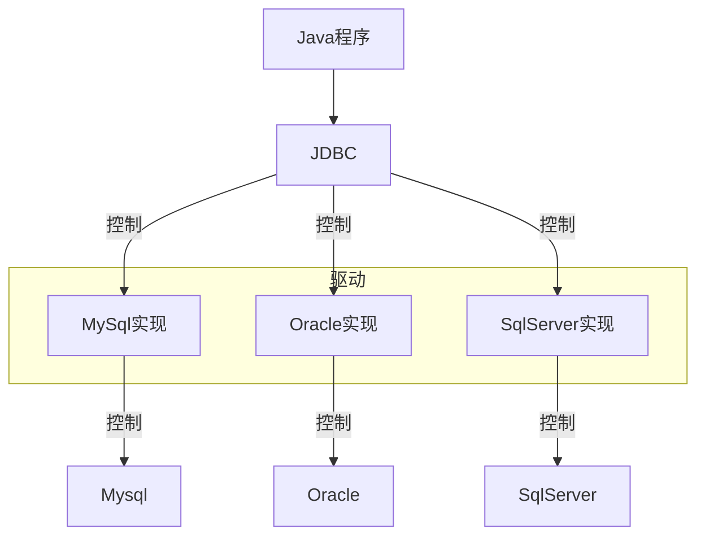
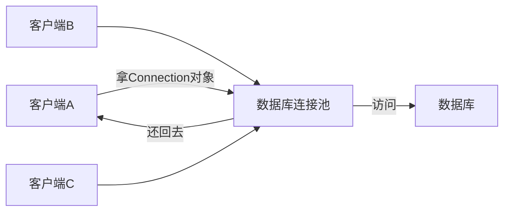

>[!hint] 技术选型
>- 【MyBatis】
>	- **优点**
>		- 适合定制化 SQL
>	- **缺点**
>		- 需要手动编写大量 SQL
>- 【Hibernate】
>	- **优点**
>		- 拥有全面的 ORM 功能

### MyBatis12310

- **优点**：
    - 提供了直观的 SQL 控制能力。
    - 性能优化，开发人员可以对 SQL 进行特定数据库的优化
    - 简单易学，没有第三方依赖。
    - 灵活的 SQL 编写和优化能力。
    - 解除 SQL 与程序代码的耦合，提高可维护性。
- **缺点**：
    - 数据库表结构变化时，维护成本高。
    - 不提供完整的对象关系映射（ORM）功能，需要手动处理对象和数据库之间的映射。
    - SQL 语句依赖于特定数据库，影响移植性。

### Hibernate123567811

- **优点**：
    - 提供强大的对象关系映射功能，简化对象和数据库表的映射。
    - 自动化程度高，减少手动编写 SQL 的工作量。
    - 跨数据库兼容性好，易于切换不同的数据库。
    - 拥有完整的日志系统和缓存机制。
- **缺点**：
    
    - 学习曲线较陡峭，需要时间来掌握。
    - 自动生成的 SQL 语句可能影响查询性能。
    - 隐藏了 SQL 执行的细节，可能难以优化。

### 性能比较

- 在性能方面，MyBatis 通常在插入和单表查询上表现优于 Hibernate，因为它直接操作数据库，而 Hibernate 需要在内存中建立对象关系映射8。
- 在关联查询数据的情况下，Hibernate 的懒加载配二级缓存可以提供与 MyBatis 相匹敌的性能，尤其是在单对象关联查询频繁时611。

### 技术选型建议

- **选择 MyBatis**：适合对 SQL 控制要求高、需要定制化 SQL 语句的场景，以及对性能优化有特定需求的项目。
- **选择 Hibernate**：适合对对象关系映射需求高、希望减少手动 SQL 编写工作量的项目，以及需要跨数据库兼容性的项目。

开发人员可以根据项目需求和团队技术栈，选择适合的持久化框架，或者在特定场景下结合使用这两种框架，以发挥各自优势，提高开发效率和系统性能。

# MyBatis
## 基本概念
>[!quote] MyBatis
>MyBatis 是一个 Java 持久层框架，**封装了 JDBC 程序**，简化了数据库的访问代码的编写，提供了灵活性和高度可定制的 SQL 映射，以及良好的性能

>[!quote] JDBC
>JDBC 是 SUN 公司提供的一套操作关系型数据库的 API


### 数据库连接池技术
- 在没有数据库连接池技术时，Java 程序要执行一条 SQL 语句，就要创建一个数据库连接对象，在使用完成之后，再释放这个连接对象
- 而使用了数据库连接池技术后，客户端需要执行 SQL 语句时，可以去数据库连接池中拿连接对象，用完之后再还回去



>[!hint] 数据库连接池的优点
>- 资源的重用【用完的 Connection 对象无需销毁，还回去即可】
>- 提升系统的响应速度【无需创建 Connection 对象，去拿即可】

## 准备工作
- 引入 MyBatis，mysql 依赖
```xml
<dependency>  
    <groupId>org.mybatis.spring.boot</groupId>  
    <artifactId>mybatis-spring-boot-starter</artifactId>  
    <version>3.0.3</version>  
</dependency>
<dependency>  
    <groupId>com.mysql</groupId>  
    <artifactId>mysql-connector-j</artifactId>  
</dependency>
```

- 在配置文件中配置 MySQL
```yml
spring:
  datasource:
    driver-class-name: com.mysql.cj.jdbc.Driver
    ## 连接到localhost:3306服务的，security数据库
    url: jdbc:mysql://localhost:3306/security
    username: root
    password: 13433026660
```

- 配置 SQL 提示
	
- 在 idea 的数据库配置中添加数据库
	
- 安装 `MyBatisX` 插件：可以在 <u>xml 文件</u> 与 <u>Mapper 接口</u> 中快速跳转

## 通过注解来实现 MyBatis
### 增删改查
```java
//配置实体user类
package com.example.Pojo;  

@Getter     //lombok中的注释
@Setter        
@ToString  
@NoArgsConstructor  
@AllArgsConstructor  
public class user {  
    private Integer id;  
    private String name;  
    private Integer age;  
    private Integer gender;  
    private String phone;  
}
```

```java
//定义Mapper接口
package com.example.mapper;  
  
import com.example.Pojo.user;  
  
//表示当前类是MyBatis的Mapper接口，在运行时会自动生成该接口的实现类对象，并将该对象交给IOC容器管理  
@Mapper    
public interface UserMapper {  
    //查询
    @Select("SELECT * FROM user")  
    public List<user> list();  
  
    //增
    @Insert("INSERT INTO user VALUES(#{id},#{name},#{age},#{gender},#{phone})")  
    public int InsertOne(Integer id, String name, Integer age, Integer gender, String phone);  
  
    //删  
    @Delete("DELETE FROM user WHERE id = #{id}")   //这个DELETE语句会返回删除了几条数据  
    public void DeleteOne(Integer id);  
  
    //改  
    @Update("UPDATE user SET name=#{name},age=#{age},gender=#{gender},phone=#{phone} WHERE id = #{id}")  
    public void UpdateOne(Integer id, String name, Integer age, Integer gender, String phone);  
}
```

```java
//启动测试类
package com.example;  
  
import com.example.Pojo.user;  
import com.example.mapper.UserMapper;  
  
@SpringBootTest  
class SpringBootMyBatisApplicationTests {  
    @Autowired  
    private UserMapper userMapper;  
  
    @Test  
    public void SelectUser() {  
        List<user> list = userMapper.list();  
        for (user user : list) {  
            System.out.println(user.toString());  
        }  
    }  
  
    @Test  
    public void InsertOne() {  
        int i = userMapper.InsertOne(6, "hoan", 30, 1, "211");  
        System.out.println(i);    //输出影响的记录数  
    }  
  
    @Test  
    public void DeleteOne() {  
        userMapper.DeleteOne(6);  
    }  
  
    @Test  
    public void UpdateOne() {  
        userMapper.UpdateOne(1, "greenteck", 35, 1, "985985");  
    }  
}

---
打印出所有用户数据
---
1
---
删除
---
修改
```

>[!hint] `#{}` 和 `${}`
>- `${}` **直接替换**：将传入的参数直接嵌入到生成的 SQL 语句中，<u>适用于动态拼接 sql 片段，而不是值</u>
>	- 会被 SQL 注入
>- `#{}` **预编译处理**：会将传递参数替换为一个占位符，在后续执行时设置具体参数，<u>适用于拼接参数值，而不是一大段 sql 片段</u>
>	- 性能高，因为不同参数的 SQL 语句只用编译一遍【MYSQL 有缓存机制】
>	- 安全：防止了 SQL 注入【用户使用输入数据来篡改 SQL 语句】
>	- `#{}` 不能放在**单引号**或**多引号**之间使用，如果一定要在引号里进行占位符，可以使用 `CONCAT 函数`

### 主键返回
>在很多时候我们会在插入一条数据之后，再拿到这条数据的 id。由于不能简单的通过 getId 来获取，所以我们要添加 **Options 注释**

- `useGeneratedKeys = true`  表示我们要拿到生成的主键值
- `keyProperty = "id"`  表示将自动生成的主键值映射到 `user` 对象的 `id` 属性

```java
@Options(useGeneratedKeys = true, keyProperty = "id")    //需要添加这条注释  
@Insert("INSERT INTO user(name,age,gender,phone) VALUES(#{name},#{age},#{gender},#{phone})") 
public void InsertOne(user user);
```

```java
package com.example;  
  
import com.example.Pojo.user;  
import com.example.mapper.UserMapper;  
  
@SpringBootTest  
class SpringBootMyBatisApplicationTests {  
    @Autowired  
    private UserMapper userMapper;  
  
    @Test  
    public void InsertOne() {  
        user user = new user();  
        user.setName("chico");  //有主键自增，所以不用插入id
        user.setAge(47);  
        user.setGender(1);  
        user.setPhone("9898989");  

        userMapper.InsertOne(user);  
        System.out.println(user.getId());  
    }  
}

---
17
```

## 通过 XML 来实现 MyBatis
>[!hint] 三大规范
> - 同包同名，一一对应：XML 文件的名称与 Mapper 接口的名称保持一致，一个 XML 文件对应一个 Mapper 接口，XML 文件在 `resource 目录` 下与 Mapper 接口在 java 目录下的包一致
> - XML 文件的 `namespace` 属性与 Mapper 接口的全类名保持一致
> - XML 文件中的 sql 语句的 id 与 Mapper 接口的方法名一致，且返回类型一致
> 
>

---
```java
package com.example.spring_security.infrastructure.mapper;

@Mapper
public interface UserMapper {
    // 查询user中所有数据
    public List<user> selectAll();
}
```

```xml
<!-- 必需添加 -->
<!DOCTYPE mapper PUBLIC "-//mybatis.org//DTD Mapper 3.0//EN" "http://mybatis.org/dtd/mybatis-3-mapper.dtd">

<mapper namespace="com.example.mapper.UserMapperXml">    
    <!--resultType表示的是单条记录所封装的类型-->
    <select id="SelectAll" resultType="com.example.Pojo.user">
        select * from user     //书写sql语句
    </select>
</mapper>
```

## 动态 SQL
### 动态查询
- `<where>` 标签可以动态的拼接 `<if>` 标签里的条件，如果只使用 WHERE
	- 如果第一个条件不成立会多出一个 AND
	- 如果所有条件不成立，会多出一个 WHERE
- `<if>` 标签可以根据 test 条件判断是否要拼接标签里的 sql

```xml
<select id="SelectCondition" resultType="com.example.Pojo.user">
    select *
    from user
    <where>
        <if test="name != null">  <!--test条件成立，则拼接sql-->
            name like concat('%',#{name},'%')
        </if>
        <if test="age != null">
            and age = #{age}
        </if>
        <if test="gender != null">
            and gender = #{gender}
        </if>
    </where>
</select>
```
### 动态更新
- `<set>` 标签可以动态删除语句中的逗号
```xml
<update id="UpdateUser">
    UPDATE user
    <set>          
        <if test="name != null">
            name=#{name}
        </if>
        <if test="age != null">
            ,age=#{age}
        </if>
        <if test="gender != null">
            ,gender=#{gender}
        </if>
        <if test="phone != null">
            ,phone=#{phone}
        </if>
        <if test="otId != null">
            ,ot_id=#{otId}
        </if>
    </set>
    WHERE id=#{id}
</update>
```
### 动态批量删除
- `collection`  表示集合的名称
- `item`  表示集合元素的名称
- `open`  在遍历元素的之前加的字符
- `separator`  遍历每个元素之后要加的字符
- `close`  遍历完所有元素之后要加的字符

```xml
<delete id="DeleteIds">
    DELETE
    FROM user
    WHERE id in       //ids集合名需要与Mapper接口传递的集合名保持一致
    <foreach collection="ids" item="id" open="(" separator="," close=")">
        #{id}
    </foreach>
</delete>

---
DELETE
FROM user
WHERE id in (A,B,C……)
```

```java
@Mapper  
public interface UserMapperXml {  
    public List<user> SelectAll();  
    //根据id集合来批量删除记录  
    public void DeleteIds(List<Integer> ids); 
}
```
### sql 片段的抽取与引用
>如果像上面一样每个语句都独立写代码，那复用性会很差，如果要更改表名或者其他参数，则要一个一个语句标签更改。引入 `<sql>` ，`<include>`标签可以解决这个问题

```xml
<sql id="select1">             //声明sql片段，定义id属性
	select id, name, age, gender, phone, ot_id
	from user
</sql>                

<select id="SelectCondition" resultType="com.example.Pojo.user">
	<include refid="select1"></include>    //引入sql片段，指定refid属性
	<where>
		……
	</where>
</select>
```
## 其他配置
### 数据封装
当数据库的字段名【dept_id】与实体类的属性名【deptId】不一致时，**默认不会进行封装**，所以我们要在配置文件中配置自动映射：

```
#开启MyBatis驼峰命名自动映射开关，此时a_column字段名 就会自动封装到 aColumn 或 AColumn 属性里
mybatis.configuration.map-underscore-to-camel-case=true
```

### 输出 MyBatis 日志到控制台
在配置文件配置之后，会在控制台输出要执行的 sql 语句，和各种日志

```
mybatis.configuration.log-impl=org.apache.ibatis.logging.stdout.StdOutImpl
```