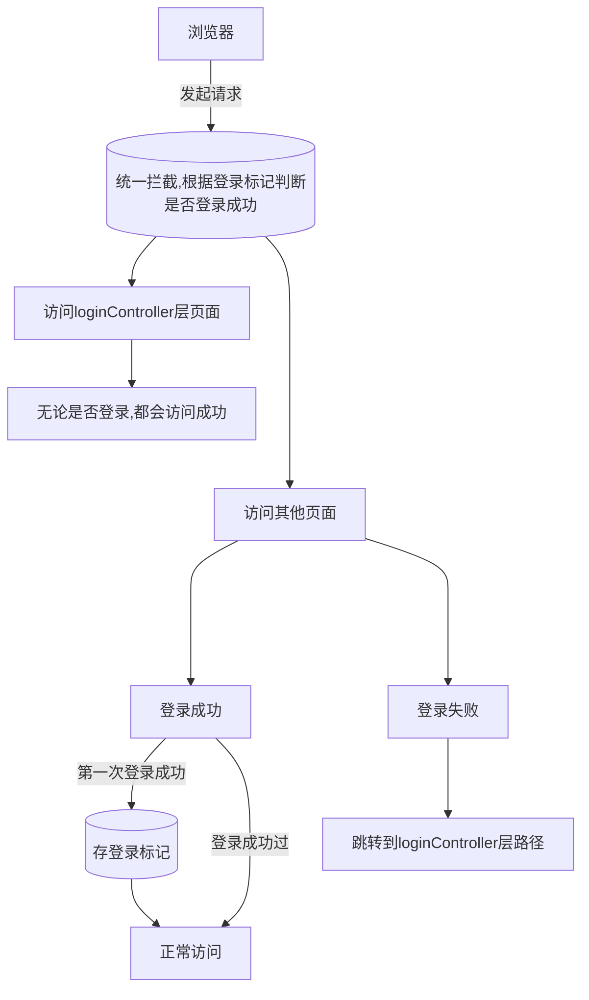

# 🌕登录功能

# 🌕登录校验
>在用户未登录时，无法访问该网站的其他子页面

### 🌗登录标记
>[!quote] 会话
>一次会话从打开浏览器访问Web服务器开始，直到其中一方断开连接，一次会话结束。***一次会话可以包含多次请求和响应***

>[!quote] 会话跟踪
>服务器来识别多次请求是否来自同一个浏览器，以便在多次请求中共享数据
##### 🌑Cookie 客户端会话跟踪技术
>服务端会创建一个Cookie响应给浏览器，浏览器会把这个Cookie保存下来，之后再发起请求时浏览器会携带Cookie，服务端根据Cookie判断会话对象

- 优点
	- HTTP协议中支持的技术
- 缺点
	- 移动端无法使用
	- 不安全
	- 用户可以自行禁用Cookie
	- Cookies不能跨域【***意味着前后端分离的设计模式无法使用***】
##### 🌑Session 服务端会话跟踪技术
>基于Cookie技术实现

- 优点
	- 安全【数据存储在服务端】
- 缺点
	- 服务器集群部署下无法使用Session技术
	- Cookie的所有缺点

>[!hint] Cookie 与 Session 已经很少使用了
##### 🌑JWT令牌

### 🌗统一拦截

##### 🌑过滤器Filter

##### 🌑拦截器Interceptor

# 🌕异常处理

