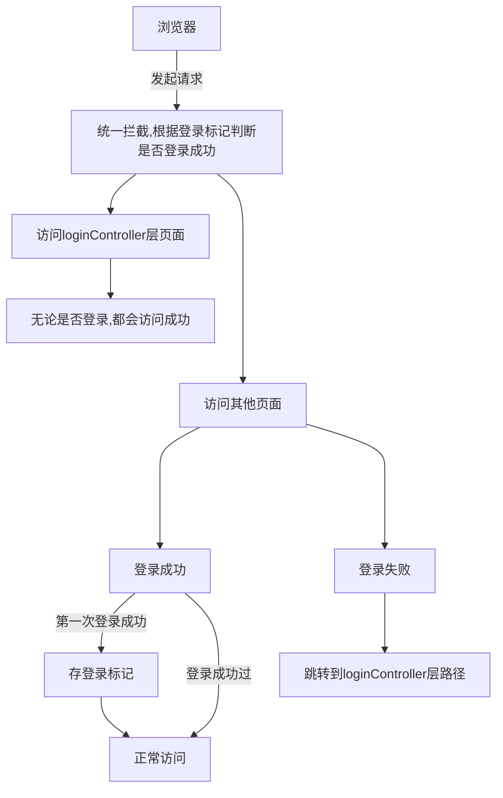

# 🌕登录功能

# 🌕登录校验
>在用户未登录时，无法访问该网站的其他子页面

```mermaid
graph TB
	a[浏览器]--发起请求-->b[统一拦截,根据登录标记判断是否登录成功]
	b-->j[访问loginController层页面]
	j-->c[无论是否登录,都会访问成功]
	
	b---->d[访问其他页面]
	d---->f[登录成功]
	f--第一次登录成功-->g[存登录标记]-->h[正常访问]
	f--登录成功过-->h

	d---->e[登录失败]-->i[跳转到loginController层路径]
```
# 🌕异常处理

