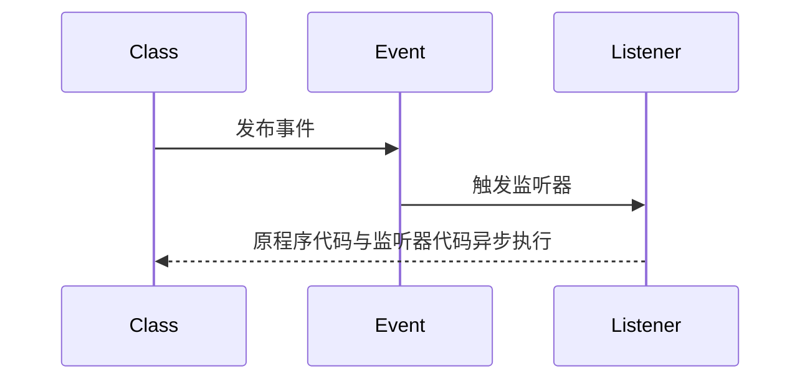

>[!hint] SpringBoot 在启动后，在不同的运行阶段会设置扩展点，可以让我们根据自己的需求在执行过程中，执行自定义的代码

# ApplicationContext
>[!quote] `ApplicationContext`【应用上下文】
>`ApplicationContext` 是 Spring 核心接口之一，是 Spring 中实现 IOC 和 DI 的容器，<u>用于存储应用程序运行时所需的各种 Bean 对象，并负责实例化，配置，组装这些 Bean</u>【当一个 Bean 需要另一个 Bean 作为依赖时，`ApplicationContext` 就会负责寻找和注入相应的 Bean】

>[!warning] 一旦 `ApplicationContext` 已经刷新，Bean 的定义就不能再被修改了，**但是，你应该尽量避免在运行时修改 Bean 的定义，而是应该在配置阶段就确定好 Bean 的定义**

`ApplicationContext` 包含一个 Environment，这个 Environment 保存了所有跟应用程序运行环境有关的属性【系统环境变量，JVM 系统属性，命令行参数，应用程序配置文件……】

## ApplicationContextInitializer
>[!quote] `ApplicationContextInitializer`
>`ApplicationContextInitializer` 就是 SpringBoot 众多扩展点中的一个，<u>在 IOC 容器创建完成后</u>， <u>`ApplicationContext` 刷新前</u>【完全初始化 Bean 之前】执行

>[!hint] `ApplicationContextInitializer` 的作用
>>对上下文环境做一些操作：
>>- 动态改变 Spring 配置属性【修改 Bean 定义】
>>- 修改 `ApplicationContext` 的环境属性
>
>你可以根据运行环境的不同，动态地修改应用程序的配置【你可能在开发环境和生产环境中使用不同的数据库配置，或者在不同的服务器上运行时使用不同的服务端口 ……】

### 具体实现
- 创建一个类，实现 `ApplicationContextInitializer` 接口，并继承`initialize 方法`

```java
package com.example.web_2.initializer;

public class MyApplicationContextInitializer implements ApplicationContextInitializer {
    @Override
    public void initialize(ConfigurableApplicationContext applicationContext) {
        // 准备属性
        Map<String, Object> myMap = new HashMap<>();
        myMap.put("applicationName", "big-events");

        // 获取环境对象
        ConfigurableEnvironment environment = applicationContext.getEnvironment();
        // 获取属性源
        MutablePropertySources propertySources = environment.getPropertySources();

        // 添加属性
        propertySources.addLast(new MapPropertySource("myPropertySource", myMap));
    }
}
```


- 在 `META-INF/spring.factories` 中注册这个初始化器

```factories
# 接口的全类名=实现类的全类名
org.springframework.context.ApplicationContextInitializer=com.example.web_2.initializer.MyApplicationContextInitializer
```

>[!hint] `resource/META-INF/spring.factories` 与 `resource/application.yml`
>>这两个都是配置文件，但是各有各的用途
>
>- `META-INF/spring.factories`：SpringBoot 在启动时会扫描这个文件，找到所有实现了特定接口，或者继承了特定类的配置类，并进行自动配置【~~在创建自定义 starter 时，通常会在这个文件中添加自己的自动配置类~~】==框架级别配置==
>- `application.yml`：包含了对 SpringBoot 的各种配置【服务器端口，数据库连接参数，应用程序的行为 ……】==应用级别配置==

- 测试一下
```java
@SpringBootApplication
public class Web2Application {
    public static void main(String[] args) {
        // 获取上下文对象
        ConfigurableApplicationContext run = SpringApplication.run(Web2Application.class, args);
        String applicationName = run.getEnvironment().getProperty("applicationName");
        System.out.println("applicationName = " + applicationName);
    }
}

---
applicationName = big-events
```

# 事件驱动编程
>[!quote] 事件驱动编程
>>事件驱动编程 是将程序的功能变为触发某个事件【比如我要实现用户注册成功之后给用户发送邮件，那就改成用户注册成功之后触发事件，由监听器来发送邮件】
>
>- **解耦**：把应用程序拆分成更小，更独立的部分，<u>这些部分通过事件进行通信，而不是直接调用彼此的方法</u>
>- **异步**：当触发事件后，程序继续执行相关代码，程序与监听器异步执行
>- **灵活**：更容易的<u>增删事件</u>【也就是功能】，而不改动原有的程序代码



## Applicationlistener
>[!quote] `Applicationlistener`
>`Applicationlistener` 是一个事件监听器接口，当在<u>特定情况下</u>【按钮，键盘，计时器 ……】触发事件时，Spring 运行时系统会发送一个 `ApplicationEvent`，然后由 `ApplicationListener` 进行接收和处理

## 具体实现
>当用户注册成功后，发送一封欢迎邮件：

- 创建 `UserRegisteredEvent` 继承 `ApplicationEvent` 

```java
public class UserRegisteredEvent extends ApplicationEvent {
    private User user;

	// `source`参数用来表示触发这个事件的对象
    public UserRegisteredEvent(Object source, User user) {
        super(source);
        this.user = user;
    }

    public User getUser() {
        return user;
    }
}
```

- 创建 `SendWelcomeEmailListener` 实现 `ApplicationListener` ，监听 `UserRegisteredEvent` ，使用 `@Component` 注入 Bean

```java
package com.example.web_2.listener;

@Component
public class SendWelcomeEmailListener implements ApplicationListener<UserRegisteredEvent> {
	// 方法中传入某个事件，如果传入ApplicationEvent，则表示监听所有事件
    @Override
    public void onApplicationEvent(UserRegisteredEvent event) {
        User user = event.getUser();
        // 使用user对象发送欢迎邮件...
    }
}
```

- 在用户注册成功后，发布 `UserRegisteredEvent` 事件

```java
// 原程序代码
User user = ... // 用户注册成功后的User对象

ApplicationContext context = ... // 获取ApplicationContext

// 构造事件对象，利用context发布事件
context.publishEvent(new UserRegisteredEvent(this, user));
```


