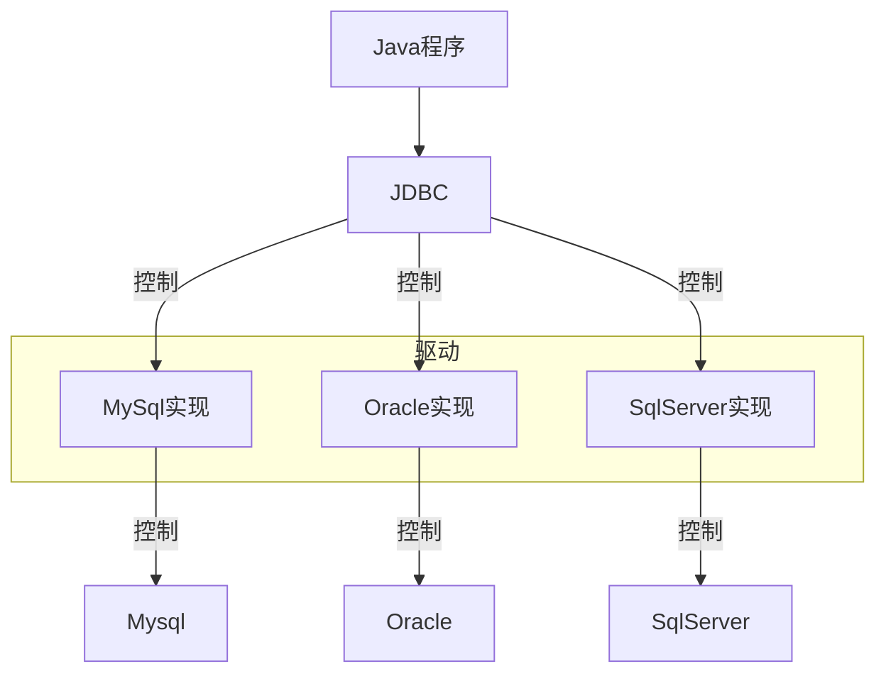
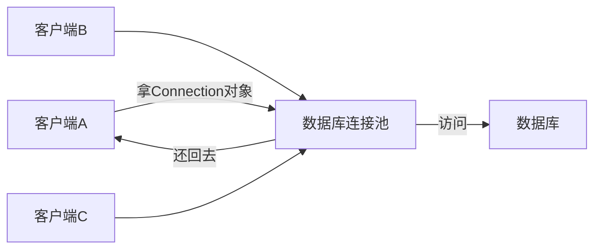

# 🌕基本概念
>Spring是一个开发生态圈，它提供了若干个子项目，用于完成特定功能
>![[JavaWeb Draw#^group=Lu3xncQA90nuAeKIaESZ_]]
# 🌕准备工作
### 🌗创建Spring项目
- 创建Spring模块
	- 勾选Web开发相关依赖
	![[JavaWeb Draw#^group=dMXiaySV]]
	![[JavaWeb Draw#^group=qCHuJWbK]]
### 🌗目录结构
- `.mvn` - Maven wrapper文件
- `src` - 源码目录
    - `main`
        - `java`
            - `包路径`
                - `启动类` 
        - `resources` - 资源文件目录
            - `application.properties` - Spring Boot配置文件
    - `test`
        - `java`
            - `包路径`
			- `项目名称ApplicationTests.java` - 测试 starters
- `pom.xml` - Maven项目对象模型配置文件
# 🌕Web服务器
>Web服务器对HTTP协议的操作进行了封装，使得Web开发更为便携。Web服务器可以用来部署我们我们开发好的Web项目，对外提供网上信息浏览服务
### 🌗HTTP协议
- HTTP协议，一次请求对应一次响应
- HTTP协议每次请求和响应都是独立的，后一次请求无法知道前一次请求的数据
### 🌗Tomcat
>Tomcat是一款轻量级的Web服务器

SpringBoot的依赖项的起步依赖web【里面包含了很多依赖】中已经***内置了Tomcat***，当启动类运行时，会自动运行Tomcat服务器
![[JavaWeb Draw#^group=yrp52Usr]]

# 🌕请求，响应，分层解耦
![[JavaWeb Draw#^group=tMdaT5BlcDIqJIyPd8ixX|770]]
### 🌗请求
>***Apifox***
>Apifox是一款 API设计/开发/测试工具

`RequestMapping`的子集：
- `@GetMapping`  限定路径的请求方式只能是 HTTP GET
- `@PostMapping`  限定路径的请求方式只能是 HTTP POST
- `@PutMapping`：限定路径的请求方式只能是 HTTP PUT
- `@DeleteMapping`  限定路径的请求方式只能是 HTTP DELETE
……
##### 🌑简单参数
GET请求：`http://localhost:8080/simpleParam?name=Tom&age=10`
```java
@RestController  //注释@RestController，表示这是一个Controller类
public class RequestController {  
    @RequestMapping("/simpleParam")    //注释RequestMapping，定义请求路径
    public String simpleParam(String name, Integer age) {  
        System.out.println(name + ":" + age);         //变量名需要和请求参数名保持一致
        return "OK";  
    }  
}


Tom:10
```
***@RestController = @Controller + @ResponseBody***
##### 🌑简单对象
GET请求：`http://localhost:8080/simplePojo?name=Tom&age=20`
```java
@RestController  
public class RequestController {  
    @RequestMapping("/simplePojo")  
    public String simplePojo(User user) {  //把请求的参数封装成User对象
        System.out.print(user.name);  
        System.out.print(":");  
        System.out.print(user.age);  
        return "OK";  
    }  

    private class User {  //定义User对象
        String name;  
        Integer age;  //定义的变量需要与请求参数保持一致
  
        public String getName() {  return name;  }  
        public void setName(String name) {  this.name = name;  }  
        public Integer getAge() {  return age;  }  
        public void setAge(Integer age) {  this.age = age;  }  
    }  
}


Tom:20
```
##### 🌑复杂参数
GET请求：`http://localhost:8080/complexPojo?name=Tom&age=20&address.province=广东&address.city=广州`
```java
@RequestMapping("/complexPojo")  
public String complexPojo(User user) {  
    System.out.println(user);  
    return "OK";  
}


User{name='Tom', age=20, address=Address{province='广东', city='广州'}}
```

```java
public class User {  
    private String name;  
    Integer age;  
    Address address;  

	get，set方法
	toString方法
}
```

```java
public class Address {  
    String province;  
    String city;  
  
    public String getProvince() {  return province;  }  
  
    public void setProvince(String province) {  this.province = province;  }  
  
    public String getCity() {  return city;  }  
  
    public void setCity(String city) {  this.city = city;  }  
  
    @Override  
    public String toString() {  
        return "Address{" +  
                "province='" + province + '\'' +  
                ", city='" + city + '\'' +  
                '}';  
    }  
}
```
##### 🌑数组参数
GET请求：`http://localhost:8080/arrayParam?hobby=dance&hobby=game&hobby=sing`
```java
@RequestMapping("/arrayParam")  
public String ArrayParam(String[] hobby) {    //数组名与请求参数名相同
    System.out.println(Arrays.toString(hobby));  
    return "OK";  
}


[dance, game, sing]
```
##### 🌑集合参数
GET请求：`http://localhost:8080/listParam?hobby=dance&hobby=game&hobby=sing`
```java
@RequestMapping("/listParam")  
public String ListParam(@RequestParam List<String> hobby) {  //需要添加RequestParam注解
    System.out.println(hobby);  
    return "OK";  
}


[dance, game, sing]
```

`@RequestParam`***注解用于从请求的URL查询参数中获取值，并将其绑定到Controller类方法的参数上***，其属性可以指定参数是否是必需的；可以设置参数的默认值
##### 🌑日期参数
GET请求：`http://localhost:8080/dateParam?updateTime=2023-10-09 15:50:20`
```java
@RequestMapping("/dateParam")  
public String DateParam(@DateTimeFormat(pattern = "yyyy-MM-dd HH:mm:ss") LocalDateTime updateTime) {         //添加注解来指定参数格式
    System.out.println(updateTime);  
    return "OK";  
}


2023-10-09T15:50:20
```
##### 🌑Json参数
POST请求：`http://localhost:8080/jsonParam`
```json
{
    "name": "Tom",
    "age": 20,
    "address": {
        "province": "广东",
        "city": "广州"
    }
}
```

```java
@RequestMapping("/jsonParam")  
public String JsonParam(@RequestBody User user) {  //注解表示将json数据封装成对象
    System.out.println(user);  
    return "OK";  
}


User{name='Tom', age=20, address=Address{province='广东', city='广州'}}
```
##### 🌑路径参数
GET请求：`http://localhost:8080/123`
```java
@RequestMapping("/{id}")  
public String PathParam(@PathVariable Integer id) {  //注解表示id是路径变量
    System.out.println(id);          //路径名与变量名要一致
    return "OK";  
}


123
```
##### 🌑文件参数
###### 🌙MultipartFile
>`MultipartFile` ***是SpringBoot提供的保存文件的一种格式***

>[!summary] 方法
> - `getName()`  返回前端form表单的名称
> - `getOriginalFilename()`  获取源文件的昵称
> - `getContentType()`  返回文件的内容类型
> - `isEmpty()`  判断上传的文件是否有内容
> - `getSize()`  返回文件大小【单位为字节】
> - `getBytes()`  返回一个将文件内容转化成一个以byte为元素的数组
> - `getInputStream()`  返回InputStream读取文件的内容
> - `transferTo(File var1)`  复制file文件到指定位置

- 前端
```html
<form action="/upload" method="get" enctype="multipart/form-data">
	图像: <input type="file" name="image">
</form>
```

- 后端
```Properties
#在配置文件中限制上传文件的Size

#配置单个文件上传大小限制（默认值为1M）  
spring.servlet.multipart.max-file-size=10MB  
#配置单次请求上传文件总大小限制（默认值为10M）  
spring.servlet.multipart.max-request-size=100MB
```

```java
@RestController  
public class UploadController {  
    @PostMapping("/upload")  
    public Result UploadFile(MultipartFile image) throws IOException {  
	    //获取到image对象的文件名
        String originalFilename = image.getOriginalFilename();  
        //拿到文件名的最后一个.的索引
        int indexOf = originalFilename.lastIndexOf(".");  
        //获取到该文件的后缀名
        String suffixName = originalFilename.substring(indexOf);  

		//获取uuid
        String uuid = UUID.randomUUID().toString();  
        //拼接uuid和后缀名
        String newFileName = uuid + suffixName;  

		//将文件保存到指定路径
        image.transferTo(new File("E:/抖音/" + newFileName));  
  
        return Result.buildResult(Result.Status.OK);  
    }  
}
```


>[!hint] 文件通过MultipartFile传递到服务器后，会产生一个临时文件，如果这时不对文件做任何操作。只要请求响应完毕之后，***这个文件就会被自动删除，不会保存***
### 🌗响应
##### 🌑首先包装一个Result类
```java
public class Result<T> {   
    private String status;      //状态码 
  
    public String getStatus() {      //获取状态  
        return status;  
    }  
   
    private String message;      //状态信息,错误描述 
    
    public String getMessage() {  //获取消息内容
        return message;  
    }  
   
    private T data;      //数据 
   
    public T getData() {  //获取数据内容
        return data;  
    }  
  
    private Result(String status, String message, T data) {  
        this.status = status;  
        this.message = message;  
        this.data = data;  
    }  
  
    private Result(String status, String message) {  
        this.status = status;  
        this.message = message;  
    }  
  
    private Result(String message) {  
        this.message = message;  
    }  
  
    //创建一个带有状态、消息和数据的结果对象 
    public static <T> Result<T> buildResult(Status status, String message, T data) {  
        return new Result<T>(status.getCode(), message, data);  
    }  
  
    //创建一个带有状态、消息和数据的结果对象
    public static <T> Result<T> buildResult(Status status, String message) {  
        return new Result<T>(status.getCode(), message);  
    }  
  
    // 创建一个带有状态和数据的结果对象
    public static <T> Result<T> buildResult(Status status, T data) {  
        return new Result<T>(status.getCode(), status.getReason(), data);  
    }  
  
    public static <T> Result<T> buildResult(Status status) {  
        return new Result<T>(status.getCode(), status.getReason());  
    }  
  
    public enum Status {  
        OK("200", "正确"),  
        BAD_REQUEST("400", "错误的请求"),  
        UNAUTHORIZED("401", "禁止访问"),  
        NOT_FOUND("404", "没有可用的数据"),  
        PWD_ERROR("300", "密码错误"),  
        EXIT("403", "已经存在"),  
        INTERNAL_SERVER_ERROR("500", "服务器遇到了一个未曾预料的状况"),  
        SERVICE_UNAVAILABLE("503", "服务器当前无法处理请求"),  
        ERROR("9999", "数据不能为空");  
  
        // 状态码,长度固定为6位的字符串.  
        private String code;  
  
        // 错误信息  
        private String reason;  
  
        Status(String code, String reason) {  
            this.code = code;  
            this.reason = reason;  
        }  
  
        public String getCode() {  
            return code;  
        }  
  
        public String getReason() {  
            return reason;  
        }  
  
        @Override  
        public String toString() {  
            return code + ": " + reason;  
        }  
    }  
}
```
##### 🌑响应对象
```java
@RequestMapping("/address")  
public Result<Address> address() {  
    Address address = new Address();  
    address.setProvince("广东");  
    address.setCity("广州");  
    return Result.buildResult(Result.Status.OK, address);  //传递状态码，数据
}
```
网页：
```
{
    "status": "200",
    "message": "正确",
    "data": {
        "province": "广东",
        "city": "广州"
    }
}
```
##### 🌑响应集合
```java
@RequestMapping("/list")  
public Result<List<Address>> list() {  
    List<Address> list = new ArrayList<>();  
    Address add1 = new Address();  
    add1.setProvince("广东");  
    add1.setCity("广州");  
  
    Address add2 = new Address();  
    add2.setProvince("福建");  
    add2.setCity("厦门");  
  
    list.add(add1);  
    list.add(add2);  
  
    return Result.buildResult(Result.Status.OK, list);  
}
```
网页：
```
{
    "status": "200",
    "message": "正确",
    "data": [
        {
            "province": "广东",
            "city": "广州"
        },
        {
            "province": "福建",
            "city": "厦门"
        }
    ]
}
```
### 🌗分层
##### 🌑Dao
>Dao层的作用是获取数据【文件数据，xml数据，json数据等】，==在MyBatis中叫Mapper==

```java
package com.example.web_2.Dao;  
  
public interface EmpDao {  //定义一个接口，固定格式
    public List<String> listEmp();  
}
```

```java
package com.example.web_2.Dao;  

//加载数据【文件数据，xml数据，json数据等】
public class EmpDaoA implements EmpDao {    
    @Override  
    public List<String> listEmp() {  
        List<String> list1 = new ArrayList(List.of("吴彦祖", "陈冠希", "金城武"));  
        return list1;  
    }  
}
```
##### 🌑Service
>Sevice层的作用对数据进行处理，然后返回给Controller类

```java
package com.example.web_2.Service;  

public interface EmpServie {  
    public List<String> listEmp();  
}
```

```java
package com.example.web_2.Service;  
  
//对数据进行逻辑处理，返回给Controller类  
public class EmpServiceA implements EmpServie {  
    private EmpDao empDao = new EmpDaoA();  //需要从EmpDao获取数据，所以创建接口对象

    @Override  
    public List<String> listEmp() {  
        List<String> emplist = empDao.listEmp();  
        emplist.add("黎明");  //对数据进行处理【添加数据】
        return emplist;  
    }  
}

/*
使用private EmpDao empDao = new EmpDaoA();的方式是为了遵循编程中的"面向接口编程"原则，这样可以在需要时轻松替换具体的实现类，而无需修改EmpServiceA类的其他部分。这样，代码在处理empDao时只关注EmpDao接口定义的方法，而不依赖于具体的实现细节。

另外，通过使用依赖注入的设计模式，可以将EmpDao对象的创建和管理交给外部的代码（例如使用依赖注入容器或手动注入）。这样可以更好地解耦和组织代码，提高代码的可测试性和可维护性。
*/
```
##### 🌑Controller
>Controller的作用是获取来自Service类发来的数据，响应数据给前端

```java
package com.example.web_2.Controller;  

//获取Service发来的数据，并响应数据给前端  
@RestController  
public class EmpController {  
    private EmpServie empServie = new EmpServiceA();  //创建EmpService对象
  
    @RequestMapping("/emp")  
    public Result listEmp() {  
        List<String> list = empServie.listEmp();  //获取Service处理过后的数据
        return Result.buildResult(Result.Status.OK, list);  //返回数据
    }  
}


---
GET请求：`http://localhost:8080/emp`
json：
{
    "status": "200",
    "message": "正确",
    "data": [
        "吴彦祖",
        "陈冠希",
        "金城武",
        "黎明"
    ]
}
```
###### 🌙公共路径
>在类的头部指定`@RequestMapping`注解

```java
@RestController  
@RequestMapping("/user")             //指定公共路径
public class UserController {  
    @Autowired  
    private UserService us;  

    @PostMapping                   //表示路径为POST请求的/user
    public Result InsertUser(@RequestBody user user) {  
        us.InsertUser(user);  
        return Result.buildResult(Result.Status.OK);  
    }  
    
    @GetMapping("/1")              //表示路径为Get请求的/user/1
    public List<user> SelectUser(Integer id) {  
	    return ……
    }  
}
```
### 🌗解耦
>以上的分层方式，实现了***高内聚***，但是依然没有实现***低耦合***【Controller中还是有依赖Service，Service还是有依赖Dao】
>![[Excalidraw/计算机/JavaWeb Draw.md#^group=g1pvEhriTd5poW0zM1k4o|500]]
>EmpController需要EmpService，那我们可以把EmpService放到IOC容器里，然后EmpController需要时就到容器中取
##### 🌑控制反转 IOC
>对象的创建控制权由程序自身转移到容器【本身由EmpController自身创建EmpService对象，变为由容器创建对象】

- ***添加***`@Component`***注释***【如果某个类不属于以下三类，但是也想交给IOC处理时使用】
	- 如果是控制器类上就用`@Controller`
	- 如果是逻辑处理Service类就用`@Service`
	- 如果是访问Dao类上就用`@Repository`，==如果Dao层中需要使用MyBatis，那要将`@Repository`注解改为`@Mapper`==
##### 🌑依赖注入 DI
>容器为应用程序提供运行时所依赖的资源【容器为EmpController提供运行时所需要的EmpService对象】

- ***添加***`@Autowired`***注释***【通过类型注入==单个注解中的单个依赖==】
- 添加`@Primary`注释【通过类型注入==多个注解中的单个依赖==】
	```java
	package com.example.web_2.Service;  
	  
	@Service
	public class EmpServiceA implements EmpServie {……}
	```
	```java
	package com.example.web_2.Service;  
	  
	@Primary  //表示优先这个Service类
	@Service  
	public class EmpServiceB implements EmpServie {……}
	```
- 添加`@Qualifier`注释【通过类型注入==多个注解中的单个依赖==】
	```java
	package com.example.web_2.Controller;  
	
	@RestController  
	public class EmpConteoller {  
		@Qualifier("empServiceB")  //指定使用的Bean对象的名称【默认为类名首字母小写】
		@Autowired  
		private EmpServie empServie;  
	  
		@RequestMapping("/emp")  
		public Result listEmp() {  
			List<String> list = empServie.listEmp();  
			return Result.buildResult(Result.Status.OK, list);  
		}  
	}
	```
- 添加`@Resource`注释【通过名称注入依赖】
	```java
	package com.example.web_2.Controller;  
	
	@RestController  
	public class EmpConteoller {  
	    @Resource(name = "empServiceB")  //直接指定Bean的名称
	    private EmpServie empServie;  
	  
	    @RequestMapping("/emp")  
	    public Result listEmp() {  
	        List<String> list = empServie.listEmp();  
	        return Result.buildResult(Result.Status.OK, list);  
	    }  
	}
	```

---

```java
@Repository  //将这个类交给IOC容器处理，成为IOC容器中的Bean
public class EmpDaoA implements EmpDao {  
    //加载数据【文件数据，xml数据，json数据等】  
    @Override  
    public List<String> listEmp() {  
        List<String> list1 = new ArrayList(List.of("吴彦祖", "陈冠希", "金城武"));  
        return list1;  
    }  
}
```

```java
package com.example.web_2.Service;  

@Service //将这个类交给IOC容器处理，成为IOC容器中的Bean  
public class EmpServiceA implements EmpServie {  
    @Autowired  //程序运行时，IOC容器会为这个变量提供Bean对象  
    private EmpDao empDao;  
  
    @Override  
    public List<String> listEmp() {  
        List<String> emplist = empDao.listEmp();  
        emplist.add("黎明");  
        return emplist;  
    }  
}
```

```java
@RestController  
public class EmpController {  
    @Autowired  //程序运行时，IOC容器会为这个变量提供Bean对象
    private EmpServie empServie;  
  
    @RequestMapping("/emp")  
    public Result listEmp() {  
        List<String> list = empServie.listEmp();  
        return Result.buildResult(Result.Status.OK, list);  
    }  
}
```
# 🌕MyBatis
### 🌗基本概念
##### 🌑什么是MyBatis
>MyBatis是一个开源的Java持久层框架，***封装了JDBC程序***，提供了一种优雅的方式来进行数据库访问，简化了数据库访问代码的编写，提供了灵活性和高度可定制的SQL映射，以及良好的性能

>JDBC是SUN公司提供的一套操作关系型数据库的API


##### 🌑数据库连接池技术
- 在没有数据库连接池技术时，Java程序要执行一条SQL语句，就要创建一个数据库连接对象，在使用完成之后，再释放这个连接对象
- 而使用了数据库连接池技术后，客户端需要执行SQL语句时，可以去数据库连接池中拿连接对象，用完之后再还回去


![[Excalidraw/计算机/编程语言/数据库/MyBatis Draw.md#^group=8ii8fwyi|700]]

>[!hint] 数据库连接池的优点
>- 资源的重用【用完的Connection对象无需销毁，还回去即可】
>- 提升系统的响应速度【无需创建Connection对象，去拿即可】
### 🌗准备工作
- 引入MyBatis的相关依赖

- 配置MyBatis

```xml
spring.datasource.driver-class-name=com.mysql.cj.jdbc.Driver  
spring.datasource.url=jdbc:mysql://localhost:3306/mybatis  
spring.datasource.username=root  
spring.datasource.password=13433026660
```
- 配置SQL提示
	
	- 在idea的数据库配置中添加数据库
	
	
- 安装`MyBatisX`插件
	- 可以在xml文件 与 Mapper接口 中快速跳转
### 🌗通过注解来实现MyBatis
##### 🌑基本操作
###### 🌙增删改查
```java
//配置实体user类
package com.example.Pojo;  

@Getter     //lombok中的注释
@Setter        
@ToString  
@NoArgsConstructor  
@AllArgsConstructor  
public class user {  
    private Integer id;  
    private String name;  
    private Integer age;  
    private Integer gender;  
    private String phone;  
}
```

```java
//定义Mapper接口
package com.example.mapper;  
  
import com.example.Pojo.user;  
  
//表示当前类是MyBatis的Mapper接口，在运行时会自动生成该接口的实现类对象，并将该对象交给IOC容器管理  
@Mapper    
public interface UserMapper {  
    //查询
    @Select("SELECT * FROM user")  
    public List<user> list();  
  
    //增
    @Insert("INSERT INTO user VALUES(#{id},#{name},#{age},#{gender},#{phone})")  
    public int InsertOne(Integer id, String name, Integer age, Integer gender, String phone);  
  
    //删  
    @Delete("DELETE FROM user WHERE id = #{id}")   //这个DELETE语句会返回删除了几条数据  
    public void DeleteOne(Integer id);  
  
    //改  
    @Update("UPDATE user SET name=#{name},age=#{age},gender=#{gender},phone=#{phone} WHERE id = #{id}")  
    public void UpdateOne(Integer id, String name, Integer age, Integer gender, String phone);  
}
```

```java
//启动测试类
package com.example;  
  
import com.example.Pojo.user;  
import com.example.mapper.UserMapper;  
  
@SpringBootTest  
class SpringBootMyBatisApplicationTests {  
    @Autowired  
    private UserMapper userMapper;  
  
    @Test  
    public void SelectUser() {  
        List<user> list = userMapper.list();  
        for (user user : list) {  
            System.out.println(user.toString());  
        }  
    }  
  
    @Test  
    public void InsertOne() {  
        int i = userMapper.InsertOne(6, "hoan", 30, 1, "211");  
        System.out.println(i);    //输出影响的记录数  
    }  
  
    @Test  
    public void DeleteOne() {  
        userMapper.DeleteOne(6);  
    }  
  
    @Test  
    public void UpdateOne() {  
        userMapper.UpdateOne(1, "greenteck", 35, 1, "985985");  
    }  
}

---
打印出所有用户数据
---
1
---
删除
---
修改
```

>[!hint] 以上的SQL语句用了“#{}”占位符，就是***预编译SQL语句***
>>=="#{}"不能放在***单引号***或***多引号***之间使用==
>>如果一定要在引号里进行占位符，可以使用`CONCAT函数`
>
>预编译SQL语句有两个优点：
>- 性能高，因为不同参数的SQL语句只用编译一遍【MYSQL有缓存机制】
>- 安全：防止了SQL注入【用户使用输入数据来篡改SQL语句】
###### 🌙主键返回
>在很多时候我们会在插入一条数据之后，再拿到这条数据的id。由于不能简单的通过getId来获取，所以我们要添加***Options注释***

`useGeneratedKeys = true`表示使用自动生成的主键
`keyProperty = "id"`表示将自动生成的主键值映射到`user`对象的`id`属性

```java
@Options(useGeneratedKeys = true, keyProperty = "id")    //需要添加这条注释  
@Insert("INSERT INTO user(name,age,gender,phone) VALUES(#{name},#{age},#{gender},#{phone})") 
public int InsertOne(user user);
```

```java
package com.example;  
  
import com.example.Pojo.user;  
import com.example.mapper.UserMapper;  
  
@SpringBootTest  
class SpringBootMyBatisApplicationTests {  
    @Autowired  
    private UserMapper userMapper;  
  
    @Test  
    public void InsertOne() {  
        user user = new user();  
        user.setName("chico");  //有主键自增，所以不用插入id
        user.setAge(47);  
        user.setGender(1);  
        user.setPhone("9898989");  

        userMapper.InsertOne(user);  
        System.out.println(user.getId());  
    }  
}

---
17
```
### 🌗通过XML来实现MyBatis
##### 🌑三大规范
- 同包同名，一一对应：XML文件的名称与Mapper接口的名称保持一致，一个XML文件对应一个Mapper接口，XML文件在resource目录下与Mapper接口在java目录下的包一致
- XML文件的`namespace`属性与Mapper接口的全类名保持一致
- XML文件中的sql语句的id 与 Mapper接口的方法名一致，且返回类型一致

![[Excalidraw/计算机/JavaWeb Draw.md#^group=fQSSes2S]]
```xml
<?xml version="1.0" encoding="UTF-8" ?>
<!DOCTYPE mapper
        PUBLIC "-//mybatis.org//DTD Mapper 3.0//EN"
        "http://mybatis.org/dtd/mybatis-3-mapper.dtd">
<mapper namespace="com.example.mapper.UserMapperXml">    
    <!--resultType表示的是单条记录所封装的类型-->
    <select id="SelectAll" resultType="com.example.Pojo.user">
        select * from user     //书写sql语句
    </select>
</mapper>
```
### 🌗动态SQL
##### 🌑动态查询
- `<where>`标签可以动态的拼接`<if>`标签里的条件，如果只使用WHERE
	- 如果第一个条件不成立会多出一个AND
	- 如果所有条件不成立，会多出一个WHERE
- `<if>`标签可以根据test条件判断是否要拼接标签里的sql

```xml
<select id="SelectCondition" resultType="com.example.Pojo.user">
    select *
    from user
    <where>
        <if test="name != null">  <!--test条件成立，则拼接sql-->
            name like concat('%',#{name},'%')
        </if>
        <if test="age != null">
            and age = #{age}
        </if>
        <if test="gender != null">
            and gender = #{gender}
        </if>
    </where>
</select>
```
##### 🌑动态更新
- `<set>`标签可以动态删除语句中的逗号
```xml
<update id="UpdateUser">
    UPDATE user
    <set>          
        <if test="name != null">
            name=#{name}
        </if>
        <if test="age != null">
            ,age=#{age}
        </if>
        <if test="gender != null">
            ,gender=#{gender}
        </if>
        <if test="phone != null">
            ,phone=#{phone}
        </if>
        <if test="otId != null">
            ,ot_id=#{otId}
        </if>
    </set>
    WHERE id=#{id}
</update>
```
##### 🌑动态批量删除
- `collection`  表示集合的名称
- `item`  表示集合元素的名称
- `open`  在遍历元素的之前加的字符
- `separator`  遍历每个元素之后要加的字符
- `close`  遍历完所有元素之后要加的字符

```xml
<delete id="DeleteIds">
    DELETE
    FROM user
    WHERE id in       //ids集合名需要与Mapper接口传递的集合名保持一致
    <foreach collection="ids" item="id" open="(" separator="," close=")">
        #{id}
    </foreach>
</delete>

---
DELETE
FROM user
WHERE id in (A,B,C……)
```

```java
@Mapper  
public interface UserMapperXml {  
    public List<user> SelectAll();  
    //根据id集合来批量删除记录  
    public void DeleteIds(List<Integer> ids); 
}
```
##### 🌑sql片段的抽取与引用
>如果像上面一样每个语句都独立写代码，那复用性会很差，如果要更改表名或者其他参数，则要一个一个语句标签更改。引入了==\<sql\>\<include\>标签==可以解决这个问题

```xml
<sql id="select1">             //声明sql片段，定义id属性
	select id, name, age, gender, phone, ot_id
	from user
</sql>                

<select id="SelectCondition" resultType="com.example.Pojo.user">
	<include refid="select1"></include>    //引入sql片段，指定refid属性
	<where>
		……
	</where>
</select>
```
### 🌗其他配置
##### 🌑数据封装
>当数据库的字段名【采用_命名，dept_id】与实体类的属性名【采用驼峰命名，deptId】不一致时，***默认不会进行封装***[^1]

在`application.properties`文件中配置：
```
#开启MyBatis驼峰命名自动映射开关
mybatis.configuration.map-underscore-to-camel-case=true
```
此时a_column字段名 就会自动封装到 aColumn 或 AColumn 属性里

[^1]:不会把数据库中的数据封装到实体对象中
##### 🌑输出MyBatis日志到控制台
>配置之后，会在控制台输出要执行的sql语句 和 各种日志

在`application.properties`文件中配置：
```
mybatis.configuration.log-impl=org.apache.ibatis.logging.stdout.StdOutImpl
```
# 🌕lombok
>Lombok是一种Java库，它通过注解的方式来简化Java类的编写，提高代码的可读性和简洁性

### 🌗引入lombok依赖
```xml  
<dependency>  
    <groupId>org.projectlombok</groupId>  
    <artifactId>lombok</artifactId>   
</dependency>           //不用指定版本号，因为在SpringBoot的父工程里已经集成了lombok
```
### 🌗具体操作
`@Getter/@Setter`  为所有属性提供get/set方法
`@ToString`  给类自动生成的toString方法
`@EqualsAndHashCode`  根据类所拥有的非静态字段重写equals方法和hashCode方法
`@Data`  是@Getter+@Setter+@ToString+@EqualsAndHashCode的集合
`@NoArgsConstructor`  为实体类生成无参构造方法
`@AllArgsConstructor`  为实体类生成除了static修饰的字段之外带有所有参数的构造方法

- 未使用lombok
	```java
	public class user {  
	    private Integer id;  
	    private String name;  
	    private Integer age;  
	    private Integer gender;  
	    private String phone;  
	  
	    public user() {  }  
	  
	    public user(Integer id, String name, Integer age, Integer gender, String phone) {  
	        this.id = id;  
	        this.name = name;  
	        this.age = age;  
	        this.gender = gender;  
	        this.phone = phone;  
	    }  
	  
	    public Integer getId() {  return id;  }  
	    public void setId(Integer id) {  this.id = id;  }  
	  
	    public String getName() {  return name;  }  
	    public void setName(String name) {  this.name = name;  }  
	  
	    public Integer getAge() {  return age;  }  
	    public void setAge(Integer age) {  this.age = age;  }  
	  
	    public Integer getGender() {  return gender;  }  
	    public void setGender(Integer gender) {  this.gender = gender;  }  
	  
	    public String getPhone() {  return phone;  }  
	    public void setPhone(String phone) {  this.phone = phone;  }  
	  
	    @Override  
	    public String toString() {  
	        return "user{" +  
	                "id=" + id +  
	                ", name='" + name + '\'' +  
	                ", age=" + age +  
	                ", gender=" + gender +  
	                ", phone='" + phone + '\'' +  
	                '}';  
	    }  
	}
	```
- 使用lombok
	```java
	import lombok.*;  
	  
	@Getter  
	@Setter  
	@ToString  
	@NoArgsConstructor  
	@AllArgsConstructor  
	public class user {  
	    private Integer id;  
	    private String name;  
	    private Integer age;  
	    private Integer gender;  
	    private String phone;  
	}
	```
# 🌕配置文件
##### 🌑参数配置化
>将项目中的参数集中化管理【***如果将参数分散在各个java类中，会导致==查找困难==，而且这种硬编码的方式，==在每次更改参数时都要重新编译项目==***】，


