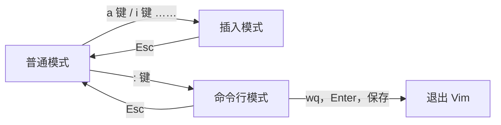

$$
Vim 是在 Linux 中的编辑器
$$

>[!hint] 使用 `vim 以存在的文件/要新建的文件`，打开 Vim 编辑器

# Vim 模式


## 普通模式
>Vim 启动后的默认模式

### 移动光标
- **基础跳转**
	- `h` 左
	- `j` 下
	- `k` 上
	- `l` 右
- **行间跳转**
	- `ngg` 游标移动到第 n 行
	- `gg` 游标移动到第一行
	- `G` 到最后一行
- **行内跳转**
- **技巧**
	- `Ctrl+o` 在完成某次跳转后，可以快速回到跳转前的位置

### 删除文本
- `x` 删除当前字符
- `dd` 删除当前行
- `dj` 删除当前行和下一行
- `2dd` 重复 `dd` 两次

### 重复
`.` 可以重复上一个命令

```bash
# 此处为普通模式
x
# 以下的两个点会重复 x
.
.
```

### 复制，粘贴，剪切
- **复制**
	- `y` 复制
	- `yy` 复制整行
	- `3yy` 复制 3 行
	- `y^` 复制至行首【不含光标所在处字符】
	- `y$` 复制至行尾【含光标所在处字符】
	- `yw` 复制一个单词
	- `y1G` 复制至文本开头
	- `yG` 复制至文本末
- **粘贴**
	- `p` 粘贴
	- **剪切**：`dd` 删除，Vim 会自动把删除的内容复制下来，再 `p`

### 替换，撤销
- `r`+<待替换字母> : 将游标所在字母替换为指定字母
- `R` : 连续替换，直到按下 `Esc`
- `cc` : 替换整行，即删除游标所在行，并进入插入模式
- `cw` : 替换一个单词，即删除一个单词，并进入插入模式
- `C` : 替换游标以后至行末
- `~` : 反转游标所在字母大小写
- `u` : 撤销操作
- `U`: 撤销当前行的所有修改
- `Ctrl+r` : 撤销<u>撤销的操作</u>

### 缩进
- `>>` 整行将向右缩进
- `<<` 整行向左回退

>[!hint] 在命令行模式下 `:set sw=2`，将缩进设置为 2


### 查找
- `/需要查找的字符串`
- 

#### 快速查找

普通模式下输入 `/` 然后键入需要查找的字符串，按回车后就会进行查找。`?` 与`/` 功能相同，只不过 `?` 是向上而 `/` 是向下查找。

进入查找之后，输入 `n` 和 `N` 可以继续查找。`n` 是查找下一个内容，`N` 查找上一个内容。

#### 快速查找练习

使用 vim 打开文件进行编辑（搜索高亮需要在配置文件 `.vimrc` 中设置 `set hls`，实验环境中已经设置好了）。

```bash
vim protocols
```

- 普通模式下输入 `/icmp` 然后回车即可查找字符串 `icmp`
- 普通模式下输入 `n` 查找下一个 `icmp`
- 普通模式下输入 `?tcp` 向上查找字符串 `tcp`
- 普通模式下输入 `N` 查找上一个出现的 `tcp`
- 命令行模式下输入 `noh` 然后回车即可取消搜索

#### 高级查找

- 普通模式下输入 `\*` 寻找游标所在处的单词
- 普通模式下输入 `\#` 同上，但 `\#` 是向前（上）找，`\*` 则是向后（下）找
- 普通模式下输入 `g\*` 同 `\*`，但部分符合该单词即可
- 普通模式下输入 `g\#` 同 `\#`，但部分符合该单词即可

以上查找 `n`，`N` 的继续查找命令依然可以用。


## 插入模式
>[!hint] 以各种方式进入到插入模式
> - `i`：在当前光标处进行编辑
> - `I`：在行首插入
> - `A`：在行末插入
> - `a`：在光标后插入编辑
> - `o`：在当前行后插入一个新行
> - `O`：在当前行前插入一个新行
> - `cw`：替换从光标所在位置后到一个单词结尾的字符


>[!hint] 每次要先回到普通模式，才能切换成不同的插入模式

## 可视模式
>可视模式 = 普通模式 + 高亮

在可视模式中，你可以使用移动命令来扩展或缩小高亮显示的文本区域，从而选择你想要操作的内容，Vim 的"文本对象"在这模式下也适用

## 选择模式
选择模式可以用鼠标或者光标键高亮选择文本，当输入任何字符时，Vim 会用这个字符替换选择的高亮文本块，并且自动进入插入模式

## 命令行模式
- **基础命令**
	- `:w` 保存文件，`:w <文件路径>` 可以另存为
	- `:q` 退出 Vim
	- `:!` 强制退出
	- `:set nu` 显示行号
- `/` 搜索
- `!` 过滤


### 文本位置
- `:ce` 让该行文本在该行居中
- `:le` 让该行文本在该行居左
- `:ri` 让该行文本在该行居右


## Ex 模式
和命令行模式比较相似，在使用 `:visual` 命令离开 Ex 模式前，可以一次执行多条命令。

这其中我们常用到就是普通模式、插入模式和命令行模式，本课程也只涉及这三个常用模式的内容


# 基本操作
## 打开文件，编辑，退出
- 进入 Vim `vim 以存在的文件/要新建的文件`
- 按下 `i` ，进入插入模式，编辑
- 按下 `Esc` ，进入普通模式，移动光标
- 按下 `:`，`wq`，`Enter`，保存并退出


