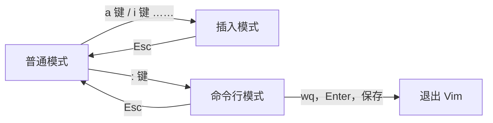

$$
Vim 是在 Linux 中的编辑器
$$

>[!hint] 使用 `vim 以存在的文件/要新建的文件`，打开 Vim 编辑器

# Vim 模式


## 普通模式
>Vim 启动后的默认模式

### 移动光标
- **基础跳转**
	- `h` 左
	- `j` 下
	- `k` 上
	- `l` 右
- **行间跳转**
	- `ngg` 游标移动到第 n 行
	- `gg` 游标移动到第一行
	- `G` 到最后一行
- **行内跳转**
- **技巧**
	- `Ctrl+o` 在完成某次跳转后，可以快速回到跳转前的位置

### 删除文本
- `x` 删除当前字符
- `dd` 删除当前行
- `dj` 删除当前行和下一行
- `2dd` 重复 `dd` 两次

### 重复
`.` 可以重复上一个命令

```bash
# 此处为普通模式
x
# 以下的两个点会重复 x
.
.
```

### 复制，粘贴，剪切
- **复制**
	- `y` 复制
	- `yy` 复制整行
	- `3yy` 复制 3 行
	- `y^` 复制至行首【不含光标所在处字符】
	- `y$` 复制至行尾【含光标所在处字符】
	- `yw` 复制一个单词
	- `y1G` 复制至文本开头
	- `yG` 复制至文本末
- **粘贴**
	- `p` 粘贴
	- **剪切**：`dd` 删除，Vim 会自动把删除的内容复制下来，再 `p`

### 替换，撤销
- **替换**
	- `r`+<待替换字母> : 将游标所在字母替换为指定字母
	- `R` : 连续替换，直到按下 `Esc`
	- `cc` : 替换整行，即删除游标所在行，并进入插入模式
	- `cw` : 替换一个单词，即删除一个单词，并进入插入模式
	- `C` : 替换游标以后至行末
	- `~` : 反转游标所在字母大小写
- **撤销**
	- `u` : 撤销操作
	- `U`: 撤销当前行的所有修改
	- `Ctrl+r` : 撤销<u>撤销的操作</u>

### 缩进
- `>>` 整行将向右缩进
- `<<` 整行向左回退

>[!hint] 在命令行模式下 `:set sw=2`，将缩进设置为 2


### 查找
- **简单查找**
	- `/需要查找的字符串` 向下查找字符串
	- `?需要查找的字符串` 向上查找字符串
	- `n` 进入查找之后，继续向下查找同一个内容
	- `N` 进入查找之后，继续向上查找同一个内容
	- `noh` + `Enter` 取消搜索
- **高级查找**
	- `\*` 向下寻找游标所在处的单词
	- `\#` 向上寻找游标所在处的单词

## 插入模式
>[!hint] 以各种方式进入到插入模式
> - `i`：在当前光标处进行编辑
> - `I`：在行首插入
> - `A`：在行末插入
> - `a`：在光标后插入编辑
> - `o`：在当前行后插入一个新行
> - `O`：在当前行前插入一个新行
> - `cw`：替换从光标所在位置后到一个单词结尾的字符


>[!hint] 每次要先回到普通模式，才能切换成不同的插入模式

## 可视模式
>可视模式 = 普通模式 + 高亮

- 在普通模式下输入 `v`，进入字符选择模式【可以移动光标，光标走过的地方就会选取】，再次按下 `v` 就会取消选取
- 在普通模式下输入 `Shift+v`，进入行选择模式【可以上下移动光标选更多的行】，再按一次可以取消选取
- 在普通模式下输入 `Ctrl+v`，这是区域选择模式【可以进行矩形区域选择】

>[!hint] 可视模式下可以执行普通模式的命令，例如在选定了高亮区域后，执行 `d`可以删除区域内容

## 选择模式
选择模式可以用鼠标或者光标键高亮选择文本，当输入任何字符时，Vim 会用这个字符替换选择的高亮文本块，并且自动进入插入模式

## 命令行模式
- **基础命令**
	- `:w` 保存文件，`:w <文件路径>` 可以另存为
	- `:q` 退出 Vim
	- `:!` 强制退出
	- `:set nu` 显示行号
- `/` 搜索
- `!` 过滤


### 文本位置
- `:ce` 让该行文本在该行居中
- `:le` 让该行文本在该行居左
- `:ri` 让该行文本在该行居右

### 功能设定
- vim 的功能设定

可以在编辑文件的时候进行功能设定，如命令行模式下输入 `:set nu`（显示行数），设定值退出 vim 后不会保存。要永久保存配置需要修改 vim 配置文件。

vim 的配置文件 `~/.vimrc`（实验楼环境中配置文件在 `/etc/vim/vimrc`），可以打开文件进行修改，不过务必小心不要影响 vim 正常使用。

- 获取目前的设定

	- 命令行模式下输入 `:set` 或者 `:se` 显示所有修改过的配置
	- 命令行模式下输入 `:set all` 显示所有的设定值
	- 命令行模式下输入 `:set <option>?` 显示 option 的设定值
	- 命令行模式下输入 `:set nooption` 取消当前设定值

- set 功能的说明

	- 命令行模式下输入 `:set autoindent(ai)` 设置自动缩进
	- 命令行模式下输入 `:set autowrite(aw)` 设置自动存档，默认未打开
	- 命令行模式下输入 `:set background=dark` 或 `light`，设置背景风格
	- 命令行模式下输入 `:set backup(bk)` 设置自动备份，默认未打开
	- 命令行模式下输入 `: set cindent(cin)` 设置 C 语言风格缩进

## Ex 模式
和命令行模式比较相似，在使用 `:visual` 命令离开 Ex 模式前，可以一次执行多条命令。

这其中我们常用到就是普通模式、插入模式和命令行模式，本课程也只涉及这三个常用模式的内容


# 基本操作
## 打开文件，编辑，退出
- 进入 Vim `vim 以存在的文件/要新建的文件`
- 按下 `i` ，进入插入模式，编辑
- 按下 `Esc` ，进入普通模式，移动光标
- 按下 `:wq`，`Enter`，保存并退出

# 高级操作
## 多文件编辑
### 进入 Vim 之前
- `vim 1.txt 2.txt`

命令行模式下输入 `:n` 编辑 2.txt 文件，`:n!` 强制切换
命令行模式下输入 `:N` 编辑 1.txt 文件，`:N!` 强制切换

### 进入 Vim 之后
- 命令行模式下输入`:e 3.txt` 打开新文件 3.txt
- 命令行模式下输入`:e#` 回到前一个文件
- 命令行模式下输入`:ls`可以列出以前编辑过的文档
- 命令行模式下输入`:b 2.txt`（或者编号）可以直接进入文件 2.txt 编辑
- 命令行模式下输入`:bd 2.txt`（或者编号）可以删除以前编辑过的列表中的文件项目
- 命令行模式下输入`:e! 4.txt`，新打开文件 4.txt，放弃正在编辑的文件
- 命令行模式下输入`:f` 显示正在编辑的文件名
- 命令行模式下输入`:f new.txt`，改变正在编辑的文件名字为 new.txt

## 恢复文件
如果因为断电，终端意外关闭等原因造成文档没有保存，可以采用恢复方式。

vim 在编辑的时候会自动在当前文件目录下生成一个交换文件，一般以 `<filename>.swp` 的格式保存，如果有多个版本的交换文件，还可能是 `.swn`，`.swm` 等字母。注意这个交换文件的更新不是实时的，因为实时的更新会占用磁盘，影响系统其他正常进程的速度。

当 vim 意外终止且没有保存已编辑的内容时，可以使用交换文件对文件进行恢复，注意需要在编辑这个文件的地方进行编辑，因为交换文件默认在编辑的目录生成。

例如假设 `1.txt` 意外关闭，我们可以输入 `vim` 然后输入 `:recover 1.txt`。

```bash
vim :recover 1.txt 
# 出现如下提示按下回车即可恢复，如果有多个版本需要输入对应的交换文件前的数字选择要恢复的版本。
Using swap file ".1.txt.swp" Original file "~/test/1.txt" Recovery completed. You should check if everything is OK. (You might want to write out this file under another name and run diff with the original file to check for changes) You may want to delete the .swp file now.
```
或者输入 `vim -r` 后直接选择用于恢复的文档的交换文件即可：
`vim -r 1.txt`

## 多视窗操作
>多视窗就是 vim 在一个界面里打开多个窗口进行编辑

- **命令行模式**
	- `:new` 打开一个新的 vim 视窗
	- `:sp 1.txt` 打开新的水平分屏视窗来编辑 1.txt
	- `:vsp 2.txt` 打开新的垂直分屏视窗来编辑 2.txt
- **普通模式**
	- `ctrl+w`
	- `Ctrl+w s` 将当前窗口分割成两个水平的窗口
	- `Ctrl+w v` 将当前窗口分割成两个垂直的窗口
	- `Ctrl+w o` 打开一个视窗并且隐藏之前的所有视窗
	- `Ctrl+w q` 即 :q 结束分割出来的视窗。如果在新视窗中有输入需要使用强制符！即:q!
	- `Ctrl+w j` 移至下面视窗
	- `Ctrl+w k` 移至上面视窗
	- `Ctrl+w h` 移至左边视窗
	- `Ctrl+w l` 移至右边视窗
	- `Ctrl+w J` 将当前视窗移至下面
	- `Ctrl+w K` 将当前视窗移至上面
	- `Ctrl+w H` 将当前视窗移至左边
	- `Ctrl+w L` 将当前视窗移至右边
	- `Ctrl+w -` 减小视窗的高度
	- `Ctrl+w +` 增加视窗的高度

## 加密文档
使用 `vim -x file1` 创建文件，之后输入密码，这样在下一次打开时，vim 就会要求你输入密码

## 执行外部命令
>在命令行模式中输入 `!` 可以执行外部的 `shell 命令`

- `:!ls` 用于显示当前目录的内容
- `:!rm FILENAME` 用于删除名为 FILENAME 的文件


