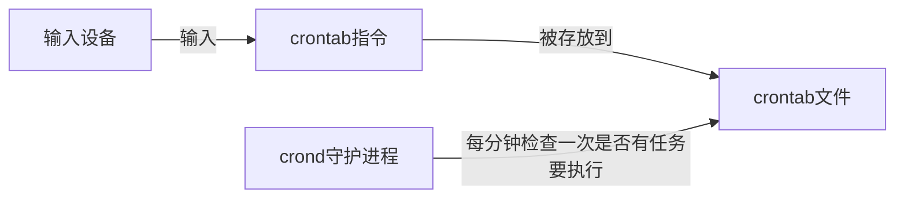

# crontab
通过 `crontab`，我们可以在固定的间隔时间执行指定的系统指令或 shell 脚本



## 格式
```bash
# .---------------- 分 (0 - 59)
# |  .------------- 时 (0 - 23)
# |  |  .---------- 日 (1 - 31)
# |  |  |  .------- 月 (1 - 12) OR jan,feb,mar,apr ...
# |  |  |  |  .---- 星期几 (0 - 6) (Sunday=0)
# |  |  |  |  |
# *  *  *  *  * user-name command to be executed
```

## 操作
- 启动 crontab【有些环境可能没启动】
```bash
sudo cron －f &
```

---

- 添加任务
	- 添加用户级别的任务
		```bash
		crontab -e
		```
	- 添加系统级别的任务
		```bash
		sudo vim /etc/crontab
		```

---

- 选择编辑器

---

- 在文档后添加命令
```bash
# 每分钟我们会在/home/shiyanlou下创建一个以当前的年月日时分秒为名字的空白文件
*/1 * * * * touch /home/shiyanlou/$(date +\%Y\%m\%d\%H\%M\%S)
```

>[!hint] 在 crontab 文件中，`%` 有结束命令行，换行，重定向的作用，如果要使用 `%`，要使用 `\` 转义

---

- 查看已添加的任务
```bash
crontab -l
```

---

- 确认 cron 是否成功运行

```bash
pgrep cron
```

---

- 查看日志信息反馈
```bash
sudo tail -f /var/log/syslog
```

---

- 删除任务
```bash
crontab -r
```

---


