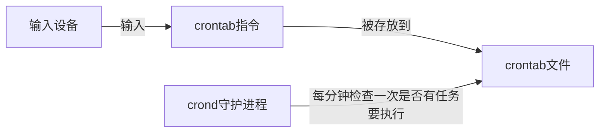

# crontab
通过 `crontab`，我们可以在固定的间隔时间执行指定的系统指令或 shell 脚本



## 格式
```bash
# .---------------- 分 (0 - 59)
# |  .------------- 时 (0 - 23)
# |  |  .---------- 日 (1 - 31)
# |  |  |  .------- 月 (1 - 12) OR jan,feb,mar,apr ...
# |  |  |  |  .---- 星期几 (0 - 6) (Sunday=0)
# |  |  |  |  |
# *  *  *  *  * user-name command to be executed
```

## 操作
- 启动 crontab【有些环境可能没启动】
```bash
sudo cron －f &
```

---

- 添加任务
```bash
crontab -e
```

---

- 选择编辑器

---

- 在文档后添加命令
```bash
# 每分钟我们会在/home/shiyanlou下创建一个以当前的年月日时分秒为名字的空白文件
*/1 * * * * touch /home/shiyanlou/$(date +\%Y\%m\%d\%H\%M\%S)
```

>[!hint] 在 crontab 文件中，`%` 有结束命令行，换行，重定向的作用，如果要使用 `%`，要使用 `\` 转义

---

- 查看已添加的任务
```bash
crontab -l
```

---

- 确认 cron 是否成功运行

```bash
pgrep cron
```

---

- 查看日志信息反馈
```bash
sudo tail -f /var/log/syslog
```

---

- 删除任务
```bash
crontab -r
```

---

每个用户使用 `crontab -e` 添加计划任务，都会在 `/var/spool/cron/crontabs` 中添加一个该用户自己的任务文档，这样目的是为了隔离。


如果是系统级别的定时任务，需要 root 权限执行的任务应该怎么处理？

只需要使用 `sudo` 编辑 `/etc/crontab` 文件就可以。

`cron` 会每分钟去读取一次 `/etc/crontab` 与 `/var/spool/cron/crontabs` 里面的內容。

在 `/etc` 目录下，`cron` 相关的目录有下面几个：


每个目录的作用：

1. `/etc/cron.daily`，目录下的脚本会每天执行一次，在每天的 6 点 25 分时运行；
2. `/etc/cron.hourly`，目录下的脚本会每个小时执行一次，在每小时的 17 分钟时运行；
3. `/etc/cron.monthly`，目录下的脚本会每月执行一次，在每月 1 号的 6 点 52 分时运行；
4. `/etc/cron.weekly`，目录下的脚本会每周执行一次，在每周第七天的 6 点 47 分时运行；

系统默认执行时间可以根据需求进行修改。

