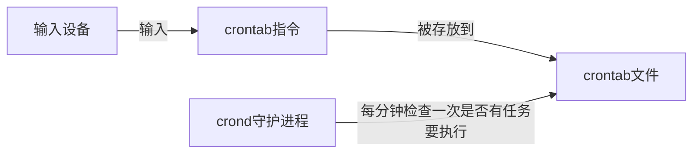

# crontab
通过 `crontab`，我们可以在固定的间隔时间执行指定的系统指令或 shell 脚本



## 格式
```bash
# .---------------- 分 (0 - 59)
# |  .------------- 时 (0 - 23)
# |  |  .---------- 日 (1 - 31)
# |  |  |  .------- 月 (1 - 12) OR jan,feb,mar,apr ...
# |  |  |  |  .---- 星期几 (0 - 6) (Sunday=0)
# |  |  |  |  |
# *  *  *  *  * user-name command to be executed
```

## 操作
- 启动 crontab【有些环境可能没启动】
```bash
sudo cron －f &
```

---

- 添加任务
```bash
crontab -e
```

---

- 选择编辑器

---

- 在文档后添加命令
```bash
# 每分钟我们会在/home/shiyanlou下创建一个以当前的年月日时分秒为名字的空白文件
*/1 * * * * touch /home/shiyanlou/$(date +\%Y\%m\%d\%H\%M\%S)
```

“ % ” 在 crontab 文件中，有结束命令行、换行、重定向的作用，前面加 ” \ ” 符号转义，否则，“ % ” 符号将执行其结束命令行或者换行的作用，并且其后的内容会被做为标准输入发送给前面的命令。

添加成功后我们会得到最后一排 installing new crontab 的一个提示：


当然我们也可以通过这样的一个指令来查看我们添加了哪些任务：

```bash
crontab -l
```

通过图中的显示，我们也可以看出，我们正确的保存并且添加成功了该任务的：


虽然我们添加了任务，但是如果 `cron` 的守护进程并没有启动，它根本都不会监测到有任务，当然也就不会帮我们执行，我们可以通过以下 2 种方式来确定我们的 `cron` 是否成功的在后台启动，默默的帮我们做事，若是没有就得执行上文准备中的第二步了。

```bash
ps aux | grep cron

# or

pgrep cron
```


通过下图可以看到任务在创建之后，执行了几次，生成了一些文件，且每分钟生成一个：


我们通过这样一个命令可以查看到执行任务命令之后在日志中的信息反馈：

```bash
sudo tail -f /var/log/syslog
```

从图中我们可以看到分别在 13 点 28、29、30 分的 01 秒为我们在 shiyanlou 用户的家目录下创建了文件。


当我们并不需要这个任务的时候我们可以使用这么一个命令去删除任务：

```bash
crontab -r
```

通过图中我们可以看出我们删除之后再查看任务列表，系统已经显示该用户并没有任务哦。


