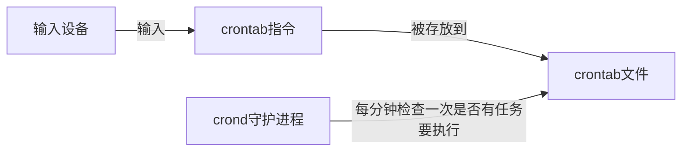

# crontab
通过 `crontab`，我们可以在固定的间隔时间执行指定的系统指令或 shell 脚本



## 格式
```bash
# .---------------- 分 (0 - 59)
# |  .------------- 时 (0 - 23)
# |  |  .---------- 日 (1 - 31)
# |  |  |  .------- 月 (1 - 12) OR jan,feb,mar,apr ...
# |  |  |  |  .---- 星期几 (0 - 6) (Sunday=0)
# |  |  |  |  |
# *  *  *  *  * user-name command to be executed
```

---
- 启动 crontab【有些环境可能没启动】

```bash
sudo cron －f &
```

---


