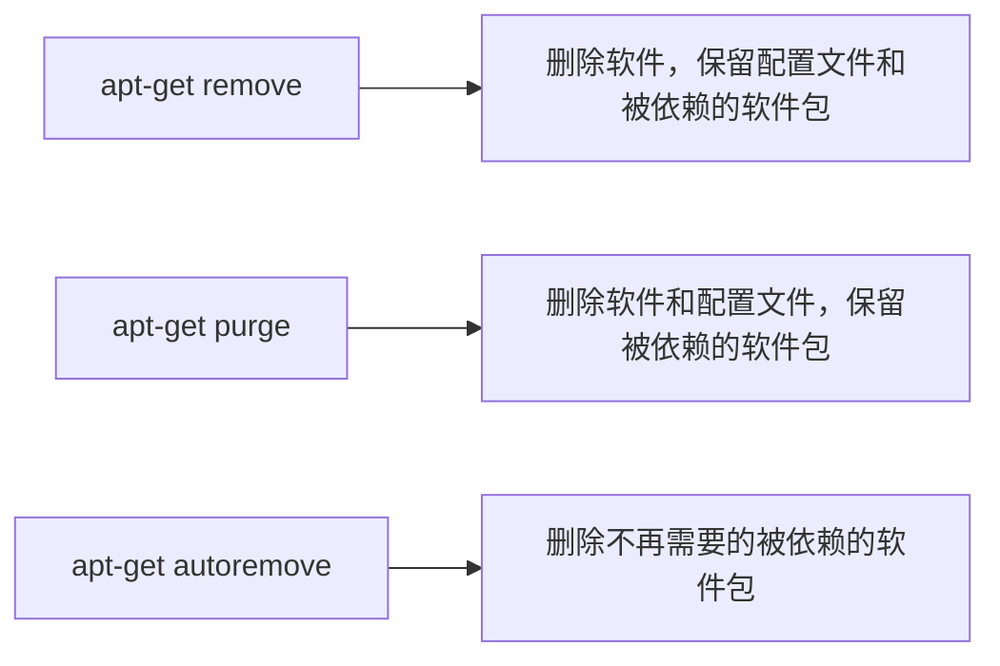

通常 Linux 上的软件安装有四种方式：
- 在线安装
- 从磁盘安装 deb 软件包
- 从二进制软件包安装
- 从源代码编译安装

# apt 在线安装
>[!hint] 不同的 linux 发行版，在线安装方式会有一些差异【使用的命令，包管理工具 ……】

---

>[!quote] apt
>>apt 是 Debian 及其派生发行版的软件包管理器，可以自动下载，配置，安装二进制，或者源代码格式的软件包
>
>现在 apt 已经可以安装在支持 <u>rpm</u> 的系统，管理 rpm 包了

>[!quote] rpm
>rpm 是 Red Hat 及其衍生版本【CentOS，Fedora】的包管理工具

---

## 更新软件源
>[!hint] 我们会在使用 `apt-get` 来安装软件之前，先使用 `sudo apt-get update` 来更新软件源列表

---

```bash
sudo apt-get update
sudo apt-get install 软件 
```

- 执行 `sudo apt-get update` 的时候，你的电脑【超市】就会查看所有的软件源【供货商】有没有新的软件【商品】
- 如果不执行这个命令，可能软件源里有新软件了，可是你的电脑不知道
- 所以每次你想要安装新的软件，或者<u>你的电脑有大的改动</u>【更换了软件源……】，你都需要运行 `sudo apt-get update` 来更新你的软件源列表

## 安装
- `sudo apt-get install 软件包名`
	- `-y` 在后续安装过程中，如果出现询问是否安装时自动回答 "是"
	- `--reinstall` 重新安装软件包

```bash
sudo apt-get --reinstall -y install 软件包名
```

>[!hint] 如果在安装软件之后，无法使用 `Tab` 键补全这个命令，可以执行 `source ~/.zshrc` 【在当前 shell 中重新加载并执行 `.zshrc` 文件中的命令】

## 升级
### 不解决依赖问题
>[!hint] `sudo apt-get upgrade` 会尽量避免升级那些会引发依赖问题的软件包【如果升级一个软件包需要升级，或删除其他的软件包，那么就不会升级这个软件包

- `sudo apt-get upgrade` 升级已安装的可更新的所有软件包

### 解决依赖问题
>[!warning] `dist-upgrade` 有一定的危险性

- `sudo apt-get dist-upgrade` 如果某个已安装的软件包的新版本需要更改依赖关系，`dist-upgrade` 将处理这种依赖关系

## 卸载


### 不完全卸载
- `sudo apt-get remove 软件包名` 删除软件，<u>不移除软件包的配置文件</u>，<u>不移除跟该软件包有依赖关系的软件包</u>

### 完全卸载
- `sudo apt-get purge 软件包名` 删除软件，移除配置文件，<u>不移除跟该软件包有依赖关系的软件包</u>

### 卸载不再需要的软件包
- `sudo apt-get autoremove` 卸载之前被其他软件包依赖，但现在不再被使用的软件包

## 搜索软件包
>[!hint] `apt-cache` 是对本地数据进行相关操作的工具

- `sudo apt-cache search softname1 softname2 softname3……` 确认软件源中搜索有没有某个软件可用，**不是搜索已安装的软件包**


| 工具          | 说明                                                |
| ----------- | ------------------------------------------------- |
| `clean`     | 移除下载到本地的已经安装的软件包，默认保存在 `/var/cache/apt/archives/` |
| `autoclean` | 移除已安装的软件的旧版本软件包                                   |


| 参数                   | 说明                                                                  |
| -------------------- | ------------------------------------------------------------------- |
| `-s`                 | 模拟安装                                                                |
| `-q`                 | 静默安装方式，指定多个 `q` 或者 `-q=#`，`#` 表示数字，用于设定静默级别，这在你不想要在安装软件包时屏幕输出过多时很有用 |
| `-f`                 | 修复损坏的依赖关系                                                           |
| `-d`                 | 只下载不安装                                                              |
| `--install-suggests` | 同时安装 APT 给出的建议安装的软件包                                                |


