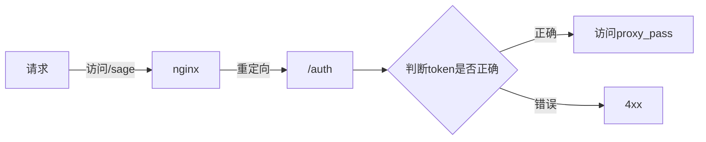

# 基础
>[!hint] nginx 中的进程
>nginx 中的进程分为：
>- `master` ：主进程，负责读取配置文件，管理 `worker` 进程，~~只有一个~~
>- `worker` ：工作进程，负责处理请求，~~可以有多个，在 `nginx.conf` 里配置~~

## 目录结构
- `nginx` 
	- `conf` 
		- `conf.d` 【所有配置文件定义在这里就好，nginx.conf 会自动引入】
			- default.conf
		- nginx.conf
	- `html` 
	- `logs` 
	- `ssl` 

## 在 docker 中安装配置
[nginx 的 docker 地址](https://hub.docker.com/_/nginx)

- 创建一个默认的 nginx 用于拷贝配置文件
```bash
docker run --name nginxconf -p 9999:80 -d nginx
```

- 在宿主机上创建目录，用来映射容器中的目录
```bash
mkdir -p /data/nginx/conf
mkdir -p /data/nginx/logs
mkdir -p /data/nginx/ssl
```

- 复制容器内的配置文件
```bash
# 拷贝nginx.conf
docker cp nginxconf:/etc/nginx/nginx.conf /data/nginx/conf/nginx.conf

# 拷贝default.conf
docker cp nginxconf:/etc/nginx/conf.d /data/nginx/conf

# 拷贝html目录
docker cp nginxconf:/usr/share/nginx/html /data/nginx
```

- 创建最终的 nginx
```bash
docker run \
  --name nginx \
  -p 80:80 \
  -v /data/nginx/logs:/var/log/nginx \
  -v /data/nginx/html:/usr/share/nginx/html \
  -v /data/nginx/conf/nginx.conf:/etc/nginx/nginx.conf \
  -v /data/nginx/conf/conf.d:/etc/nginx/conf.d \
  -v /data/nginx/ssl:/etc/nginx/ssl \
  -d --restart=always nginx
```

- 删除原来没用的 nginx
```bash
docker rm -f nginxconf
```

# 命令
## Win
- `nginx` 
	- `-s 值` 
		- `quit` 优雅停止【~~等待 `worker` 进程完成当前处理后退出~~】
		- `stop` 立即停止
		- `reload` 重新加载配置文件
		- `reopen` 重新打开新的日志文件，并写入
	- `-t` 检查配置文件是否正确

- `start nginx` 启动 nginx

## Linux

# 配置文件
- `event{……}` 告诉 nginx 如何处理连接

---

- `http{……}` 设置 HTTP 服务器相关的参数，和指令
	- `include 文件` 引入某个文件，这样可以不用把配置全部配置在一个文件里
		- `include /etc/nginx/mime.types;` 引入文件，告诉浏览器要怎么样处理 nginx 中的文件，~~比如 css 文件就不要处理成 text 纯文本文件~~
	- `server{……}` 定义服务器配置
		- `listen 端口号` 指定服务器监听的端口号
		- `server_name 域名` 定义该服务器的名称，通常是域名
		- `location 路径{……}` 根据路径进行不同的处理
			- `internal;` 指定该 location 只能被内部请求使用，不能直接被客户端访问
			- `root 文件路径` 在指定路径下查找要响应的文件
			- `index 具体文件` 在指定路径下查找要响应的具体文件，~~不指定则默认打开 root 路径下的 `index.html` 文件~~
			- `auth_request 鉴权路径` 对于访问 location 的请求，再发送子请求给鉴权路径，如果返回 2xx，则会继续处理这个原始请求；否则 4xx
			- `proxy_pass 请求地址` 将 location 的请求转发到另一个请求地址

>[!hint] `location = /auth { ... }` 与 `location /auth { ... }` 的区别
>- `location = /auth { ... }`：只会匹配 /auth
>- `location /auth { ... }`：会匹配以 /auth 开头的所有路径，及其所有子路径下的 index.html

---

```bash
user  nginx;
# 定义了工作进程数
worker_processes  auto;

# 定义了错误日志文件的位置和日志级别
error_log  /var/log/nginx/error.log notice;
pid        /var/run/nginx.pid;

events {
    worker_connections  1024;
}

http {
	# 引入这个文件，可以让引入进来的文件在浏览器中
    include       /etc/nginx/mime.types;
    default_type  application/octet-stream;

    log_format  main  '$remote_addr - $remote_user [$time_local] "$request" '
                      '$status $body_bytes_sent "$http_referer" '
                      '"$http_user_agent" "$http_x_forwarded_for"';

    access_log  /var/log/nginx/access.log  main;

    sendfile        on;
    #tcp_nopush     on;

	# 设置了保持连接的超时时间
    keepalive_timeout  65;

    #gzip  on;

	# 包含了其他的配置文件
    include /etc/nginx/conf.d/*.conf;
}
```

# 功能
## 反向代理 + 负载均衡
- 在 `http 块` 中添加 `upstream 块` ，里面配置服务的 IP 地址，和端口号
```yml
http {
    upstream backend {    # backend是给upstream取的名字
        server 127.0.0.1:8000;
        server 127.0.0.1:8001;
        server 127.0.0.1:8002;
    }
}
```

- 在 `server 块` 中添加 `location 块` 
```yml
server {
	# 会把所有访问/app的请求，分发到backend里（第一步定义的upstream块里）
    location /app {   
        proxy_pass http://backend;
    }
}
```

>[!quote] 负载均衡的三种方式
>- **轮询**【~~默认~~】
>- **权重**
> ```yml
> # 接收请求的比例就是3：1：1
> upstream backend {  
> 	server 127.0.0.1:8000 weight=3;
> 	server 127.0.0.1:8001;
> 	server 127.0.0.1:8002;
> }
> ```
> - **哈希**：同一个 IP 地址的用户会一直被分配到同一个服务器
> ```yml
> upstream backend {
> 	ip_hash;
> 	server 127.0.0.1:8000;
> 	server 127.0.0.1:8001;
> 	server 127.0.0.1:8002;
> }
> ```

## 鉴权
>[!quote] 鉴权
>鉴权 可以对请求进行身份验证，进行对某个用户的限频限次

- 在 `server 块` 中的 `location 块` 中配置


```yml
server {
	# 将请求转发给后端服务之前，先进行一个子请求到 /auth。如果这个子请求返回的 HTTP 状态码是 2xx，那么原始请求将会继续被处理
	# 否则，原始请求将会被拒绝
	location /sage {
		auth_request /auth;
		proxy_pass http://localhost:8080/aftersuccess;
	}

	location /auth {
		# 该location只能被内部请求使用，不能直接被客户端访问
		internal;
		# 设置参数
		set $token '';
		if ($request_uri ~* "[^\?]+\?(.*)$") {
			set $token $1;
		}

		proxy_pass http://localhost:8080/verify?$token;
		proxy_pass_request_body off;
		proxy_set_header Content-Type "";
	}
}

---
http://localhost/sage?token=success  ✔️
http://localhost/sage?token=succ  ❌
```

## HTTPS
HTTPS = HTTP + SSL

>[!quote] SSL
>>SSL 是一种安全协议，提供了各种<u>安全保障</u>【数据加密，服务器身份验证，消息完整性检查 ……】，对我们在网页中输入的<u>敏感信息</u>【密码、信用卡号 ……】进行加密，让它们不容易被解读
>
>一般申请到的 SSL 有两个文件：密钥文件，证书文件

---

- 把监听的端口号改为 `443 ssl` ，并添加相关配置
```yml
server {
	listen 443 ssl;
	server_name 网站域名;

	# 证书文件路径
    ssl_certificate /etc/nginx/ssl/example.com.crt;
	# 证书密钥路径
    ssl_certificate_key /etc/nginx/ssl/example.com.key;

}
```

- 添加一个 `server 块` 配置一个重定向，将 `80` 的请求重定向到 `443`
```yml
server {
    listen 80;
    server_name example.com;

    location / {
        return 301 https://$host$request_uri;
    }
}

server {
	……
}
```


