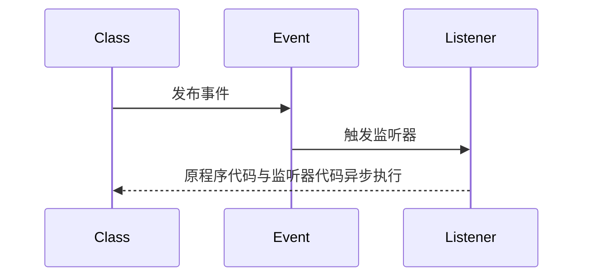

>[!quote] 事件驱动编程
>>事件驱动编程 是将程序的功能变为触发某个事件【比如我要实现用户注册成功之后给用户发送邮件，那就改成用户注册成功之后触发事件，由监听器来发送邮件】
>
>- **解耦**：把应用程序拆分成更小，更独立的部分，<u>这些部分通过事件进行通信，而不是直接调用彼此的方法</u>
>- **异步**：当触发事件后，程序继续执行相关代码，程序与监听器异步执行
>- **灵活**：更容易的<u>增删事件</u>【也就是功能】，而不改动原有的程序代码



>[!hint] 在 SpringBoot 启动完成并且所有的 Bean 都已经创建完毕后，SpringBoot 会发布一个 `ApplicationReadyEvent` 事件

# Applicationlistener
>[!quote] `Applicationlistener`
>`Applicationlistener` 是一个事件监听器接口，当在<u>特定情况下</u>【按钮，键盘，计时器 ……】触发事件时，Spring 运行时系统会发送一个 `ApplicationEvent`，然后由 `ApplicationListener` 进行接收和处理

# 具体实现
当用户注册成功后，发送一封欢迎邮件：

- 创建 `UserRegisteredEvent` 继承 `ApplicationEvent` 

```java
public class UserRegisteredEvent extends ApplicationEvent {
    private User user;

	// `source`参数用来表示触发这个事件的对象
    public UserRegisteredEvent(Object source, User user) {
        super(source);
        this.user = user;
    }

    public User getUser() {
        return user;
    }
}
```

- 创建 `SendWelcomeEmailListener` 实现 `ApplicationListener` ，监听 `UserRegisteredEvent` ，使用 `@Component` 注入 Bean

```java
package com.example.web_2.listener;

@Component
public class SendWelcomeEmailListener implements ApplicationListener<UserRegisteredEvent> {
	// 方法中传入某个事件，如果传入ApplicationEvent，则表示监听所有事件
    @Override
    public void onApplicationEvent(UserRegisteredEvent event) {
        User user = event.getUser();
        // 使用user对象发送欢迎邮件...
    }
}
```

- 在用户注册成功后，发布 `UserRegisteredEvent` 事件

```java
// 原程序代码
User user = ... // 用户注册成功后的User对象

ApplicationContext context = ... // 获取ApplicationContext

// 构造事件对象，利用context发布事件
context.publishEvent(new UserRegisteredEvent(this, user));
```
