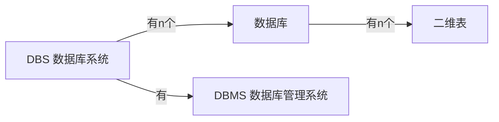

---
tags:
  - 计算机/数据库
---
# 基础概念


>[!faq] 为什么要构建关系型数据库
>例如我们有一个产品目录的表【包含产品ID，价格，供应商ID】，然后有同一供应商生产多种产品，供应商表【供应商ID，地址】
>
>此时，我们有两种构建方法：
>
>***把这些信息放到一个表里***：
>>- 同一供应商生产的产品，其供应商的ID都是相同的，对在一个表中存储重复信息既浪费时间又浪费空间
>>- 如果后续信息需要更新【例如地址需要改动】，要修改多次
>
>***产品信息一个表，供应商一个表，然后通过某个共同的值进行关联***：
## SQL语句
### 通用格式
- SQL语句可以单行/多行书写，以`分号;`结尾
- SQL语句不区分大小写，但是***关键字建议大写***
- 注释
	- 单行注释：`--` 或 `#`
	- 多行注释：`/*  */`
### 分类
- DDL
- DML
- DQL
- DCL
# 数据类型
## 数值
如果数值用于计算，那应该存储为数值类型；***如果数值作为字符串使用，则应该存储为字符串【电话号码，邮政编码等】***
### 整数类型
| 数值类型    |大小 |有符号范围【默认】|无符号范围|
| ------------ | ------ | ------------------ | ---------------------- |
| TINYINT      |1 字节| -128 到 127                                 | 0 到 255                                  |
| SMALLINT     | 2 字节 | -32,768 到 32,767                           | 0 到 65,535                               |
| MEDIUMINT    | 3 字节 | -8,388,608 到 8,388,607                     | 0 到 16,777,215                           |
| INT          | 4 字节 | -2,147,483,648 到 2,147,483,647             | 0 到 4,294,967,295                         |
| BIGINT       | 8 字节 | -9,223,372,036,854,775,808 到 9,223,372,036,854,775,807 | 0 到 18,446,744,073,709,551,615           |
从上到下为：小整数--->大整数
### 浮点数类型
| 数值类型    |大小|有符号范围|无符号范围|
| ------------ | ------ | ------------------ | ---------------------- |
| FLOAT        |4字节|-3.402823466E+38 到 -1.175494351E-38，<br> 0 和 1.175494351E-38 到 3.402823466E+38| -3.402823466E+38 到 -1.175494351E-38、0 和 1.175494351E-38 到 3.402823466E+38 |
| DOUBLE       |8字节|-1.7976931348623157E+308 到 -2.2250738585072014E-308、0 和 2.2250738585072014E-308 到 1.7976931348623157E+308 | -1.7976931348623157E+308 到 -2.2250738585072014E-308、0 和 2.2250738585072014E-308 到 1.7976931348623157E+308 |
| DECIMAL      |可变长度|依赖于指定的精度和范围 | 依赖于指定的精度和范围                     |
从上到下为：单精度浮点数，双精度浮点数，精确定点数【避免精度损失】
### 布尔类型
| 数值类型    |大小|有符号范围|无符号范围|
| ------------ | ------ | ------------------ | ---------------------- |
|BOOL/BOOLEAN| 1 字节 | 无符号范围不适用   | 无符号范围不适用     |
## 字符串
- `CHAR`：定长字符串。范围为 0 到 255 字符。***性能比varchar好***
	- 比如`char(10)`，表示最多存10个字符，不足10个字符，也占用10个字符的空间
- `VARCHAR`：变长字符串。范围为 0 到 65,535 字符
	- `varchar(10)`，表示最多存10个字符，不足10个字符，会按照实际长度存储

- `TINYTEXT`：可变长度字符串。范围为 0 到 255 字节
- `TEXT`：可变长度字符串。范围为 0 到 65,535 字节
- `MEDIUMTEXT`：可变长度字符串。范围为 0 到 16,777,215 字节
- `LONGTEXT`：可变长度字符串。范围为 0 到 4,294,967,295 字节
- `BINARY`：固定长度二进制字符串。范围为 0 到 255 字节
- `VARBINARY`：可变长度二进制字符串。范围为 0 到 65,535 字节
- `TINYBLOB`：可变长度二进制字符串，范围为 0 到 255 字节。***可用于存储视频，音频***
- `BLOB`：可变长度二进制字符串。范围为 0 到 65,535 字节
- `MEDIUMBLOB`：可变长度二进制字符串。范围为 0 到 16,777,215 字节
- `LONGBLOB`：可变长度二进制字符串。范围为 0 到 4,294,967,295 字节
- `ENUM`：枚举类型，存储从预定义值列表中选择的一个字符串。可根据枚举值的数量进行大小和范围的计算
- `SET`：集合类型，存储从预定义值列表中选择的一个或多个字符串。可根据集合值的数量进行大小和范围的计算
- `JSON`：存储 JSON 格式的数据，最大长度为 4,294,967,295 字符
## 日期时间
- `DATE`：表示日期
	- 格式为'YYYY-MM-DD'
	- 范围从'1000-01-01'到'9999-12-31'
- `TIME`：表示时间
	- 格式为'HH:MM:SS'
	- 范围从'-838:59:59'到'838:59:59'
- `DATETIME`：表示日期和时间
	- 格式为'YYYY-MM-DD HH:MM:SS'
	- 范围从'1000-01-01 00:00:00'到'9999-12-31 23:59:59'

- `TIMESTAMP`：表示日期和时间
	- 格式为'YYYY-MM-DD HH:MM:SS'
	- 范围从'1970-01-01 00:00:01'到'2038-01-19 03:14:07'
- `YEAR`：表示年份
	- 格式为'YYYY'
	- 范围从1901到2155
# DDL
>Data Definition Language 数据库定义语言
## 数据库操作
- ***查询***
	- `SHOW DATABASES;`  查询所有数据库
	- `SELECT DATABASE();`  查询当前正在使用的数据库
- ***创建***
	```sql
	CREATE DATABASE  
	    [IF NOT EXISTS]      /*中括号表示可选项*/
	    数据库名  
	    [CHARACTER SET 字符集名]
	    [COLLATE 排序规则];
	```
- ***使用***
	- `USE 数据库名;`  切换到某个数据库
- ***删除***
	- `DROP DATABASE [IF EXISTS] 数据库名;`  删除某个数据库
## 表的操作
- ***查询***
	- `SHOW TABLES;`  查询当前数据库所有的表
	- `DESC 表名;`  查询表结构
	- `SHOW CREATE TABLE 表名;`  查询建表语句
- ***创建***
	```sql
	CREATE TABLE 表名(
		字段1 字段类型 [约束] [COMMENT 注释],
		字段2 字段类型 [约束] [COMMENT 注释],
		字段3 字段类型 [约束] [COMMENT 注释],
		…………
		字段n 字段类型 [约束] [COMMENT 注释]
	)[COMMENT 表注释]
	```
- ***修改***
	- 对于字段
		- 添加字段
			```sql
			ALTER TABLE 表名 ADD 字段名 数据类型[COMMENT 注释] [约束];
			```
		- 修改属性
			```sql
			ALTER TABLE 表名
				CHANGE 旧字段名 新字段名 新数据类型 [COMMENT 注释]
				[约束];
			```
	- 对于表
		- 修改表名
			```sql
			ALTER TABLE 旧表名 RENAME TO 新表名;
			```
		- 修改表的存储引擎
			```sql
			ALTER TABLE 表名
				ENGINE = 存储引擎类型;       //修改表的存储引擎
			```
- ***删除***
	```sql
	ALTER TABLE 表名 DROP 字段名;   //删除某个字段名【删除一列】
	```
	```sql
	DROP TABLE [IF EXISTS] 表名;       //删除整张表
	```
	```sql
	TRUNCATE TABLE 表名;        //删除表中数据，但保留表结构
	```
# DML
>Data Manipulation Language 数据库操作语言

字符串和日期时间类型都需要包含在`引号''`内
## INSERT
- ***单个插入***
	- 给指定数量字段插入【***安全插入***】[^1]
		```sql
		INSERT INTO 表名(字段1,字段2,……,字段n) VALUES(值1,值2,……,值n);
		```
	- 给所有字段插入【***不安全插入***】[^2]
		```sql
		INSERT INTO 表名 VALUES(值1,值2,……,值n);
		```
- ***批量插入***
	- 给指定数量字段插入
		```sql
		INSERT TABLE 表名(字段1,字段2) VALUES(值1,值2,……,值n),(值1,值2,……,值n)……;
		```
	- 给所有字段插入
		```sql
		INSERT INTO 表名 VALUES(值1,值2,……,值n),(值1,值2,……,值n)……;
		```

[^1]:不会由于表结构的改变而导致语法错误
[^2]:可能因为表结构的改变而导致语法错误

>[!hint] 如何插入SELECT出的数据
>```sql
> INSERT INTO 表1 (column1, column2, ...)  
> SELECT column1,  
>        column2, 
>        ...  
> FROM 表2;
> ```
> ***INSERT只能插入一行，而INSERT-SELECT可以插入多行***
## UPDATE
```sql
UPDATE 表名 SET 字段名1=值1,字段名2=值2 [WHERE 条件];
```

>[!hint] 如何从 表A 中选择数据，并使用这些数据来更新 表B 的行
>```sql
>UPDATE table1
> 	JOIN table2 ON join_condition
> 	SET table1.column1 = table2.column1, table1.column2 = table2.column2, ...
> 	[WHERE 条件];
>```
>`table1` 是要更新的目标表，`table2` 是提供数据的源表。`JOIN` 子句用于指定两个表之间的连接条件。您可以在 `SET` 子句中指定要更新的列，并将其设置为源表中相应列的值
## DELETE
```sql
DELETE FROM 表名 [WHERE 条件];   //删除n行
```

***DELETE的删除是以==行==为单位的***

>[!hint] 如何不删除某个字段，但是删除这个字段的所有数据
>```sql
>UPDATE 表名 SET 字段名 = NULL;
>```
# DQL
>Data Query Language 数据查询语言

>[!hint] DQL语句的执行顺序
>```sql
> select 字段列表  // 4
> from 表名  // 1
> where 条件  // 2 
> group by 分组字段列表  // 3
> having 分组后条件列表  // 7
> order by 排序字段列表  // 5
> limit 分页参数； // 6
>```
## 基本查询
- 查询指定个字段
	```sql
	SELECT 字段1,字段2,……,字段n FROM 表名;  //查询指定个字段的所有内容
	```
- 查询所有字段
	```sql
	SELECT * FROM 表名;
	```
- 去除重复查询
	```sql
	SELECT DISTINCT 字段1,字段2,……,字段n FROM 表名;
	```
- 取别名查询
	```sql
	SELECT 字段1[别名1],字段2[别名2] FROM 表名;
	```
## 条件查询
```sql
SELECT 字段 FROM 表名 WHERE 条件;   //可以有多个条件【用逻辑符连接】
 ```

|比较运算符|描述 |示例|
|---|---|---|
|=|等于|WHERE column_name = value|
|!= 或 <>|不等于|WHERE column_name != value |
|>|大于|WHERE column_name > value |
|< |小于|WHERE column_name < value|
|>= |大于等于 |WHERE column_name >= value|
|<= |小于等于|WHERE column_name <= value|
|BETWEEN...AND... |在范围内|WHERE column_name BETWEEN 值1 AND 值2 |
|NOT BETWEEN...AND...|不在范围内|WHERE column_name NOT BETWEEN 值1 AND 值2|
|IN|在给定值列表中|WHERE column_name IN (值1, 值2, ...)|
|NOT IN|不在给定值列表中|WHERE column_name NOT IN (值1, 值2, ...)|
|LIKE|模糊匹配|WHERE column_name LIKE `pattern`|
|NOT LIKE|不匹配指定模式|WHERE column_name NOT LIKE `pattern`|
|IS NULL |为 NULL|WHERE column_name IS NULL|
|IS NOT NULL|不为 NULL|WHERE column_name IS NOT NULL |
`pattern` 中的 `_` 表示单个模糊字符，`%` 表示任意个字符，***此类通配符只能用于文本字段【字符串】***
```sql
SELECT * FROM 表名 WHERE name like '张_';  //表示查询name为姓张什么的人

SELECT * FROM 表名 WHERE name like '张%';  //表示查询name为姓张什么什么什么……的人
```

- 尽量不要把通配符用在搜索模式的开始处，例如`LIKE '%立'`，这样搜索起来是最慢的【数据库需要对表中的每个记录进行扫描】
- `IN`操作符比`OR`操作符的执行速度更快【数据越多越明显】
- 如果其他操作符可以达到相同目的，就不要使用通配符【***通配符处理时间长***】

---

|逻辑运算符 |描述|示例|
|:-:|:-:|:-:|
|AND 或 &&|并且 |WHERE 字段 > 1 AND 字段 != 5 |
|OR 或 \|\||或者|WHERE 字段 > 1 OR 字段 != 5|
|NOT 或 !|非|WHERE NOT 字段 = 2|
- ***AND 的优先级高于 OR***
- ***逻辑不明确时可以加括号***
## 分组查询
```sql
SELECT 字段 FROM 表名 [WHERE 条件] GROUP BY 分组字段名 [HAVING 分组后的过滤条件]; 

---

SELECT gender,COUNT(*) FROM table GROUP BY gender;

|gender|COUNT(\*)|
|:-:|:-:|
|女 |7|
|男 |9|
```

- 如果分组列中包含具有NULL值的行，则NULL将作为一个分组返回

>[!hint] WHERE 与 HAVING 的区别
>where：
>- 对分组之前的数据进行过滤，如果不满足则不参与分组；
>- 而且where不能对聚合函数进行过滤；
>
>having：
>- 对分组之后的数据进行过滤；
>- having可以对聚合函数进行过滤；

>[!hint] 在有 GROUP BY 子句的SELECT语句中，被SELECT的字段是有限制的
>使用了GROUP BY的SELECT语句中，只能SELECT已经GROUP BY过的列，和使用了聚集函数的任何列。例如：
>```sql
> SELECT customer_name, SUM(order_amount)
> FROM orders
> GROUP BY customer_name;
> ```
> 就是正确的，不能在SELECT里再加入customer_year，***因为这是没有意义的***，但是可以加入聚合函数（customer_year）
## 排序查询
```sql
SELECT 字段 FROM 表名 ORDER BY 字段1 排序方式1,字段2 排序方式2……;

---

根据年龄对公司员工进行升序排序，年龄相同，再按照入职时间进行降序
SELECT * FROM table ORDER BY age ASC,entrydate DESC……; 
                                     //DESC为降序，ASC为升序【默认】
```
## 分页查询
```sql
SELECT 字段 FROM 表名 LIMIT 起始索引,查询记录数;    //起始索引从0开始

---

查询第1页员工数据，每页展示10条记录
select * from emp limit 0,10；//查询的是第1页数据，起始索引可以省略，简写为limit 10

查询第二页的员工数据，每页展示10条记录
select * from emp limit 10,10;
```

***分页查询是数据库的方言【每个数据库都不同】***
## 子查询
### 标量子查询
>子查询返回的结果是单个值

```sql
SELECT * FROM emp WHERE dept_id = (SELECT id FROM dept WHERE name = '教研部');
                                        //这里的子查询只有一个结果
```
### 列子查询
>子查询返回的结果是一列

```sql
SELECT * FROM emp WHERE dept_id in (SELECT id FROM dept WHERE name = '教研部' OR name = '咨询部');                    //这里的子查询有多个结果
```
### 行子查询
>子查询返回的结果是一行

```sql
//查询入职日期和工作跟吴彦祖都相同的人
SELECT * FROM emp WHERE entrydate = (SELECT entrydate FROM emp WHERE name = '吴彦祖'),job = (SELECT job FROM emp WHERE name = '吴彦祖');
或
SELECT * FROM emp WHERE (entrydate,job) = (SELECT entrydate,job FROM emp WHERE name = '吴彦祖');
```
### 表子查询
>子查询返回的结果是多行多列

```SQL
SELECT e.*,dept.name FROM (SELECT * FROM emp WHERE entrydate > 2) e,dept WHERE e.dept_id = dept.id;          //此处把子查询的结果作为了一张表 
```
# DCL
>Data Control Language 数据库控制语言
# 函数
## 日期函数
>[!summary] 方法
>now()  获取当前的系统时间
>YEAR(date)  ------在date数据类型中提取出year

```sql
insert into customer(update_time) values (now());         //插入当前时间

SELECT order_num FROM Orders WHERE YEAR(order_date) = 2020;
```
## 文本函数
>[!summary] 方法
>CONCAT(S1,S2,..Sn)  ------将S1，S2，….Sn拼接成一个字符串
>
>LOWER(str)  ------将字符串str全部转为小写
>UPPER(str)  ------将字符串str全部转为大写
>
>LPAD(str，n，pad)  ------左填充，用字符串pad对str的左边进行填充，达到n个长度
>RPAD(str，n，pad)  ------右填充，用字符串pad对str的右边进行填充，达到n个长度
>
>TRIM(str)  ------去掉字符串头部和尾部的空格
>SUBSTRING(str,start,len)  ------返回从字符串str从start位置起的len个长度的字符串
>
>LEFT(str，len)  ------返回str左边开始数len长度个字符
>RIGHT(str，len)  ------返回str右边开始数len长度个字符
>LENGTH(str)  ------返回str字符串的长度

```sql
select concat ('hello', 'MySQL');         hello MySQL 
select Lower('Hello');       hello
select upper('Hello');        HELLO
select lpad('01', 5, '-');       ---01
select rpad('01', 5, '-');        01---
select trim(' Hello MySQL ')       Hello MySQL
						// RTRIM()：去掉字符串右边的空格
						// LTRIM()：去掉字符串左边的空格

select substring('Hello MySQL',1, 5);     Hello
          // 注意索引是从1开始的

SELECT LEFT('HELLO',3);     HEL
SELECT LENGTH('HELLO');     5
```
## 数值函数
>[!summary] 方法
>
## 聚合函数
>[!summary] 方法
>AVG()  ------返回某列的平均值
>COUNT()  ------返回某列的行数
>MAX()  ------返回某列的最大值
>MIN()  ------返回某列的最小值
>SUM()  ------返回某列值之和
### COUNT
```sql
SELECT COUNT(cust_email) AS num_cust FROM Customers;
```

***使用***`COUNT(*)`***对表中行进行计数时，对于***`NULL值`***也会记录***
```sql
SELECT COUNT(*) FROM Customers;
```

***但是如果只是***`COUNT(某个字段)`，***则不会计数***`NULL值`
```sql
SELECT COUNT(numbers) FROM Customers;
```
# 联结表🔗
>联结表是一种将<u>两个</u>或<u>多个表</u>中的数据***通过某些共同的值***关联起来的操作

>[!hint] 笛卡尔积
>如果在联结时，没有加上限制条件，则是把<u>表A</u>的每一行匹配<u>表B</u>的每一行，***所以如果此种情况***`SELECT *`***时，则查询的行数 = 表A行数 \* 表B行数***

>[!hint] 联结的好处：***大多数DBMS，处理联结的速度 远大于 子查询***
## 内联结
### 隐式内联结
```sql
SELECT 字段 FROM 表1，表2 WHERE 条件;   //表1 和 表2 就通过了WHERE条件联结在了一起
```
### 显示内联结
```sql
SELECT 字段 FROM 表1 [INNER] JOIN 表2 ON 联结条件;

---

select user.id, user.name, user.age, table_name.产品ID 
from user 
INNER JOIN table_name ON table_name.id = user.id;


|id|name|age|            
|:-:|:-:|:-:|
|123|陈冠希|45|
|11|刘诗诗|14|
|444|吴彦祖|4|
     +
|产品ID|id|
|:-:|:-:|
|乌鸦 |444|
|狗|11|
|老虎|123|
     ↓
|id|name|age|产品ID|
|:-:|:-:|:-:|:-:|
|123|陈冠希|45|老虎|
|444 |吴彦祖|4|乌鸦|
|11 |刘诗诗|14|狗|
```
## 自联结
```sql
//使用自联结的方式来实现
SELECT c1.id, c1.name, c1.contact
FROM customers AS c1,
     customers AS c2
WHERE c2.contact = 'jim'    //经过这个条件筛选过后，c2表中只剩下一条记录
  AND c1.name = c2.name;     //c1表中的name与c2表中的那一条记录进行比较

//如果使用子查询的方式来实现：
SELECT id, name, contact
FROM customers
WHERE name = (SELECT name FROM customers WHERE contact = 'Jim');

---

|id|name|contact|
|:-:|:-:|:-:|
|100|Fun123|Jim|
|101|Fun566|Tom|     × 2
|102|Fun123|Mike|
|103|Fun578|July|
       ↓
|100|Fun123|Jim|
|102|Fun123|Mike|
```
## 外联结
### 左外联结
>返回左表中所有的行，以及右表中满足条件的行

```sql
SELECT 字段列表
FROM 表A LEFT JOIN 表B ON 联结条件;

---

SELECT customers.id, orders.numbers
FROM customers
         LEFT JOIN orders ON customers.id = orders.id;


|id|numbers|
|:-:|:-:|
|101|null|
|102 |9|
|103 |229|
    +
|id|name|contact|
|:-:|:-:|:-:|
|100|Fun123|Jim|
|101|Fun566|Tom|  
|102|Fun123|Mike|
|103|Fun578|July|
        ↓
|id|numbers|
|:-:|:-:|
|100|9|
|101|null|
|102 |null|
|103 |229|
```
### 右外联结
>返回右表中所有的行，以及左表中满足条件的行

***一般不使用右外联结***
# 视图

# 存储过程

# 事务
>事务是一组SQL语句

- 原子性：事务要么完全执行，要么完全不执行
- 一致性：事务完成时，必须使所有数据都保持一致状态[^3]
- 隔离性：只要不COMMIT，则别的窗口看不到数据的变化
- 持久性：事务一旦COMMIT/ROLLBACK，则数据永久改变

>[!hint] 事务处理可以回退INSERT, UPDATE, DALETE。不能回退SELECT, CREATE, DROP

[^3]:比如部门表中的某个部门被删除了，那员工表中就不会出现该部门下的员工
## 具体操作
***如果执行过程中没有发生错误，则COMMIT整组SQL语句；如果发生错误，则ROLLBACK，将数据库恢复到正常状态***

- `START TRANSACTION;`  开始事务
- `COMMIT;`  结束事务并提交
- `ROLLBACK;`  回退到事务处理之前
- `SAVEPOINT`  设置保留点：允许在事务中的特定位置进行部分回滚，而不必回滚整个事务

```sql
START TRANSACTION;    //第一步先执行此语句

SAVEPOINT point1;    //设置一个保留点

UPDATE table SET id = 188;       //-------------------
UPDATE table SET name = Tom;      //然后执行这组语句体
UPDATE table SET age = 18;       //-------------------

---

COMMIT;      //如果这组语句体都执行成功，则可以执行COMMIT来提交

ROLLBACK;     //如果有语句执行失败了，则执行ROLLBACK来回退

ROLLBACK TO point1;  //返回到保留点point1
```
# 游标


# 约束
>约束是处理数据库的规则

- `NOT NULL`  非空约束：限制字段不能为NULL
- `UNIQUE`  唯一约束：保证字段所有数据唯一
- `PRIMARY KEY`  主键约束
- `FOREIGN KEY`  外键约束
- `DEFAULT`  默认值约束：如果未指定字段的值，则采用默认值
## 主键
>主键是用于唯一标识数据库表中每一行数据的***字段/字段组合***
### 对于主键的约束
- 每个表都需要有主键【因为这便于以后的数据操作和管理】
- 主键列不允许`null值`
- 包含主键值的列从不修改或更新
- 主键值不能重用【***如果从表中删除某一行，其主键值不分配给新行***】

```sql
CREATE TABLE Vendors  
(                          //并且还定义了该字段不能为空
    vend_id      CHAR(10) NOT NULL PRIMARY KEY auto increment, //定义了vend_id字段为主键
    vend_name    CHAR(50) NOT NULL,             //此属性可以自动自增该字段的值
    vend_address CHAR(50) NULL
);
```

```sql
ALTER TABLE Vendors  //表示需要修改的表是Vendors
    ADD CONSTRAINT PRIMARY KEY (vend_id);     //给该表添加一个主键 vend_id
```
## 外键
>外键定义了一个表中的一个或多个字段，而这些字段来源于另一个表中的主键

### 如何创建外键
- 在创建表时指定
	```sql
	CREATE TABLE(
		字段名 数据类型，
		……
		FOREIGN KEY(外键字段名) REFERENCES 主表(字段名)
	);
	```

- 在建表之后指定
	```sql
	ALTER TABLE 表名 
	add constraint
	FOREIGN KEY(外键字段名) REFERENCES 主表(字段名);
	```

>[!hint] 外键的缺点
>- 影响增删改的效率【需要检查外键关系】
>- 容易引发数据库的死锁问题
## 唯一约束
>唯一约束用于确保表中的<u>某个列/一组列</u>的***值是唯一的***

>[!hint] 在唯一约束的列中，允许NULL值，且可以有多个NULL值
### 如何创建唯一约束
- 在创建表时指定
	```sql
	CREATE TABLE 表名 (
	    字段名 数据类型 UNIQUE,   //使用UNIQUE关键字
	    ...
	);
	```

- 在建表之后指定
	```sql
	ALTER TABLE 表名
	ADD CONSTRAINT [约束名称] UNIQUE (字段名);
	```
## 检查约束
>检查约束是一种用于***限制表中列值***的条件约束，可以应用于单个列或多个列的组合

### 如何创建检查约束
- 在创建表时指定
	```sql
	CREATE TABLE 表名 (
	    字段名 数据类型 CHECK (逻辑表达式),
	    ...
	);

	---

	CREATE TABLE 表名 (
	age int CHECK (age > 18),    //保证了age大于18
	...
	);
	```

- 在建表之后指定
	```sql
	ALTER TABLE 表名
	ADD CONSTRAINT [约束名] CHECK (逻辑表达式);
	```
## 额外约束
### 时间约束
表中除了主键，还需要指定两个基础字段，一个是***创建时间***，一个是***更新时间***
### 前端动态渲染约束
如果要存储的某些值，在前端不会固定渲染的话，一般存储为`int`【比如要存储性别，在前端可能渲染为男士，男生，男神，所以我们把性别存储为`int`，在前端需要展示时再把`int`转换为具体的值】
# 数据库的优化
## 索引
>索引是***高效获取数据***的数据结构。MYSQL中的索引有多种，默认是B+Tree索引

- 索引可以提高搜索的效率
- 索引会占用存储空间
- ***索引降低了***`INSERT`，`UPDATE`，`DELETE`***的效率***【因为修改数据时需要重新维护数据结构】

>[!hint] 当我为一张表创建***主键***后，MYSQL会自动帮我们为主键字段创建一个***主键索引***[^4]

>[!hint] 当我为一张表创建***唯一约束***后，MYSQL会自动帮我们为该字段创建一个***唯一索引***
### 创建索引
```sql
CREATE [UNIQUE] INDEX 索引名 ON 表名(字段名);

---

CREATE INDEX idx_emp_name ON emp(name);
```
### 查看索引
```sql
SHOW INDEX FROM 表名;
```
### 删除索引
```sql
DROP INDEX 索引名 ON 表名;
```

[^4]:主键索引是所有索引中性能最高的
# 问题处理
>[!faq] 如果要为表的主键添加auto increment属性，这个表的主键被作为了其他表的外键，每个表中都有数据，我不想数据丢失，那我该怎么办？

- 在表中添加一个新的自增长主键列，而不删除现有的主键列
	```
	ALTER TABLE customer ADD COLUMN NewID INT AUTO_INCREMENT PRIMARY KEY FIRST;
	```
- 将现有的主键列的值复制到新的主键列中
	```sql
	UPDATE customer SET NewID = CustomerID;
	```
- 对于引用了表主键的其他表，更新它们的外键引用，将其指向新的主键列 "NewID"
	```sql
	ALTER TABLE other_table ADD CONSTRAINT fk_customer_id FOREIGN KEY (customer_id) REFERENCES customer (NewID);
	```
- 删除旧的主键列
	```sql
	ALTER TABLE customer DROP COLUMN CustomerID;
	```
- 最后将“NewID”设置为主键


