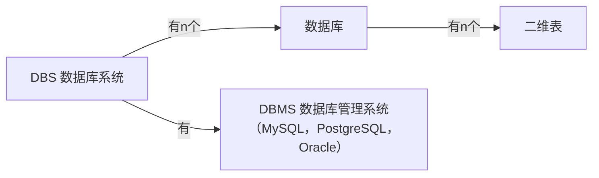

---
tags:
  - 计算机/数据库
---
# 基础概念

>[!hint] 为什么要构建关系型数据库 ？
>例如我们有一个产品目录的表【包含产品 ID，价格，供应商 ID】，然后有同一供应商生产多种产品，供应商表【供应商 ID，地址】
>
>此时，我们有两种构建方法：
>
>**把这些信息放到一个表里**：
>>- 同一供应商生产的产品，其供应商的 ID 都是相同的，对在一个表中存储重复信息既浪费时间又浪费空间
>>- 如果后续信息需要更新【例如地址需要改动】，要修改多次
>
>**产品信息一个表，供应商一个表，然后通过某个共同的值进行关联**：

>[!quote] SQL 语句
>**SQL 语句分为**：
> - DDL
> - DML
> - DQL
> - DCL
> 
> **书写格式**：
> - SQL 语句可以单行/多行书写，以 `分号;` 结尾
> - SQL 语句不区分大小写，但是<u>关键字建议大写</u>
> - 注释
> 	- 单行注释：`--` 或  `#`
> 	- 多行注释：`/*  */`

# MySQL 体系结构

- **连接层**：接收客户端连接；处理连接；认证授权
- **服务层**
	- SQL 接口：DML；DDL；存储过程；视图；函数
	- 解析器
	- 查询优化器
	- 缓存
- **引擎层**【~~默认为 InnoDB~~】：真正负责 MySQL 中数据的读取和存储
	- <u>索引</u>【~~意味着不同的存储引擎，索引的结构不同~~】
- **存储层**：存储相关数据【~~日志，查询日志 ……~~】

# 数据类型
>[!hint] 会有相同的数据类型在不同的 DBMS 中有不同的名称，对此我们毫无办法，你只能记住这个差异

>[!hint] 数值要设置为什么类型 ？
> - 如果数值用于计算，那应该存储为数值类型
> - 如果数值作为字符串使用，则应该存储为字符串【电话号码，邮政编码 ……】

## 数值
### 整数类型
| 数值类型    |大小 |有符号范围【默认】|无符号范围|
| ------------ | ------ | ------------------ | ---------------------- |
| TINYINT      |1 字节| -128 到 127                                 | 0 到 255                                  |
| SMALLINT     | 2 字节 | -32,768 到 32,767                           | 0 到 65,535                               |
| MEDIUMINT    | 3 字节 | -8,388,608 到 8,388,607                     | 0 到 16,777,215                           |
| INT          | 4 字节 | -2,147,483,648 到 2,147,483,647             | 0 到 4,294,967,295                         |
| BIGINT       | 8 字节 | -9,223,372,036,854,775,808 到 9,223,372,036,854,775,807 | 0 到 18,446,744,073,709,551,615           |
从上到下为：小整数--->大整数

### 浮点数类型
| 数值类型    |大小|有符号范围|无符号范围|
| ------------ | ------ | ------------------ | ---------------------- |
| FLOAT        |4字节|-3.402823466E+38 到 -1.175494351E-38，  0 和 1.175494351E-38 到 3.402823466E+38| -3.402823466E+38 到 -1.175494351E-38、0 和 1.175494351E-38 到 3.402823466E+38 |
| DOUBLE       |8字节|-1.7976931348623157E+308 到 -2.2250738585072014E-308、0 和 2.2250738585072014E-308 到 1.7976931348623157E+308 | -1.7976931348623157E+308 到 -2.2250738585072014E-308、0 和 2.2250738585072014E-308 到 1.7976931348623157E+308 |
| DECIMAL      |可变长度|依赖于指定的精度和范围 | 依赖于指定的精度和范围                     |
从上到下为：单精度浮点数，双精度浮点数，精确定点数【避免精度损失】

### 布尔类型
| 数值类型    |大小|有符号范围|无符号范围|
| ------------ | ------ | ------------------ | ---------------------- |
|BOOL/BOOLEAN| 1 字节 | 无符号范围不适用   | 无符号范围不适用     |

## 字符串
- `CHAR`：定长字符串。范围为 0 到 255 字符。**性能比 varchar 好**
	- 比如 `char(10)`，表示最多存 10 个字符，不足 10 个字符，也占用 10 个字符的空间
- `VARCHAR`：变长字符串。范围为 0 到 65,535 字符
	- `varchar(10)`，表示最多存10个字符，不足10个字符，会按照实际长度存储

- `TINYTEXT`：可变长度字符串。范围为 0 到 255 字节
- `TEXT`：可变长度字符串。范围为 0 到 65,535 字节
- `MEDIUMTEXT`：可变长度字符串。范围为 0 到 16,777,215 字节
- `LONGTEXT`：可变长度字符串。范围为 0 到 4,294,967,295 字节
- `BINARY`：固定长度二进制字符串。范围为 0 到 255 字节
- `VARBINARY`：可变长度二进制字符串。范围为 0 到 65,535 字节
- `TINYBLOB`：可变长度二进制字符串，范围为 0 到 255 字节。**可用于存储视频，音频**
- `BLOB`：可变长度二进制字符串。范围为 0 到 65,535 字节
- `MEDIUMBLOB`：可变长度二进制字符串。范围为 0 到 16,777,215 字节
- `LONGBLOB`：可变长度二进制字符串。范围为 0 到 4,294,967,295 字节
- `ENUM`：枚举类型，存储从预定义值列表中选择的一个字符串。可根据枚举值的数量进行大小和范围的计算
- `SET`：集合类型，存储从预定义值列表中选择的一个或多个字符串。可根据集合值的数量进行大小和范围的计算
- `JSON`：存储 JSON 格式的数据，最大长度为 4,294,967,295 字符

## 日期时间
- `DATE`：表示日期
	- 格式为'YYYY-MM-DD'
	- 范围从'1000-01-01'到'9999-12-31'
- `TIME`：表示时间
	- 格式为'HH:MM:SS'
	- 范围从'-838:59:59'到'838:59:59'
- `DATETIME`：表示日期和时间
	- 格式为'YYYY-MM-DD HH:MM:SS'
	- 范围从'1000-01-01 00:00:00'到'9999-12-31 23:59:59'
- `TIMESTAMP`：表示日期和时间
	- 格式为'YYYY-MM-DD HH:MM:SS'
	- 范围从'1970-01-01 00:00:01'到'2038-01-19 03:14:07'
- `YEAR`：表示年份
	- 格式为'YYYY'
	- 范围从 1901 到 2155

# 修改配置的作用范围
- `SET GLOBAL` 修改后配置在当前会话和所有新的连接中都有效，但是在 MySQL 服务重启后会恢复默认值
- `SET SESSION`: 修改后配置只在当前会话有效，其他会话和新的连接不会受到影响
- `修改配置文件` 通过编辑配置文件【~~`my.cnf` / `my.ini`~~】，修改后配置在所有会话和新的连接都有效，并且在 MySQL 服务重启后仍然保持设置

