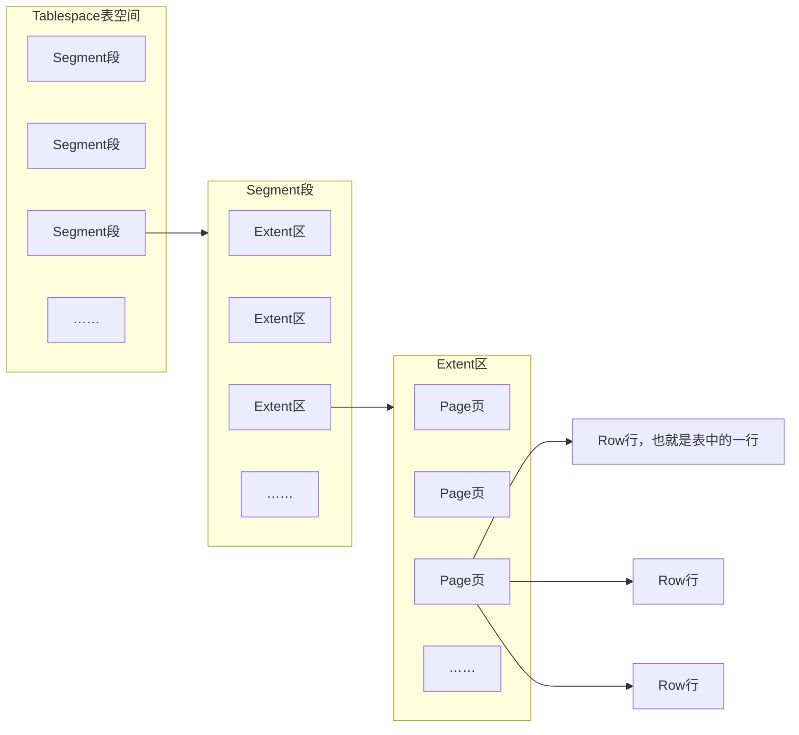

>[!quote] 存储引擎
>存储引擎 是存储数据，建立索引，更新/查询数据 ……技术的实现方式，存储引擎是基于<u>表</u>的，不是基于数据库的【~~也就是一个数据库中可以有多个存储引擎~~】
>
>- 不同的存储引擎有不同的优缺点，没有好坏之分，要看具体的使用场景
>

```SQL
-- 查看当前数据库支持的存储引擎
SHOW ENGINES;
```

# InnoDB
>[!quote] InnoDB
>在 MySQL 5.5 之后，InnoDB 是默认的存储引擎，兼顾高可靠性和高性能
>
> - DML 语句支持事务，也就是遵循 ACID 模型
> - 行级锁
> - 支持外键

## 逻辑存储结构
InnoDB 存储引擎的表后缀为 `.ibd` ，里面存储了<u>表结构</u>，<u>表数据</u>，<u>索引</u>




