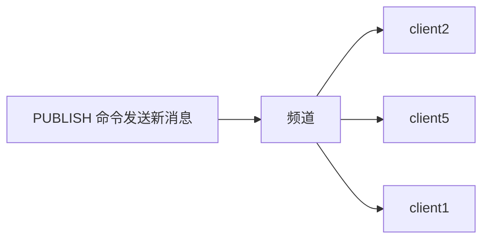

# 发布订阅
>[!quote] 发布订阅
>>发布订阅 是一种<u>消息通信模式</u>：发送者【~~pub~~】发送消息，订阅者【~~sub~~】接收消息
>
>

>[!hint] Redis 客户端可以订阅任意数量的频道

```mermaid
graph LR
    A[PUBLISH 命令发送新消息] --> B[频道]
    B --> C[client2]
    B --> D[client5]
    B --> E[client1]
```

