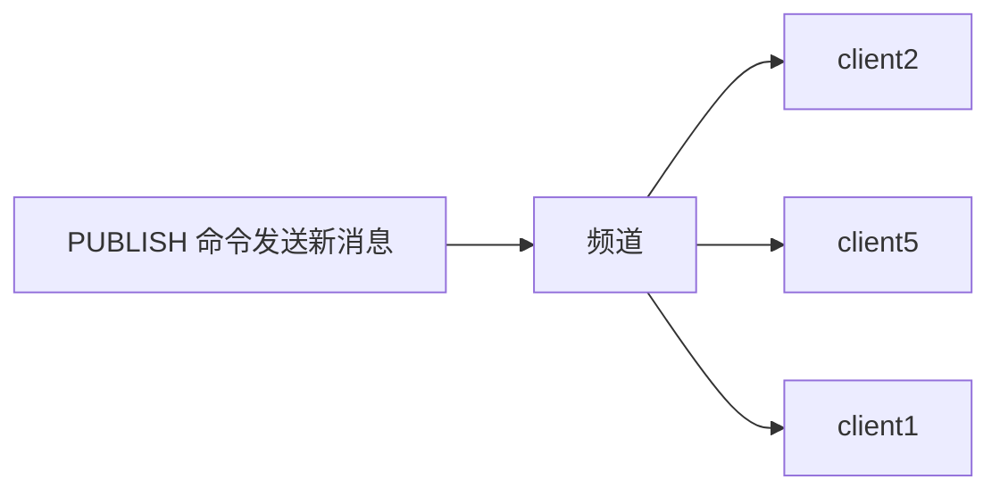

# 发布订阅
>[!quote] 发布订阅
>>发布订阅 是一种<u>消息通信模式</u>：发送者【~~pub~~】发送消息，订阅者【~~sub~~】接收消息
>
>主要用于创建实时消息系统【实时推送，实时分析数据，实时日志 ……】



---

>[!warning] 现在一般使用 Stream 流来替代发布订阅，因为发布订阅有几个缺点：
>- 消息无法持久化，如果出现网络断开，Redis 宕机 ……，消息就会被丢弃
>- 如果在消息发布的时候，订阅者没有在线，那么这个消息就会丢失
>- 可以分发消息，但无法记录历史消息

>[!hint] Redis 客户端可以订阅任意数量的频道

>[!hint] Redis 的发布订阅模式还支持<u>模式匹配订阅</u>
>>[!quote] 模式匹配订阅
>>假设有三个频道："news.sport", "news.technology", "news.fashion"。订阅者可以选择订阅"news."，这样，无论是"news.sport", "news.technology"还是"news.fashion"频道有新的消息发布，订阅了"news."的订阅者都能收到
>
>**优点**：
>- 订阅者可以根据自己的需求，灵活地订阅一组相关的频道，而不需要一个个地去订阅
>- 处理大量频道时，会非常方便

---

## 命令

|序号|命令及描述|
|---|---|
|1|[PSUBSCRIBE pattern [pattern ...]](https://www.runoob.com/redis/pub-sub-psubscribe.html)  <br>订阅一个或多个符合给定模式的频道。|
|2|[PUBSUB subcommand [argument [argument ...]]](https://www.runoob.com/redis/pub-sub-pubsub.html)  <br>查看订阅与发布系统状态。|
|3|[PUBLISH channel message](https://www.runoob.com/redis/pub-sub-publish.html)  <br>将信息发送到指定的频道。|
|4|[PUNSUBSCRIBE [pattern [pattern ...]]](https://www.runoob.com/redis/pub-sub-punsubscribe.html)  <br>退订所有给定模式的频道。|
|5|[SUBSCRIBE channel [channel ...]](https://www.runoob.com/redis/pub-sub-subscribe.html)  <br>订阅给定的一个或多个频道的信息。|
|6|[UNSUBSCRIBE [channel [channel ...]]](https://www.runoob.com/redis/pub-sub-unsubscribe.html)  <br>指退订给定的频道。|

---
## 模板
- 订阅了一个名为 "runoobChat" 的频道，任何发布到 "runoobChat" 频道的消息，这个客户端都能收到
```bash
# 第一个redis-cli客户端----------------

# 创建了runoobChat订阅频道
redis 127.0.0.1:6379> SUBSCRIBE runoobChat

Reading messages... (press Ctrl-C to quit)
1) "subscribe"
2) "runoobChat"
3) (integer) 1
```

- 发布消息到 "runoobChat" 频道【~~首先发布了一条"Redis PUBLISH test"的消息，然后又发布了一条"Learn redis by runoob.com"的消息~~】
```bash
# 第二个redis-cli客户端----------------
redis 127.0.0.1:6379> PUBLISH runoobChat "Redis PUBLISH test"
(integer) 1

redis 127.0.0.1:6379> PUBLISH runoobChat "Learn redis by runoob.com"
(integer) 1

# 订阅者的客户端会显示如下消息
 1) "message"
2) "runoobChat"
3) "Redis PUBLISH test"
 1) "message"
2) "runoobChat"
3) "Learn redis by runoob.com"
```

# 事务
>[!quote] 事务
>>Redis 的事务同其他事务相同，都是把一组命令作为单一的操作
>
>四个保证：
>- **在发送 EXEC 命令前，命令入队缓存**：当你开始一个事务时，所有接下来的命令不会立即执行，而是被放入一个队列中，只有当发送 EXEC 命令后，所有在队列中的命令才会一次性地执行
>-  **不容许语法错误**：命令有语法错误时，redis 会在执行事务前就发现，并阻止整个事务的执行
>- **事务中任意命令执行失败，继续执行剩余命令**：如果在执行事务中的命令时，有一个命令执行失败，那么剩余的命令仍然会被执行【~~这和其他数据库完全不同，因为 redis 需要简单高效~~】
>- **事务隔离**：一个事务的执行不会被其他事务干扰，每个事务都在一个独立的空间中进行

>[!hint] 集群中使用事务很困难
>- **在单机中**：我们有仓库【一个 redis 实例】，仓库里有很多的铭牌【key】，通过铭牌可以找到对应箱子【value】，也可以同时处理很多箱子【事务】
>	- 但是现在箱子很多，一个仓库放不下了，我需要把箱子分到多个仓库中
>- **在集群中**：我们有多个仓库，每个仓库存一些箱子
>	- 但是你想同时处理很多箱子，可能会发现需要的箱子分散在不同的仓库，你就需要在多个仓库之间来回跑，这就很麻烦，可能会导致事务处理失败

>[!hint] 事务的执行过程
> - **开始事务**：使用 MULTI 命令来标记一个事务的开始
> - **命令入队**：输入你想在事务中执行的所有 Redis 命令
> - **执行事务**：输入 EXEC 命令，一次性执行队列中的所有命令

---

- `multi` 标记事务开始
- `exec` 执行事务
- `discard` 取消事务
- `watch 键1 键2 ……` 监视一个/多个 key ，如果在 `watch` 之后，`exec` 之前，这些 key 被<u>其他客户端</u>修改过，则<u>取消整个事务</u>【事务中的命令都不执行】
- `unwatch` 取消对所有 key 的监视

>[!hint] 使用 `WATCH` 监视一个/多个 key 时，无论这个事务是否成功执行，一旦事务执行结束，对这些 key 的监视就会自动取消

>[!hint] 使用 `WATCH` 监视一个/多个键时，这个监视状态是和我们当前的客户端连接绑定的【如果你通过客户端连接监视了一个键，然后这个客户端连接被关闭了，那么这个键的监视状态就会被取消】

```bash
multi
……
exec
```

```bash
multi
……
discard
```

```bash
redis> WATCH mykey
OK

redis> MULTI
OK

# ……其他客户端修改了 mykey

# 本客户端修改了 mykey
redis> SET mykey "World"
QUEUED
redis> EXEC
# 取消事务
```

---

>[!hint] `watch` 实现乐观锁
>>[!quote] 乐观锁
>>>乐观锁 是一种并发控制的方法。它默认多个并发操作之间不会冲突，所以在执行操作的时候<u>不会去获取锁</u>【不会去阻塞其他操作】，只有在提交操作的时候，才会检查是否有冲突
>>
>>- 乐观锁可以减少锁的开销
>>- 主要用于读操作>>写操作时，因为这种情况下，冲突可能小，不会多次取消事务
>
>`watch` 也会默认在命令入队时，多个并发操作之间不会冲突，放任命令入队，只有在最后 `exec` 时，检查是否有冲突

## 模板
```bash
# 开启事务
redis 127.0.0.1:6379> MULTI
OK

# 将命令入队
redis 127.0.0.1:6379> SET book-name "Mastering C++ in 21 days"
QUEUED

redis 127.0.0.1:6379> GET book-name
QUEUED

redis 127.0.0.1:6379> SADD tag "C++" "Programming" "Mastering Series"
QUEUED

redis 127.0.0.1:6379> SMEMBERS tag
QUEUED

# 执行事务
redis 127.0.0.1:6379> EXEC
1) OK
2) "Mastering C++ in 21 days"
3) (integer) 3
4) 1) "Mastering Series"
   2) "C++"
   3) "Programming"
```

```bash
redis 127.0.0.1:7000> multi
OK
redis 127.0.0.1:7000> set a aaa
QUEUED
redis 127.0.0.1:7000> set b bbb
QUEUED
redis 127.0.0.1:7000> set c ccc
QUEUED
redis 127.0.0.1:7000> exec
1) OK
2) OK
3) OK
```

# 脚本
>[!quote] redis 脚本
>>redis 脚本可以用来完成更加复杂的逻辑，而不需要在客户端和服务器之间多次往返传输数据
>
>功能：
>- 一次执行一系列操作
>- 实现更复杂的数据处理和转换任务【你可以编写脚本来实现自定义的排序和过滤逻辑，或者进行复杂的数学运算。通过在服务器端处理这些任务，可以减少网络传输的开销，进一步提高性能】

>[!hint] 对于处理一系列操作，redis 脚本 和 事务 的区别
> - **错误处理**
> 	- 事务中，如果一个命令执行失败，其他的命令仍然会继续执行
> 	- 在 Lua 脚本中，如果出现错误，整个脚本会立即停止执行，并返回错误
> - **条件执行**
> 	- 事务无法条件执行【一旦事务开始，所有的命令都会顺序执行】
> 	- 在 Lua 脚本中，你可以使用 if-then-else 来根据条件执行不同的命令
> - **性能**：由于 Lua 脚本在服务器端执行，因此可以避免多次的客户端和服务器之间的网络往返通信，提高性能
> - **功能**：Lua 脚本可以执行的操作远超过事务

|序号|命令及描述|
|---|---|
|1|[EVAL script numkeys key [key ...] arg [arg ...]](https://www.runoob.com/redis/scripting-eval.html)  <br>执行 Lua 脚本。|
|2|[EVALSHA sha1 numkeys key [key ...] arg [arg ...]](https://www.runoob.com/redis/scripting-evalsha.html)  <br>执行 Lua 脚本。|
|3|[SCRIPT EXISTS script [script ...]](https://www.runoob.com/redis/scripting-script-exists.html)  <br>查看指定的脚本是否已经被保存在缓存当中。|
|4|[SCRIPT FLUSH](https://www.runoob.com/redis/scripting-script-flush.html)  <br>从脚本缓存中移除所有脚本。|
|5|[SCRIPT KILL](https://www.runoob.com/redis/scripting-script-kill.html)  <br>杀死当前正在运行的 Lua 脚本。|
|6|[SCRIPT LOAD script](https://www.runoob.com/redis/scripting-script-load.html)  <br>将脚本 script 添加到脚本缓存中，但并不立即执行这个脚本。|

```bash
redis 127.0.0.1:6379> EVAL "return {KEYS[1],KEYS[2],ARGV[1],ARGV[2]}" 2 key1 key2 first second

1) "key1"
2) "key2"
3) "first"
4) "second"
```

# 持久化
>[!quote] redis 持久化
>>redis 是基于内存的数据库，如果不进行数据持久化，关机后，数据就会消失
>
>持久化的方式：
>- **RDB**：在指定时间间隔内，将内存的快照写入磁盘
>- **AOF**：将执行的每个写操作写入到 AOF 文件中，当 redis 重启时，会重新执行这个文件来重建 redis 的数据

## RDB
- **备份数据**
	- 自动备份：在 `redis.conf` 文件中配置
	- 手动备份
		- `save` 将在 redis 安装目录中，创建<u>备份文件</u>【~~dump.rdb~~】
		- `bgsave` 在后台备份文件【~~但是在 fork 子进程时，还是不能处理数据~~】

```bash
redis 127.0.0.1:6379> SAVE 
OK
```

---

- **恢复数据**：将备份文件移动到 redis 安装目录并启动服务
```bash
# 获取 redis 安装目录
redis 127.0.0.1:6379> CONFIG GET dir
1) "dir"
2) "/data"
```

## AOF
在 `redis.conf` 中定义 `appendonly yes` 

# 性能测试
性能测试是在 redis 的目录下【~~/usr/local/bin~~】执行，而不是在 redis-cli 中执行

- `redis-benchmark` 
	- `-h 主机名` 
	- `-p 端口号` 
	- `-n 请求数` 
	- `-c 并发数` 
	- `-q` 退出 redis，不显示性能测试中命令的执行后果

```bash
root@5e76898a0e9d:/usr/local/bin# redis-benchmark -n 10000 -q
# 结果
……
# 1s 可以执行 xadd 68965 次
XADD: 68965.52 requests per second, p50=0.415 msec
```

# 客户端连接
redis 服务器如何处理新的客户端连接：
- 首先，客户端 socket 会被设置为非阻塞模式
- 然后，为 socket 设置 TCP_NODELAY 属性，禁用 <u>Nagle 算法</u>【~~禁用之后，这使得每次发送数据都立即传输~~】
- 然后，创建一个文件事件，用于监听客户端的数据发送：~~当客户端有数据发送到服务器时，这个文件事件会被触发，Redis 服务器就知道可以读取新的数据了~~

>[!quote] Nagle 算法
>Nagle 算法 通过将小的数据包组合成大的数据包来减少网络传输的次数，可以改善网络传输效率，但是会导致数据延迟

# 管道技术
redis 默认是基于客户端-服务端模型，以及请求/响应协议的 TCP 服务【~~意味着是阻塞模式~~】
但是，我们可以使用管道，在服务端未响应时，客户端可以继续向服务端发送请求，并最终一次性读取所有服务端的响应

>[!hint] 管道并不是一个可以在服务端打开的操作，而是服务端支持管道技术，客户端可以代码编程使用管道

# 分区
>[!quote] 分区
>>分区 是分割数据到多个 redis 实例的处理过程
>
>**优点**：
> - 允许我们构造更大的数据库
> - 通过多核和多台计算机，允许我们扩展计算能力
> - 通过多台计算机，和网络适配器，允许我们扩展网络带宽
> 
> **缺点**：
> - 涉及多个 key 的操作通常是不被支持的【~~例如，当两个集合映射到不同的 redis 实例上时，你就不能对这两个 set 执行交集操作~~】
> - 涉及多个 key 的 redis 事务不能使用
> - 当使用分区时，数据处理较为复杂【~~比如，你需要处理多个持久化文件（rdb/aof），并且从多个实例备份持久化文件~~】
> - 增加/删除容量也比较复杂

## 范围分区
>[!quote] 范围分区
>范围分区 是映射一定范围的对象到特定的 redis 实例【~~比如，ID 从 0-10000 的用户保存到实例 R0，ID 从 10001-20000 的用户保存到 R1~~】

- **缺点**：
	- 要有一个映射表来记录哪个范围的数据存储在哪个实例上
	- 这个表随着数据的增加/减少，要被更新

## 哈希分区
>[!quote] 哈希分区
> - 用一个 hash 函数将 key 转换为一个数字
> - 对这个整数取模，将其转化为 0-3 之间的数字，就可以将这个整数映射到 4 个 redis 实例中的一个了
> 
> 如果你需要增加/减少 redis 实例的数量，那么你需要重新计算所有键的映射关系

# 主从复制
>[!quote] 主从复制
> - **主节点**：主节点是原始的数据持有者，可以处理写操作和读操作。所有的写操作【新增，更新，删除】都会在主节点上执行，并且主节点会将这些写操作记录到一个日志中
> - **从节点**：从节点是主节点的复制品，它可以从主节点那里获取和复制数据。<u>从节点主要用于处理读操作，这样可以分担主节点的读取负载</u>。<u>从节点也可以作为数据的备份</u>，如果主节点出现问题，从节点可以立即接管主节点的角色，保证数据的可用性
> 
> >从节点的复制过程是通过网络进行的：
> >- 首先，从节点会连接到主节点，并请求主节点发送其数据的副本
> >- 然后，主节点会将其数据发送给从节点
> > - 从节点接收并加载了主节点的数据后，就可以开始接收和处理读请求
> >- 后续，主节点会持续将其新的写操作日志发送给从节点，从节点会实时更新其数据

---

- 将主节点的配置文件 `redis.conf` 复制一份，并修改为 `redis-6380.conf` 
```bash
# 6380 是从节点的端口号
```
- 将 `redis-6380.conf` 文件中的所有 `6379` 改为 `6380` 
- 修改持久化配置 `dbfilename` ，区分主从节点的数据
```bash
dbfilename dump.rdb  --修改为--> dbfilename dump-6380.rdb
```
- 在 `redis-6380.conf` 中配置主节点
```bash
# replicaof 主机号 主节点的端口号
replicaof 127.0.0.1 6379
```
- 然后将修改好的 `redis-6380.conf` 文件给 docker run 就好了

---

>[!hint] 主从复制还是<u>无法做到</u>主节点宕机了，从节点自动提升为主节点，所以我们引入了 ”<u>哨兵模式</u>“

# 哨兵模式
>[!quote] 哨兵
>哨兵以一个独立的进程，运行在 redis 集群中，监控各个节点是否正常：
>- 如果发现某个节点出现问题，就会通过<u>发布订阅模式</u>来通知其他节点
>- 如果发现主节点故障，会将某个从节点提升为主节点，并将其他从节点指向新的主节点

>[!quote] 客观下线，主观下线
>- 主观下线：有一个哨兵无法联系到主节点时
>- 客观下线：当有 n 个哨兵无法联系到主节点时【~~n 由 `sentinel monitor` 决定~~】

---

- 新建 `sentinel.conf` 
```bash
# sentinel.conf
# 使用给定的IP和端口，监视一个名为 mymaster 的Redis主服务器
# 如果有2个哨兵无法联系主节点，那么这个服务器将被标记为客观下线
sentinel monitor mymaster 127.0.0.1 6379 2

# 如果哨兵在30000毫秒内，无法与主节点取得联系，那么这个master会被判断为主观下线
sentinel down-after-milliseconds mymaster 30000

# sentinel failover-timeout <master-name> <milliseconds>
# 在180000毫秒之后仍然没有完成故障转移，那么哨兵将放弃执行故障转移
sentinel failover-timeout mymaster 180000

# sentinel parallel-syncs <master-name> <numslaves>
# 在执行故障转移时，每次只会有一个从节点进行数据同步【减少了主节点的负载】
sentinel parallel-syncs mymaster 1
```
