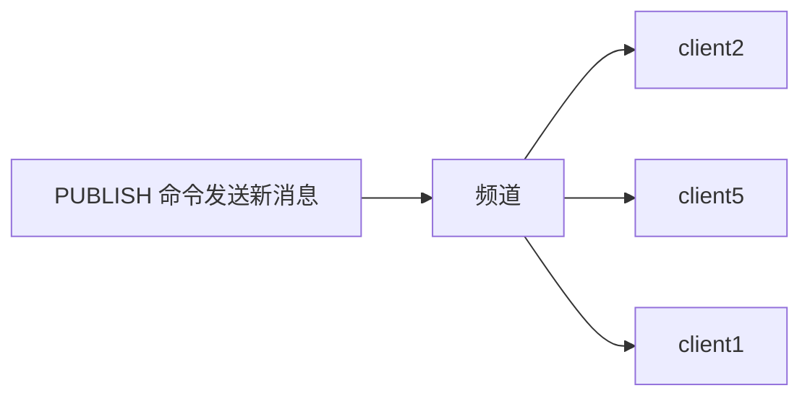

# 发布订阅
>[!quote] 发布订阅
>>发布订阅 是一种<u>消息通信模式</u>：发送者【~~pub~~】发送消息，订阅者【~~sub~~】接收消息
>
>主要用于创建实时消息系统【实时推送，实时分析数据，实时日志 ……】

>[!hint] Redis 客户端可以订阅任意数量的频道




>[!hint] Redis 的发布订阅模式还支持<u>模式匹配订阅</u>
>>[!quote] 模式匹配订阅
>>假设有三个频道："news.sport", "news.technology", "news.fashion"。订阅者可以选择订阅"news."，这样，无论是"news.sport", "news.technology"还是"news.fashion"频道有新的消息发布，订阅了"news."的订阅者都能收到
>
>**优点**：
>- 订阅者可以根据自己的需求，灵活地订阅一组相关的频道，而不需要一个个地去订阅
>- 处理大量频道时，会非常方便

```bash
// 第一个
```


