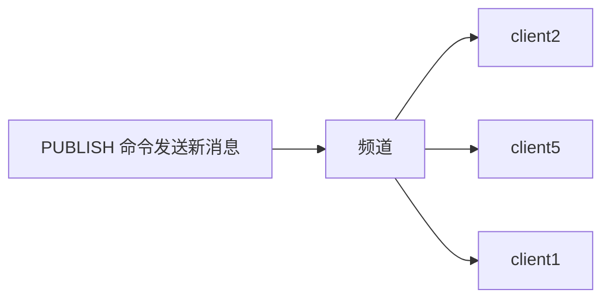

# 发布订阅
>[!quote] 发布订阅
>>发布订阅 是一种<u>消息通信模式</u>：发送者【~~pub~~】发送消息，订阅者【~~sub~~】接收消息
>
>主要用于创建实时消息系统【实时推送，实时分析数据，实时日志 ……】

>[!hint] Redis 客户端可以订阅任意数量的频道

Redis 的发布订阅模式还支持模式匹配订阅，这意味着订阅者不仅可以订阅特定的频道，还可以订阅满足特定模式的所有频道

