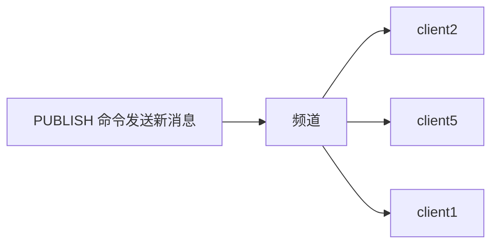

# 发布订阅
>[!quote] 发布订阅
>>发布订阅 是一种<u>消息通信模式</u>：发送者【~~pub~~】发送消息，订阅者【~~sub~~】接收消息
>
>主要用于创建实时消息系统【实时推送，实时分析数据，实时日志 ……】



---

>[!warning] 现在一般使用 Stream 流来替代发布订阅，因为发布订阅有几个缺点：
>- 消息无法持久化，如果出现网络断开，Redis 宕机 ……，消息就会被丢弃
>- 如果在消息发布的时候，订阅者没有在线，那么这个消息就会丢失
>- 可以分发消息，但无法记录历史消息

>[!hint] Redis 客户端可以订阅任意数量的频道

>[!hint] Redis 的发布订阅模式还支持<u>模式匹配订阅</u>
>>[!quote] 模式匹配订阅
>>假设有三个频道："news.sport", "news.technology", "news.fashion"。订阅者可以选择订阅"news."，这样，无论是"news.sport", "news.technology"还是"news.fashion"频道有新的消息发布，订阅了"news."的订阅者都能收到
>
>**优点**：
>- 订阅者可以根据自己的需求，灵活地订阅一组相关的频道，而不需要一个个地去订阅
>- 处理大量频道时，会非常方便

---

## 命令

|序号|命令及描述|
|---|---|
|1|[PSUBSCRIBE pattern [pattern ...]](https://www.runoob.com/redis/pub-sub-psubscribe.html)  <br>订阅一个或多个符合给定模式的频道。|
|2|[PUBSUB subcommand [argument [argument ...]]](https://www.runoob.com/redis/pub-sub-pubsub.html)  <br>查看订阅与发布系统状态。|
|3|[PUBLISH channel message](https://www.runoob.com/redis/pub-sub-publish.html)  <br>将信息发送到指定的频道。|
|4|[PUNSUBSCRIBE [pattern [pattern ...]]](https://www.runoob.com/redis/pub-sub-punsubscribe.html)  <br>退订所有给定模式的频道。|
|5|[SUBSCRIBE channel [channel ...]](https://www.runoob.com/redis/pub-sub-subscribe.html)  <br>订阅给定的一个或多个频道的信息。|
|6|[UNSUBSCRIBE [channel [channel ...]]](https://www.runoob.com/redis/pub-sub-unsubscribe.html)  <br>指退订给定的频道。|

---
## 模板
- 订阅了一个名为 "runoobChat" 的频道，任何发布到 "runoobChat" 频道的消息，这个客户端都能收到
```bash
# 第一个redis-cli客户端----------------

# 创建了runoobChat订阅频道
redis 127.0.0.1:6379> SUBSCRIBE runoobChat

Reading messages... (press Ctrl-C to quit)
1) "subscribe"
2) "runoobChat"
3) (integer) 1
```

- 发布消息到 "runoobChat" 频道【~~首先发布了一条"Redis PUBLISH test"的消息，然后又发布了一条"Learn redis by runoob.com"的消息~~】
```bash
# 第二个redis-cli客户端----------------
redis 127.0.0.1:6379> PUBLISH runoobChat "Redis PUBLISH test"
(integer) 1

redis 127.0.0.1:6379> PUBLISH runoobChat "Learn redis by runoob.com"
(integer) 1

# 订阅者的客户端会显示如下消息
 1) "message"
2) "runoobChat"
3) "Redis PUBLISH test"
 1) "message"
2) "runoobChat"
3) "Learn redis by runoob.com"
```

# 事务
>[!quote] 事务
>>Redis 的事务同其他事务相同，都是把一组命令作为单一的操作
>
>四个保证：
>- **在发送 EXEC 命令前，命令入队缓存**：当你开始一个事务时，所有接下来的命令不会立即执行，而是被放入一个队列中，只有当发送 EXEC 命令后，所有在队列中的命令才会一次性地执行
>-  **不容许语法错误**：命令有语法错误时，redis 会在执行事务前就发现，并阻止整个事务的执行
>- **事务中任意命令执行失败，继续执行剩余命令**：如果在执行事务中的命令时，有一个命令执行失败，那么剩余的命令仍然会被执行【~~这和其他数据库完全不同，因为 redis 需要简单高效~~】
>- **事务隔离**：一个事务的执行不会被其他事务干扰，每个事务都在一个独立的空间中进行

>[!hint] 事务的执行过程
> - **开始事务**：使用 MULTI 命令来标记一个事务的开始
> - **命令入队**：输入你想在事务中执行的所有 Redis 命令
> - **执行事务**：输入 EXEC 命令，一次性执行队列中的所有命令

---

- `multi` 标记事务开始
- `exec` 执行事务
- `discard` 取消事务
- `watch 键1 键2 ……` 监视一个/多个 key ，如果在 `watch` 之后，`exec` 之前，这些 key 被<u>其他客户端</u>修改过，则<u>取消整个事务</u>【事务中的命令都不执行】
- `unwatch` 取消对所有 key 的监视

```bash
multi
……
exec
```

```bash
multi
……
discard
```

```bash
redis> WATCH mykey
OK

redis> MULTI
OK

# ……其他客户端修改了 mykey

# 本客户端修改了 mykey
redis> SET mykey "World"
QUEUED
redis> EXEC
# 取消事务
```

---

## 模板
```bash
# 开启事务
redis 127.0.0.1:6379> MULTI
OK

# 将命令入队
redis 127.0.0.1:6379> SET book-name "Mastering C++ in 21 days"
QUEUED

redis 127.0.0.1:6379> GET book-name
QUEUED

redis 127.0.0.1:6379> SADD tag "C++" "Programming" "Mastering Series"
QUEUED

redis 127.0.0.1:6379> SMEMBERS tag
QUEUED

# 执行事务
redis 127.0.0.1:6379> EXEC
1) OK
2) "Mastering C++ in 21 days"
3) (integer) 3
4) 1) "Mastering Series"
   2) "C++"
   3) "Programming"
```

```bash
redis 127.0.0.1:7000> multi
OK
redis 127.0.0.1:7000> set a aaa
QUEUED
redis 127.0.0.1:7000> set b bbb
QUEUED
redis 127.0.0.1:7000> set c ccc
QUEUED
redis 127.0.0.1:7000> exec
1) OK
2) OK
3) OK
```

>[!hint] 集群中使用事务很困难
>- **在单机中**：我们有仓库【一个 redis 实例】，仓库里有很多的铭牌【key】，通过铭牌可以找到对应箱子【value】，也可以同时处理很多箱子【事务】
>	- 但是现在箱子很多，一个仓库放不下了，我需要把箱子分到多个仓库中
>- **在集群中**：我们有多个仓库，每个仓库存一些箱子
>	- 但是你想同时处理很多箱子，可能会发现需要的箱子分散在不同的仓库，你就需要在多个仓库之间来回跑，这就很麻烦，可能会导致事务处理失败


一种可能的解决方案是在应用程序级别处理事务，但这可能会增加复杂性，并可能引入新的问题。所以总的来说，你说的没错，Redis 在多节点环境中使用事务确实会非常困难。

---

Redis 的 watch 机制实现乐观锁
虽说 Redis不支持直接回滚，但我们可以通过 Redis提供的一个命令来实现回滚
这个命令就是 watch，该命令可以为 Redis事务提供 check-and-set （CAS）行为。
我们可以使用 watch命令来监视一个 或多个key，如果被监视的 key在事务执行前被修改过那么本次事务将会被取消，也就是所谓的回滚
只有确保被监视的 key，在事务开始前到执行 这段时间内未被修改过事务才会执行成功（类似乐观锁）
如果一次事务中存在被监视的 key，无论此次事务执行成功与否，该 key的监视都将会在执行后失效 也就是说监视是一次性的。
watch在事务的 运用注意点：
watch要在事务开启之前就监控不然会报错
watch是一次性的
watch开启的客户端端口连接这个客户端对watch的监听就会被取消

看watch的使用
  


我认为现阶段Redis事务的作用不大，因为我们看上面的开启事务后每提交一次命令都返回 QUEUED ，所以我们在开启事务的时候会跟 Redis 的管道一起使用来减少读写请求次数，而 Redis 的事务不保证原子性，隔离性，我们谈到什么 Redis 实现分布式锁的细节的时候就会说加锁时候要保证原子性，解锁的时候原子性也要保证

---


