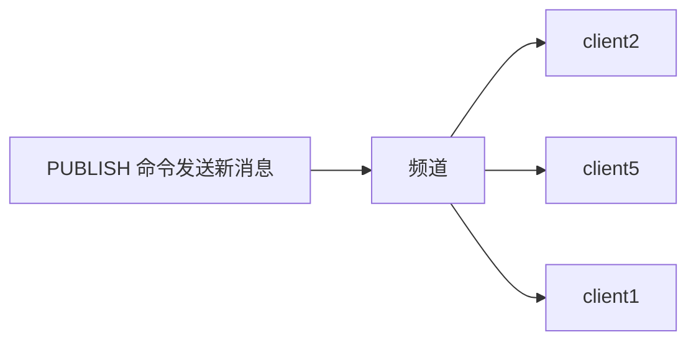

# 发布订阅
>[!quote] 发布订阅
>>发布订阅 是一种<u>消息通信模式</u>：发送者【~~pub~~】发送消息，订阅者【~~sub~~】接收消息
>
>主要用于创建实时消息系统【实时推送，实时分析数据，实时日志 ……】



---

>[!warning] 现在一般使用 Stream 流来替代发布订阅，因为发布订阅有几个缺点：
>- 消息无法持久化，如果出现网络断开，Redis 宕机 ……，消息就会被丢弃
>- 如果在消息发布的时候，订阅者没有在线，那么这个消息就会丢失
>- 可以分发消息，但无法记录历史消息

>[!hint] Redis 客户端可以订阅任意数量的频道

>[!hint] Redis 的发布订阅模式还支持<u>模式匹配订阅</u>
>>[!quote] 模式匹配订阅
>>假设有三个频道："news.sport", "news.technology", "news.fashion"。订阅者可以选择订阅"news."，这样，无论是"news.sport", "news.technology"还是"news.fashion"频道有新的消息发布，订阅了"news."的订阅者都能收到
>
>**优点**：
>- 订阅者可以根据自己的需求，灵活地订阅一组相关的频道，而不需要一个个地去订阅
>- 处理大量频道时，会非常方便

---

## 命令

|序号|命令及描述|
|---|---|
|1|[PSUBSCRIBE pattern [pattern ...]](https://www.runoob.com/redis/pub-sub-psubscribe.html)  <br>订阅一个或多个符合给定模式的频道。|
|2|[PUBSUB subcommand [argument [argument ...]]](https://www.runoob.com/redis/pub-sub-pubsub.html)  <br>查看订阅与发布系统状态。|
|3|[PUBLISH channel message](https://www.runoob.com/redis/pub-sub-publish.html)  <br>将信息发送到指定的频道。|
|4|[PUNSUBSCRIBE [pattern [pattern ...]]](https://www.runoob.com/redis/pub-sub-punsubscribe.html)  <br>退订所有给定模式的频道。|
|5|[SUBSCRIBE channel [channel ...]](https://www.runoob.com/redis/pub-sub-subscribe.html)  <br>订阅给定的一个或多个频道的信息。|
|6|[UNSUBSCRIBE [channel [channel ...]]](https://www.runoob.com/redis/pub-sub-unsubscribe.html)  <br>指退订给定的频道。|

---
## 模板
- 订阅了一个名为 "runoobChat" 的频道，任何发布到 "runoobChat" 频道的消息，这个客户端都能收到
```bash
# 第一个redis-cli客户端----------------

# 创建了runoobChat订阅频道
redis 127.0.0.1:6379> SUBSCRIBE runoobChat

Reading messages... (press Ctrl-C to quit)
1) "subscribe"
2) "runoobChat"
3) (integer) 1
```

- 发布消息到 "runoobChat" 频道【~~首先发布了一条"Redis PUBLISH test"的消息，然后又发布了一条"Learn redis by runoob.com"的消息~~】
```bash
# 第二个redis-cli客户端----------------
redis 127.0.0.1:6379> PUBLISH runoobChat "Redis PUBLISH test"
(integer) 1

redis 127.0.0.1:6379> PUBLISH runoobChat "Learn redis by runoob.com"
(integer) 1

# 订阅者的客户端会显示如下消息
 1) "message"
2) "runoobChat"
3) "Redis PUBLISH test"
 1) "message"
2) "runoobChat"
3) "Learn redis by runoob.com"
```

# 事务
>[!quote] 事务
>>Redis 的事务同其他事务相同，都是把一组命令作为单一的操作
>
>三个保证：
>- **在发送 EXEC 命令前，命令入队缓存**：当你开始一个事务时，所有接下来的命令不会立即执行，而是被放入一个队列中，只有当发送 EXEC 命令后，所有在队列中的命令才会一次性地执行
>- **事务中任意命令执行失败，继续执行剩余命令**：如果在执行事务中的命令时，有一个命令失败，那么剩余的命令仍然会被执行【~~这和其他数据库完全不同，因为 redis 需要简单高效~~】
>- **事务隔离**：一个事务的执行不会被其他事务干扰，每个事务都在一个独立的空间中进行

>[!hint] 事务的执行过程
> - **开始事务**：使用 MULTI 命令来标记一个事务的开始
> - **命令入队**：输入你想在事务中执行的所有 Redis 命令
> - **执行事务**：输入 EXEC 命令，一次性执行队列中的所有命令

---

- `multi` 标记事务开始
- `exec` 执行事务

---

## 模板
```bash
# 开启事务
redis 127.0.0.1:6379> MULTI
OK

redis 127.0.0.1:6379> SET book-name "Mastering C++ in 21 days"
QUEUED

redis 127.0.0.1:6379> GET book-name
QUEUED

redis 127.0.0.1:6379> SADD tag "C++" "Programming" "Mastering Series"
QUEUED

redis 127.0.0.1:6379> SMEMBERS tag
QUEUED

redis 127.0.0.1:6379> EXEC
1) OK
2) "Mastering C++ in 21 days"
3) (integer) 3
4) 1) "Mastering Series"
   2) "C++"
   3) "Programming"
```

单个 Redis 命令的执行是原子性的，但 Redis 没有在事务上增加任何维持原子性的机制，所以 Redis 事务的执行并不是原子性的。

事务可以理解为一个打包的批量执行脚本，但批量指令并非原子化的操作，中间某条指令的失败不会导致前面已做指令的回滚，也不会造成后续的指令不做。

```bash
redis 127.0.0.1:7000> multi
OK
redis 127.0.0.1:7000> set a aaa
QUEUED
redis 127.0.0.1:7000> set b bbb
QUEUED
redis 127.0.0.1:7000> set c ccc
QUEUED
redis 127.0.0.1:7000> exec
1) OK
2) OK
3) OK
```

如果在 set b bbb 处失败，set a 已成功不会回滚，set c 还会继续执行。

| 序号  | 命令及描述                                                                                                                                  |
| --- | -------------------------------------------------------------------------------------------------------------------------------------- |
| 1   | [DISCARD](https://www.runoob.com/redis/transactions-discard.html)  <br>取消事务，放弃执行事务块内的所有命令                                              |
| 4   | [UNWATCH](https://www.runoob.com/redis/transactions-unwatch.html)  <br>取消 WATCH 命令对所有 key 的监视                                          |
| 5   | [WATCH key [key ...]](https://www.runoob.com/redis/transactions-watch.html)  <br>监视一个(或多个) key ，如果在事务执行之前这个(或这些) key 被其他命令所改动，那么事务将被打断 |


