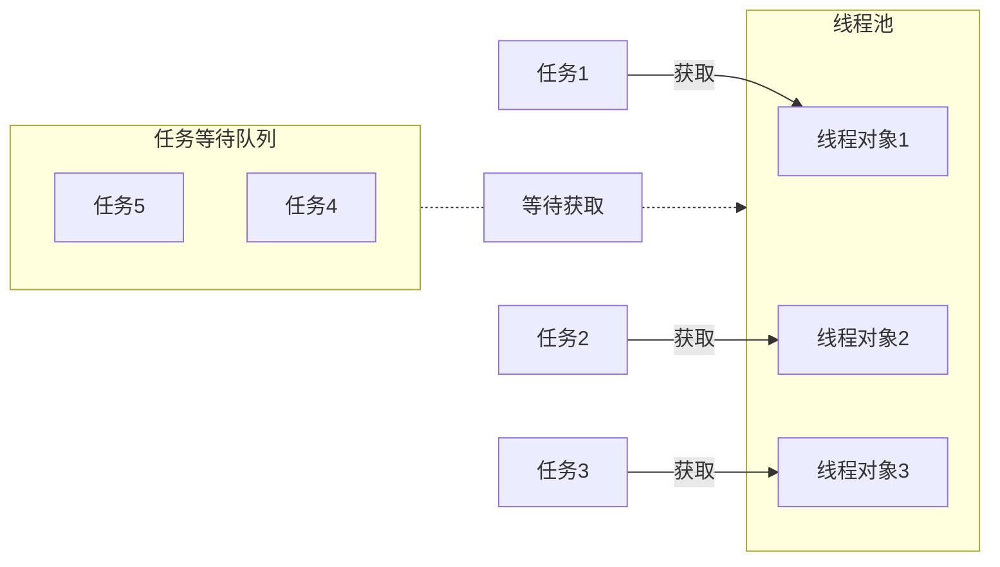

# 线程池
>[!quote] 线程池
>线程池 是一种利用池化技术思想来实现的线程管理技术，是将提前创建好的线程对象放入到一个池子，任务来了可以直接获取，
>
>- 解耦了线程的创建和任务的执行
>- 不用频繁地创建和销毁进程
>- 便于统一管理线程对象
>- 可以控制最大的并发数

# 线程安全
>[!quote] 线程安全
>线程安全 指的是允许多个执行线程能够安全访问同一内存区域，无需担心并发执行时，各个线程操作相互干扰

- 互斥锁 / 悲观锁：当线程 1 拿到某个数据时，将这个数据上锁，此时线程 2 更改数据就要等待锁释放才行，

锁的获取和释放是有一定开销的

- CAS / 乐观锁：

