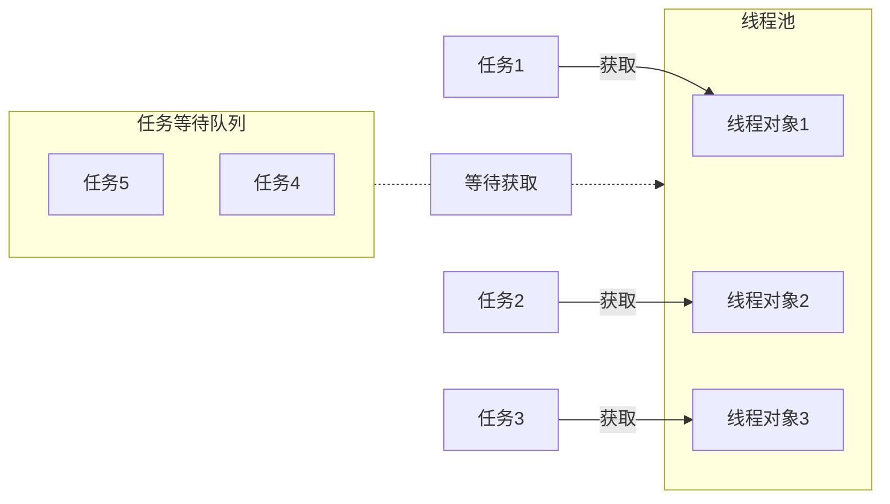

# 线程池
>[!quote] 线程池
>线程池 是一种利用池化技术思想来实现的线程管理技术，是将提前创建好的线程对象放入到一个池子，任务来了可以直接获取，
>
>- 解耦了线程的创建和任务的执行
>- 不用频繁地创建和销毁进程
>- 便于统一管理线程对象
>- 可以控制最大的并发数

# 线程安全
>[!quote] 线程安全
>线程安全 指的是允许多个执行线程能够安全访问同一内存区域，无需担心并发执行时，各个线程操作相互干扰

- 互斥锁 / 悲观锁：当线程 1 拿到某个数据时，将这个数据上锁，此时线程 2 更改数据就要等待锁释放才行，

锁的获取和释放是有一定开销的

- CAS / 乐观锁：

---

>[!quote] 乐观锁
>>乐观锁 就是<u>假设多个线程在同一数据上的操作通常不冲突</u>【~~所以叫乐观~~】，所以不对数据加锁，而是在提交更新时，会检查数据在读取后是否被其他线程修改过
>
>乐观锁通常使用版本号或者时间戳来检测数据是否在读取和更新之间发生了变化

如果其他事务已经对该数据进行了更改，当前事务则需要回滚并重新尝试操作。

>[!quote] 悲观锁
>悲观锁 就是假设多个线程在同一数据上会发生冲突，所以对数据进行加锁，直到锁释放，才允许其他线程 <u>读取 / 修改</u>

悲观锁可以锁住行、页或整个对象，直至事务完成。

如果系统面临高并发的情况，悲观锁可能会导致性能问题，因为过多的等待和锁争用

总体来说，乐观锁适合在冲突不频繁的系统环境中，而悲观锁更适合那些冲突较频繁或者数据一致性要求非常高的系统环境中。选择使用乐观锁还是悲观锁取决于具体的应用场景和对性能与正确性的实际需求。