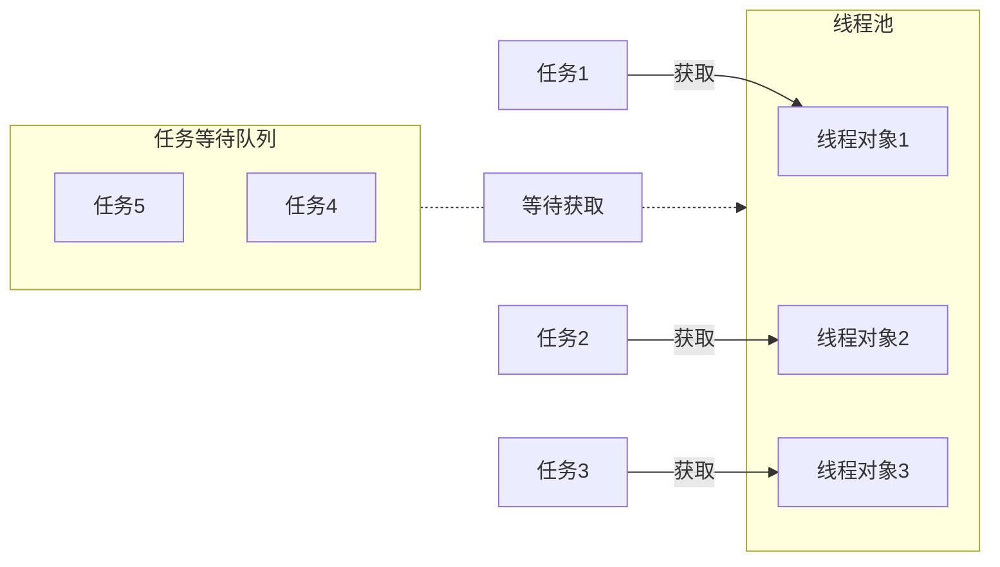

# 线程池
>[!quote] 线程池
>线程池 是一种利用池化技术思想来实现的线程管理技术，是将提前创建好的线程对象放入到一个池子，任务来了可以直接获取
>
>- 解耦了线程的创建和任务的执行
>- 不用频繁地创建和销毁进程
>- 便于统一管理线程对象
>- 可以控制最大的并发数

# 线程安全
>[!quote] 线程安全
>线程安全 指的是允许多个执行线程能够安全访问同一内存区域，无需担心并发执行时，各个线程操作相互干扰

>[!quote] 乐观锁 / CAS
>>乐观锁 就是<u>假设多个线程在同一数据上的操作通常不冲突</u>【~~所以叫乐观~~】，所以不对数据加锁，而是在提交更新时，会检查数据在读取后是否被其他线程修改过，如果当前线程在修改数据后发现该数据被其他线程修改过，则当前进程所做的操作无效【~~数据是 a，线程 A 将数据修改为 b，在提交时发现数据被修改为 c，那此时回滚线程 A 的操作，所以最后数据会是 c~~】，<u>可能某些系统会重新执行修改操作</u>
>
>- 乐观锁通常使用版本号或者时间戳来检测数据是否在读取和更新之间发生了变化
>- **所以乐观锁适合在冲突不频繁的系统环境中**

>[!quote] 悲观锁
>悲观锁 就是假设多个线程在同一数据上会发生冲突，所以对数据进行加锁，直到锁释放，才允许其他线程 <u>读取 / 修改</u>
>
>- **悲观锁更适合冲突较频繁，或数据一致性要求高的系统环境中**

在高并发的情况下，不适合单独使用任何一种锁，因为有很多事务可能在同一时间点上尝试获取同一个资源的锁，所以使用悲观锁可能导致性能问题，而乐观锁会频繁地回滚

# 可见性
>[!quote] 可见性
>可见性 指当多个线程访问同一个变量时，一个线程修改了这个变量的值，其他线程能够立即看得到修改的值【~~在多线程环境下，默认，一个线程对共享变量的操作对其他线程是不可见的~~】

<u>如何保证可见性</u> ：
- `volatile` 当一个线程修改共享变量后他会立即被更新到主内存中，其他线程读取共享变量时，会直接从主内存中读取
- `synchronized，Lock` 保证同一时刻只有一个线程获取锁，然后执行同步代码，并且在释放锁之前会将对变量的修改刷新到主存当中

## volatile
https://cloud.tencent.com/developer/article/1618122
https://blog.csdn.net/goodjava2007/article/details/130978659
https://www.cnblogs.com/dolphin0520/p/3920373.html
https://blog.csdn.net/asd136912/article/details/106243585

给变量加上 `volatile` 关键字，以便某个变量在多个线程之间共享，A 线程修改了该变量，B 线程立马能看见

`volatile` 会发出 lock 指令对当前 cpu 缓存进行上锁，接下来操作的指令会独占数据写回主存和缓存，其他 cpu 因为缓存失效就会去主存读数据重新写入缓存，就保证了不同cpu之间的缓存一致性

---

volatile 变量的同步性较差（有时它更简单并且开销更低），而且其使用也更容易出错。

---

当一个线程修改了一个`volatile`变量的值时，这个修改会立即写入主内存，而不是仅仅存储在CPU缓存中

1. **`volatile`与`lock`指令**：`volatile`关键字本身并不直接与CPU的`lock`指令相关。`lock`指令通常用于实现原子操作，确保在多处理器系统中，对共享内存的访问是原子的，即在执行操作期间，其他处理器不能访问该内存地址。
    
2. **CPU缓存一致性**：在多处理器系统中，每个处理器都有自己的缓存，而`volatile`关键字确保了当一个处理器修改了`volatile`变量的值后，这个值能够及时地同步到主内存中。其他处理器在访问这个变量时，会从主内存中读取最新的值，而不是依赖于可能已经过时的缓存数据。这是通过缓存一致性协议（如MESI协议）来实现的，而不是通过`lock`指令。
3. **缓存一致性协议**：缓存一致性协议确保了在多处理器系统中，所有处理器看到的内存状态是一致的。当一个处理器修改了内存中的数据，其他处理器的相应缓存行会被标记为无效，迫使它们在需要时从主内存中重新加载数据。
4. **`volatile`与缓存行锁定**：虽然`volatile`不直接导致缓存行锁定，但它确保了对`volatile`变量的写操作会立即写回主内存，并且对其他处理器可见。这有助于维护内存的一致性，但并不等同于缓存行锁定。

总结来说，`volatile`关键字在Java中用于确保变量的内存可见性，它通过确保变量的修改能够及时写入主内存来实现这一点。这与CPU的`lock`指令和缓存一致性协议是不同的概念，但它们共同作用于确保多线程程序的正确性和性能。