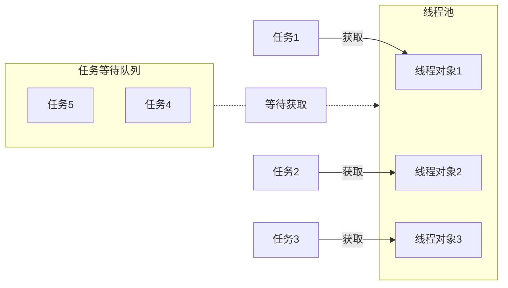

# 线程池
>[!quote] 线程池
>线程池 是一种利用池化技术思想来实现的线程管理技术，是将提前创建好的线程对象放入到一个池子，任务来了可以直接获取
>
>- 解耦了线程的创建和任务的执行
>- 不用频繁地创建和销毁进程
>- 便于统一管理线程对象
>- 可以控制最大的并发数

# 线程安全
>[!quote] 线程安全
>线程安全 指的是允许多个执行线程能够安全访问同一内存区域，无需担心并发执行时，各个线程操作相互干扰

>[!quote] 乐观锁 / CAS
>>乐观锁 就是<u>假设多个线程在同一数据上的操作通常不冲突</u>【~~所以叫乐观~~】，所以不对数据加锁，而是在提交更新时，会检查数据在读取后是否被其他线程修改过，如果当前线程在修改数据后发现该数据被其他线程修改过，则当前进程所做的操作无效【~~数据是 a，线程 A 将数据修改为 b，在提交时发现数据被修改为 c，那此时回滚线程 A 的操作，所以最后数据会是 c~~】，<u>可能某些系统会重新执行修改操作</u>
>
>- 乐观锁通常使用版本号或者时间戳来检测数据是否在读取和更新之间发生了变化
>- **所以乐观锁适合在冲突不频繁的系统环境中**

>[!quote] 悲观锁
>悲观锁 就是假设多个线程在同一数据上会发生冲突，所以对数据进行加锁，直到锁释放，才允许其他线程 <u>读取 / 修改</u>
>
>- **悲观锁更适合冲突较频繁，或数据一致性要求高的系统环境中**

在高并发的情况下，不适合单独使用任何一种锁，因为有很多事务可能在同一时间点上尝试获取同一个资源的锁，所以使用悲观锁可能导致性能问题，而乐观锁会频繁地回滚

# ❤️ 可见性
>[!quote] 可见性
>可见性 指当多个线程访问同一个变量时，一个线程修改了这个变量的值，其他线程能够立即看得到修改的值【~~在多线程环境下，默认，一个线程对共享变量的操作对其他线程是不可见的~~】

<u>如何保证可见性</u> ：
- `volatile` 当一个线程修改共享变量后他会立即被更新到主内存中，其他线程读取共享变量时，会直接从主内存中读取
- `synchronized，Lock` 保证同一时刻只有一个线程获取锁，然后执行同步代码，并且在释放锁之前会将对变量的修改刷新到主存当中

## volatile
https://cloud.tencent.com/developer/article/1618122
https://blog.csdn.net/goodjava2007/article/details/130978659
https://www.cnblogs.com/dolphin0520/p/3920373.html
https://blog.csdn.net/asd136912/article/details/106243585

>[!quote] `volatile`
>volatile 是一个关键字，给变量加上 `volatile`，以便这个变量在多个线程之间共享，A 线程修改了该变量，B 线程立马能看见
>
><u>优点</u> ：
>- 开销低
>
><u>缺点</u> ：
>- 非线程安全，volatile 只保证可见性，不保证原子性

---

<u>volatile 是如何确保可见性的</u> ：
- **缓存一致性** ：当一个线程修改了一个 `volatile` 变量的值时，这个修改会被写入到缓存，并且立即同步到主内存，其他处理器的缓存中，该变量的副本会被标记为无效。在其他处理器访问这个变量时，会从主内存中读取最新的值
- **指令重排序** ：`volatile` 可以防止指令重排序，确保变量的读写操作按顺序执行

>[!quote] 指令重排序
>指令重排序 是指编译器或处理器可能会调整代码中指令的执行顺序，以优化性能

# ❤️ 有序性
## 💛 线程内
<u>在本线程内观察，所有操作都是有序的</u> ：
- 在单个线程内部，操作的执行顺序是按照代码中定义的顺序进行的，不会乱序

## 💛 线程间
<u>在一个线程中观察另一个线程，所有操作都是无序的</u> ~~即从一个线程观察另一个线程的操作时，可能会看到与代码中定义的顺序不一致的行为~~：
- **指令重排序** ：指令重排序不会影响单个线程内操作的最终结果，但是可能会导致不同线程之间观察到的操作顺序与代码中定义的顺序不同
- **工作内存与主内存同步延迟** ：当线程需要读取或写入变量时，它首先与主内存进行同步。由于同步操作可能存在延迟，因此一个线程可能看不到另一个线程对共享变量所做的最新更改

#问题/没搞懂为什么会延迟，这个过程是什么  

>[!quote] 工作内存，主内存
>- 工作内存：每个线程都有自己的工作内存，~~也称为本地内存，或线程栈~~，用于存储该线程使用的变量的副本
>- 主内存：所有线程共享的内存

