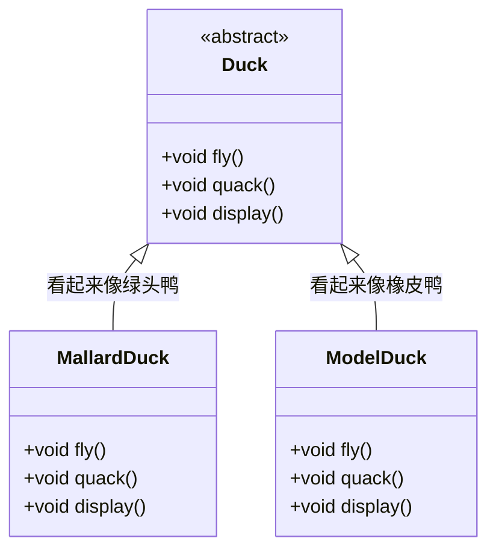

# ❤️ 责任链模式


---

- 传递类
```java
// 报销申请类，层层传递下去的类
class Reimbursement {
    private int amount;

    public Reimbursement(int amount) { this.amount = amount; }
    public int getAmount() { return amount; }
}
```

- 责任链
```java
// 抽象的审批人
interface Approver {
    Approver setNextApprover(Approver nextApprover);
    void processRequest(Reimbursement reimbursement);
}
```

```java
// 抽象类定义重用方法
public abstract class AbstractApprover {
    private String name;
    private Approver nextApprover;

    @Override
    public Approver setNextApprover(Approver nextApprover){
		this.nextApprover = nextApprover;
        return this;
    }
    
    @Override
    abstract void processRequest(Reimbursement reimbursement);
}
```

```java
/*
具体审批人 - 部门经理
*/
public class DepartmentManager extends AbstractApprover {

    public DepartmentManager(String name) {
        this.name = name;
    }

    @Override
    public void processRequest(Reimbursement reimbursement) {
        if (reimbursement.getAmount() > 10000) {
            if (nextApprover != null) {
                nextApprover.processRequest(reimbursement);
            } else {
                System.out.println(" 没有更多审批人可用于金额请求 " + reimbursement.getAmount());
            }
        } else {
            System.out.println(name + " 已批准金额请求 " + reimbursement.getAmount());
        }
    }
}
```

```java
/*
具体审批人 - 财务经理
*/
public class FinanceManager extends AbstractApprover {

    public FinanceManager(String name) {
        this.name = name;
    }

    @Override
    public void processRequest(Reimbursement reimbursement) {
	    if (reimbursement.getAmont() > 20000) {
		    if (nextApprover != null) {
			    nextApprover.processRequest(reimbursement);
		    } else {
                System.out.println(" 没有更多审批人可用于金额请求 " + reimbursement.getAmount());
		    }
	    }
	    else {
	        System.out.println(name + " 已批准金额请求 " + reimbursement.getAmount());
	    }
    }
}
```

```java
/* 
具体审批人 - CEO
*/
public class CEO extends AbstractApprover {

    public CEO(String name) {
        this.name = name;
    }
    
    @Override
    public void processRequest(Reimbursement reimbursement) {
	    if (reimbursement.getAmont() > 30000) {
		    if (nextApprover != null) {
			    nextApprover.processRequest(reimbursement);
		    } else {
                System.out.println(" 没有更多审批人可用于金额请求 " + reimbursement.getAmount());
		    }
	    }
	    else {
	        System.out.println(name + " 已批准金额请求 " + reimbursement.getAmount());
	    }
    }
}
```

- 测试
```java
// 测试
public static void main(String[] args) {
	// 构建责任链
	Approver approver = new DepartmentManager("部门经理")
							.setNextApprover(new FinanceManager("财务经理"))
							.setNextApprover(new CEO("CEO"));

	approver.processRequest(new Reimbursement(60000));
}
```

# ❤️ 策略模式
>[!quote] 策略模式
>策略模式 定义了一系列算法，并将每一个算法封装起来，使它们可以在运行时互换使用【~~策略 -> 一组行为集合，算法 -> 行为~~】
>
>- **优点**
>	- 易于扩展和维护：将算法封装在独立的类中，使得它们易于切换和扩展，添加新的行为只需要添加一个新的算法类，而不需要修改现有的类层次结构
>	- 独立性：算法的变化不会影响到使用算法的用户
>	- 灵活：可以在运行时动态改变对象的行为，而不需要修改对象本身的代码
>	- 可复用：策略可以在不同的上下文中重用，只要上下文需要相同的行为。这增加了代码的复用性【~~比如有另外一个 bird 类也需要 fly 行为~~】
>- **缺点**
>	- 类爆炸：如果策略类太多，可能会导致系统难以管理和扩展

>[!hint] 策略模式中依赖了哪些 OO 原则 ？
> - 依赖倒置原则
> - 开放封闭原则
> - 单独封装变化
> - 组合复用原则

---

> **案例场景分析**：
> Duck 的子类中：
> - 变化的部分：飞行【~~有子类不会飞；有子类有多种飞行模式；有的子类被安装了人工翅膀~~】，叫声【~~有的子类不会叫~~】；
> - 不太会变的部分：`display()`

## 不使用策略模式
<u>也就是使用继承实现行为</u>，Duck 类中写入 `fly()` ， `quack()` ，然后各种子类重写这两个方法，自己去实现自己的行为

- **缺点**
	- 如果有些子类不会飞，也不会叫，那会在该类中重写方法，但是没有方法体，是一个空方法
	- 如果后续要去掉一组行为，那将变动所有的类



## 使用策略模式

```mermaid
classDiagram
    class Duck {
		<<abstract>>
		+FlyBehavior flyBehavior
		+QuackBehavior quackBehavior
		+void performFly()
		+void performQuack()
		+void display()
		+void setFlyBehavior(FlyBehavior fb)
		+void setQuackBehavior(QuackBehavior qb)
    }
    
    class MallardDuck {
        +void display()
    }
    class ModelDuck {
        +void display()
    }
    
    Duck <|-- MallardDuck : 看起来像绿头鸭
    Duck <|-- ModelDuck : 看起来像橡皮鸭

	%% 飞行接口
	class FlyBehavior {
		<<interface>>
        +void fly()
    }
	class FlyWithWings {
		+void fly()
	}
	class FlyNoWay {
		+void fly()
	}
	FlyBehavior <|.. FlyWithWings
	FlyBehavior <|.. FlyNoWay


    %% 叫声接口
    class QuackBehavior {
	    <<interface>>
        +void quack()
    }
    class Quack {
	    +void quack()
    }
    class Squeak {
	    +void quack()
    }
    class MuteQuack {
	    +void quack()
    }
    QuackBehavior <|.. Quack
    QuackBehavior <|.. Squeak
    QuackBehavior <|.. MuteQuack

	Duck --> FlyBehavior
    Duck --> QuackBehavior
```



